Figure 1 and related supplement tables and figures
================
Meng-Ching Ko (MaggieMCKO)
05/06/2023

- <a href="#fig-1c-f" id="toc-fig-1c-f">Fig. 1C-F</a>

This [R Markdown](http://rmarkdown.rstudio.com) Notebook contain codes
for reproducing Fig.1 and related supplement tables and figures of Ko et
al. (<https://www.biorxiv.org/content/10.1101/2022.06.13.495861v1>).
Data deposited on dryad: <https://doi.org/10.5061/dryad.5hqbzkh8c>

### Fig. 1B, Supplementary Table 2 and 3

``` r
library(tidyverse) # v.2.0.0
```

    ## ── Attaching core tidyverse packages ──────────────────────── tidyverse 2.0.0 ──
    ## ✔ dplyr     1.1.2     ✔ readr     2.1.4
    ## ✔ forcats   1.0.0     ✔ stringr   1.5.0
    ## ✔ ggplot2   3.4.2     ✔ tibble    3.2.1
    ## ✔ lubridate 1.9.2     ✔ tidyr     1.3.0
    ## ✔ purrr     1.0.1     
    ## ── Conflicts ────────────────────────────────────────── tidyverse_conflicts() ──
    ## ✖ dplyr::filter() masks stats::filter()
    ## ✖ dplyr::lag()    masks stats::lag()
    ## ℹ Use the conflicted package (<http://conflicted.r-lib.org/>) to force all conflicts to become errors

``` r
library(lme4) # 1.1-29
```

    ## Loading required package: Matrix
    ## 
    ## Attaching package: 'Matrix'
    ## 
    ## The following objects are masked from 'package:tidyr':
    ## 
    ##     expand, pack, unpack

``` r
library(arm) # 1.7-19
```

    ## Loading required package: MASS
    ## 
    ## Attaching package: 'MASS'
    ## 
    ## The following object is masked from 'package:dplyr':
    ## 
    ##     select
    ## 
    ## 
    ## arm (Version 1.13-1, built: 2022-8-25)
    ## 
    ## Working directory is /Users/maggie/ownCloud/Gahr/R/2015/TESTO2/Repos/github/TimeLapseTestoFemaleCanary/Analysis

``` r
set.seed(100)

## load data
path =  paste0(getwd(), "/Data/PlasmaAndrogenLv.tsv")
T_sub = read_tsv(path)
```

    ## Rows: 84 Columns: 5
    ## ── Column specification ────────────────────────────────────────────────────────
    ## Delimiter: "\t"
    ## chr (3): Group, PrePost, date
    ## dbl (2): ProcessNum, ngml
    ## 
    ## ℹ Use `spec()` to retrieve the full column specification for this data.
    ## ℹ Specify the column types or set `show_col_types = FALSE` to quiet this message.

``` r
db = T_sub

db$Group <- factor(db$Group, levels = c("CON", "T1h", "T3h", "T8h", "T3d", "T7d", "T14d"))
db$Group <- droplevels(db$Group)
db$ProcessNum <- factor(db$ProcessNum)
db$ProcessNum <- droplevels(db$ProcessNum)
db$date <- factor(db$date)
db$date <- droplevels(db$date)
db$PrePost <- factor(db$PrePost)
db$PrePost <- droplevels(db$PrePost)


y_lab = 'Plasma androgens (ng/ml)'

## deciding using sqrt or not and evaluating model
mod_a <- lmer(data = db, log(ngml) ~ PrePost + Group + PrePost:Group +
                (1|date) + (1|ProcessNum)) # log
```

    ## boundary (singular) fit: see help('isSingular')

``` r
plot(mod_a)  
```

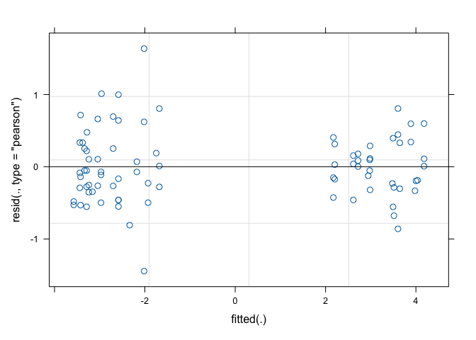<!-- -->

``` r
summary(mod_a)
```

    ## Linear mixed model fit by REML ['lmerMod']
    ## Formula: log(ngml) ~ PrePost + Group + PrePost:Group + (1 | date) + (1 |  
    ##     ProcessNum)
    ##    Data: db
    ## 
    ## REML criterion at convergence: 146.2
    ## 
    ## Scaled residuals: 
    ##      Min       1Q   Median       3Q      Max 
    ## -2.64800 -0.54139 -0.09707  0.54067  2.99696 
    ## 
    ## Random effects:
    ##  Groups     Name        Variance Std.Dev.
    ##  ProcessNum (Intercept) 0.00000  0.0000  
    ##  date       (Intercept) 0.05868  0.2422  
    ##  Residual               0.29777  0.5457  
    ## Number of obs: 84, groups:  ProcessNum, 42; date, 33
    ## 
    ## Fixed effects:
    ##                            Estimate Std. Error t value
    ## (Intercept)                -3.43156    0.28102 -12.211
    ## PrePostsacrifice            0.29015    0.39742   0.730
    ## GroupT1h                    0.05683    0.37987   0.150
    ## GroupT3h                    0.27329    0.39346   0.695
    ## GroupT8h                    1.64625    0.38811   4.242
    ## GroupT3d                    1.25468    0.38811   3.233
    ## GroupT7d                    0.64714    0.42388   1.527
    ## GroupT14d                   0.59560    0.39742   1.499
    ## PrePostsacrifice:GroupT1h   6.78821    0.53997  12.571
    ## PrePostsacrifice:GroupT3h   6.90812    0.54843  12.596
    ## PrePostsacrifice:GroupT8h   5.02122    0.54888   9.148
    ## PrePostsacrifice:GroupT3d   4.85596    0.54888   8.847
    ## PrePostsacrifice:GroupT7d   5.16131    0.58105   8.883
    ## PrePostsacrifice:GroupT14d  4.75294    0.56025   8.484

    ## 
    ## Correlation matrix not shown by default, as p = 14 > 12.
    ## Use print(x, correlation=TRUE)  or
    ##     vcov(x)        if you need it

    ## optimizer (nloptwrap) convergence code: 0 (OK)
    ## boundary (singular) fit: see help('isSingular')

``` r
plot.new()
par(mfrow=c(3,2))
qqnorm(resid(mod_a))
qqline(resid(mod_a))
qqnorm(ranef(mod_a)$"ProcessNum"[,1])   # random effect
qqline(ranef(mod_a)$"ProcessNum"[,1])
qqnorm(ranef(mod_a)$"date"[,1])   # random effect
qqline(ranef(mod_a)$"date"[,1])
scatter.smooth(fitted(mod_a), resid(mod_a))
```

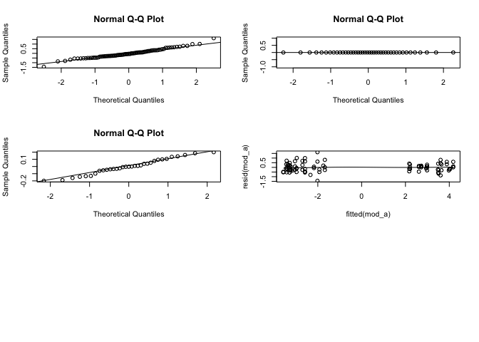<!-- -->

``` r
## Draw 200 random values from the posterior distribuition of the model
nsim = 10000 # 200 # 
bsim = sim(mod_a, n.sims = nsim) # curve
# str(bsim)

## Check the credible intervals
Ind_b_CrI = apply(bsim@fixef, 2, quantile, prob=c(0.025, 0.975)) 

Ind_b = mod_a@beta
x = as.data.frame(VarCorr(mod_a))
Ind_random_Bird = x[1, 4]
Ind_random_Date = x[2, 4]
Ind_residual = x[3, 4]
Ind_random_Bird_CrI = quantile(apply(bsim@ranef$ProcessNum[,,1],1,var),prob=c(0.025, 0.975))
Ind_random_Date_CrI = quantile(apply(bsim@ranef$date[,,1],1,var),prob=c(0.025, 0.975))
Ind_residual_CrI = quantile(bsim@sigma^2,c(0.025, 0.975))

x = cbind("Var" = "T_ngml", "Estimate" = Ind_b, t(Ind_b_CrI))
df_t = rbind(cbind(x, "Parameter" = row.names(x)),
             cbind("Var" = "T_ngml", 
                   "Estimate" =  Ind_random_Date, t(Ind_random_Date_CrI),
                   "Parameter" = "random_Date"),
             cbind("Var" = "T_ngml", 
                   "Estimate" =  Ind_random_Bird, t(Ind_random_Bird_CrI),
                   "Parameter" = "random_Bird"),
             cbind("Var" = "T_ngml", 
                   "Estimate" =  Ind_residual, t(Ind_residual_CrI),
                   "Parameter" = "residual"))

## Draw dummy values from the raw data
groups = sort(unique(db$Group))
new_data_mod_a = data.frame(
  PrePost = rep(unique(T_sub$PrePost), each=length(groups)),
  Group = rep(groups, 2))

## Simulate dummy values that can be multiplied later
xmat = model.matrix(~ PrePost + Group + PrePost:Group, data = new_data_mod_a)

## Empty matrix to store results of the multiplication
fitmat = matrix(ncol = nsim, nrow=nrow(new_data_mod_a))

## Multiply dummy values and the model and store in the empty matrix
for(i in 1:nsim){
  fitmat[,i] = xmat%*%bsim@fixef[i,]}

## Calculate the upper and lower limits of the credible interval and back transform
new_data_mod_a$lower <- apply(fitmat, 1, quantile, prob=0.025)
new_data_mod_a$upper <- apply(fitmat, 1, quantile, prob=0.975)
new_data_mod_a$fit <- apply(fitmat, 1, mean)
new_data_mod_a$fit_exp <- exp(new_data_mod_a$fit)        # transform back from log
new_data_mod_a$upper_exp <- exp(new_data_mod_a$upper)    # transform back from log
new_data_mod_a$lower_exp <- exp(new_data_mod_a$lower)    # transform back from log

# grey_point_size = 0.2
mean_point_size = 1
errorbar_wd = 1
errorbar_hori = 0

w = 0.25
Tplot = ggplot(data=db) +
  # raw data
  geom_point(aes(x=as.numeric(Group)+w, y=ngml, # shape = PrePost, 
                 colour=PrePost, group=PrePost), 
             size = 0.5, alpha = 0.7, 
             position=position_jitter(w = 0.05, h = 0)) +
  # Credible interval
  geom_errorbar(data = new_data_mod_a,
                aes(x = as.numeric(Group), ymax=upper_exp, ymin=lower_exp,
                    colour=PrePost, group=PrePost),
                width= errorbar_hori, size = errorbar_wd ) +
  # estimate
  geom_point(data = new_data_mod_a,
             aes(x = as.numeric(Group), y = fit_exp,
                 color = PrePost, group=PrePost, fill = PrePost),
             stroke = 0.2, color = 'black', size = mean_point_size) +
  scale_x_continuous("Group", breaks=c(1:7),
                     label=c("CON", "T1h", "T3h", "T8h", "T3d", "T7d", "T14d"))+
  scale_color_manual(values = c("cornflowerblue", "darkorange") ) +
  scale_y_continuous(name = 'Plasma androgens (ng/ml)',
                     expand = c(0, 0),
                     limits = c(-5, 120)) + theme_classic() ; Tplot
```

    ## Warning: Using `size` aesthetic for lines was deprecated in ggplot2 3.4.0.
    ## ℹ Please use `linewidth` instead.
    ## This warning is displayed once every 8 hours.
    ## Call `lifecycle::last_lifecycle_warnings()` to see where this warning was
    ## generated.

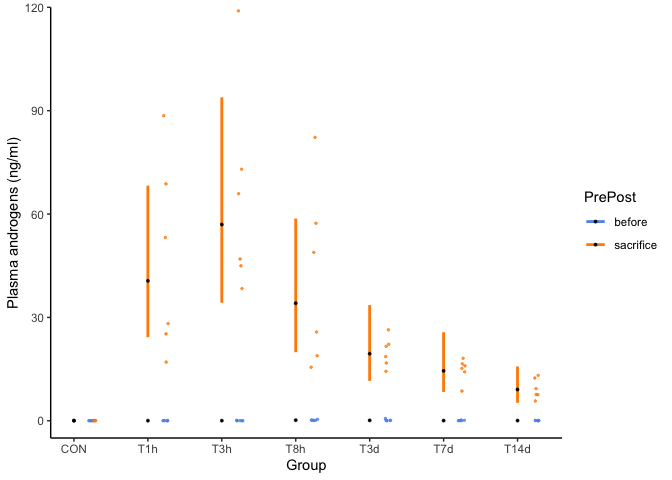<!-- -->

``` r
pp = function(StimulatedTable){
  Individualb1 <- new_data_mod_a$Group=='CON' & new_data_mod_a$PrePost=='before'
  Individualb2 <- new_data_mod_a$Group=='T1h' & new_data_mod_a$PrePost=='before'
  Individualb3 <- new_data_mod_a$Group=='T3h' & new_data_mod_a$PrePost=='before'
  Individualb4 <- new_data_mod_a$Group=='T8h' & new_data_mod_a$PrePost=='before'
  Individualb5 <- new_data_mod_a$Group=='T3d' & new_data_mod_a$PrePost=='before'
  Individualb6 <- new_data_mod_a$Group=='T7d' & new_data_mod_a$PrePost=='before'
  Individualb7 <- new_data_mod_a$Group=='T14d' & new_data_mod_a$PrePost=='before'
  
  Individuala1 <- new_data_mod_a$Group=='CON' & new_data_mod_a$PrePost=='sacrifice'
  Individuala2 <- new_data_mod_a$Group=='T1h' & new_data_mod_a$PrePost=='sacrifice'
  Individuala3 <- new_data_mod_a$Group=='T3h' & new_data_mod_a$PrePost=='sacrifice'
  Individuala4 <- new_data_mod_a$Group=='T8h' & new_data_mod_a$PrePost=='sacrifice'
  Individuala5 <- new_data_mod_a$Group=='T3d' & new_data_mod_a$PrePost=='sacrifice'
  Individuala6 <- new_data_mod_a$Group=='T7d' & new_data_mod_a$PrePost=='sacrifice'
  Individuala7 <- new_data_mod_a$Group=='T14d' & new_data_mod_a$PrePost=='sacrifice'
  
  # sacrifice > before
  d1 = mean(fitmat[Individuala1,]>fitmat[Individualb1,]) # posterior probability 
  d2 = mean(fitmat[Individuala2,]>fitmat[Individualb2,]) # posterior probability 
  d3 = mean(fitmat[Individuala3,]>fitmat[Individualb3,]) # posterior probability 
  d4 = mean(fitmat[Individuala4,]>fitmat[Individualb4,]) # posterior probability 
  d5 = mean(fitmat[Individuala5,]>fitmat[Individualb5,]) # posterior probability 
  d6 = mean(fitmat[Individuala6,]>fitmat[Individualb6,]) # posterior probability 
  d7 = mean(fitmat[Individuala7,]>fitmat[Individualb7,]) # posterior probability 
  
  # sacrifice > sacrifice (CON)
  ds2 = mean(fitmat[Individuala2,]>fitmat[Individuala1,]) # posterior probability 
  ds3 = mean(fitmat[Individuala3,]>fitmat[Individuala1,]) # posterior probability 
  ds4 = mean(fitmat[Individuala4,]>fitmat[Individuala1,]) # posterior probability 
  ds5 = mean(fitmat[Individuala5,]>fitmat[Individuala1,]) # posterior probability 
  ds6 = mean(fitmat[Individuala6,]>fitmat[Individuala1,]) # posterior probability 
  ds7 = mean(fitmat[Individuala7,]>fitmat[Individuala1,]) # posterior probability 
  
  # sacrifice > sacrifice (T1h)
  ds32 = mean(fitmat[Individuala3,]>fitmat[Individuala2,]) # posterior probability 
  ds42 = mean(fitmat[Individuala4,]>fitmat[Individuala2,]) # posterior probability 
  ds52 = mean(fitmat[Individuala5,]>fitmat[Individuala2,]) # posterior probability 
  ds62 = mean(fitmat[Individuala6,]>fitmat[Individuala2,]) # posterior probability 
  ds72 = mean(fitmat[Individuala7,]>fitmat[Individuala2,]) # posterior probability 
  
  # sacrifice > sacrifice (T3h)
  ds43 = mean(fitmat[Individuala4,]>fitmat[Individuala3,]) # posterior probability 
  ds53 = mean(fitmat[Individuala5,]>fitmat[Individuala3,]) # posterior probability 
  ds63 = mean(fitmat[Individuala6,]>fitmat[Individuala3,]) # posterior probability 
  ds73 = mean(fitmat[Individuala7,]>fitmat[Individuala3,]) # posterior probability 
  
  # sacrifice > sacrifice (T8h)
  ds54 = mean(fitmat[Individuala5,]>fitmat[Individuala4,]) # posterior probability 
  ds64 = mean(fitmat[Individuala6,]>fitmat[Individuala4,]) # posterior probability 
  ds74 = mean(fitmat[Individuala7,]>fitmat[Individuala4,]) # posterior probability 
  
  # sacrifice > sacrifice (T3d)
  ds65 = mean(fitmat[Individuala6,]>fitmat[Individuala5,]) # posterior probability 
  ds75 = mean(fitmat[Individuala7,]>fitmat[Individuala5,]) # posterior probability 
  
  # sacrifice > sacrifice (T7d)
  ds76 = mean(fitmat[Individuala7,]>fitmat[Individuala6,]) # posterior probability 
  
  group = c("CON", "T1h", "T3h", "T8h", "T3d", "T7d", "T14d")
  dt = data.frame("Comparison" = c(paste0(group, '(sacrifice > before)'),
                                   paste0(group[-1], '(sacrifice > sacrifice (', group[1], '))'),
                                   paste0(group[-c(1:2)], '(sacrifice > sacrifice (', group[2], '))'),
                                   paste0(group[-c(1:3)], '(sacrifice > sacrifice (', group[3], '))'),
                                   paste0(group[-c(1:4)], '(sacrifice > sacrifice (', group[4], '))'),
                                   paste0(group[-c(1:5)], '(sacrifice > sacrifice (', group[5], '))'),
                                   paste0(group[-c(1:6)], '(sacrifice > sacrifice (', group[6], '))')
  ), 
  "Posterior probability" = c(d1, d2, d3, d4, d5, d6, d7,
                              ds2, ds3, ds4, ds5, ds6, ds7,
                              ds32, ds42, ds52, ds62, ds72,
                              ds43, ds53, ds63, ds73,
                              ds54, ds64, ds74,
                              ds65, ds75,
                              ds76
  ))
}

# posterior probability 
plasmaT = pp(new_data_mod_a) # posterior probabilities
plasmaT = plasmaT %>% mutate(sig = ifelse(Posterior.probability > 0.95, 'sig', NA)); plasmaT
```

    ##                           Comparison Posterior.probability  sig
    ## 1            CON(sacrifice > before)                0.7654 <NA>
    ## 2            T1h(sacrifice > before)                1.0000  sig
    ## 3            T3h(sacrifice > before)                1.0000  sig
    ## 4            T8h(sacrifice > before)                1.0000  sig
    ## 5            T3d(sacrifice > before)                1.0000  sig
    ## 6            T7d(sacrifice > before)                1.0000  sig
    ## 7           T14d(sacrifice > before)                1.0000  sig
    ## 8   T1h(sacrifice > sacrifice (CON))                1.0000  sig
    ## 9   T3h(sacrifice > sacrifice (CON))                1.0000  sig
    ## 10  T8h(sacrifice > sacrifice (CON))                1.0000  sig
    ## 11  T3d(sacrifice > sacrifice (CON))                1.0000  sig
    ## 12  T7d(sacrifice > sacrifice (CON))                1.0000  sig
    ## 13 T14d(sacrifice > sacrifice (CON))                1.0000  sig
    ## 14  T3h(sacrifice > sacrifice (T1h))                0.8304 <NA>
    ## 15  T8h(sacrifice > sacrifice (T1h))                0.3265 <NA>
    ## 16  T3d(sacrifice > sacrifice (T1h))                0.0267 <NA>
    ## 17  T7d(sacrifice > sacrifice (T1h))                0.0053 <NA>
    ## 18 T14d(sacrifice > sacrifice (T1h))                0.0001 <NA>
    ## 19  T8h(sacrifice > sacrifice (T3h))                0.0837 <NA>
    ## 20  T3d(sacrifice > sacrifice (T3h))                0.0034 <NA>
    ## 21  T7d(sacrifice > sacrifice (T3h))                0.0004 <NA>
    ## 22 T14d(sacrifice > sacrifice (T3h))                0.0000 <NA>
    ## 23  T3d(sacrifice > sacrifice (T8h))                0.0743 <NA>
    ## 24  T7d(sacrifice > sacrifice (T8h))                0.0161 <NA>
    ## 25 T14d(sacrifice > sacrifice (T8h))                0.0012 <NA>
    ## 26  T7d(sacrifice > sacrifice (T3d))                0.2259 <NA>
    ## 27 T14d(sacrifice > sacrifice (T3d))                0.0289 <NA>
    ## 28 T14d(sacrifice > sacrifice (T7d))                0.1194 <NA>

``` r
# estimates and credible intervals
df_t2 = df_t %>% as_tibble() %>%
  mutate(Parameter = gsub("Group", "", Parameter),
         Parameter = gsub("PrePostsacrifice", "BeforeSacrifice", Parameter)); df_t2
```

    ## # A tibble: 17 × 5
    ##    Var    Estimate           `2.5%`             `97.5%`           Parameter     
    ##    <chr>  <chr>              <chr>              <chr>             <chr>         
    ##  1 T_ngml -3.43156178427207  -3.99330028911444  -2.86171705111386 (Intercept)   
    ##  2 T_ngml 0.290153941610414  -0.5130728154498   1.08692029780565  BeforeSacrifi…
    ##  3 T_ngml 0.0568258854289144 -0.705491807013294 0.809415989099609 T1h           
    ##  4 T_ngml 0.273287652974053  -0.526842529267737 1.04723453902864  T3h           
    ##  5 T_ngml 1.64624929359554   0.874485654147127  2.40902363877497  T8h           
    ##  6 T_ngml 1.25468377016814   0.475380912541678  2.0175705962343   T3d           
    ##  7 T_ngml 0.647141264539208  -0.200316848035493 1.49126817017087  T7d           
    ##  8 T_ngml 0.595598609159733  -0.198012933845416 1.39588996559243  T14d          
    ##  9 T_ngml 6.78820602369848   5.70115241288068   7.85385517801287  BeforeSacrifi…
    ## 10 T_ngml 6.90811949535952   5.83982525348049   8.01402898885491  BeforeSacrifi…
    ## 11 T_ngml 5.02122432698368   3.92612110949686   6.11832768739599  BeforeSacrifi…
    ## 12 T_ngml 4.8559648721204    3.75761981685092   5.96730226891967  BeforeSacrifi…
    ## 13 T_ngml 5.16131478179705   4.00910558670118   6.33404336380842  BeforeSacrifi…
    ## 14 T_ngml 4.75293545852277   3.6282584816365    5.87174708728345  BeforeSacrifi…
    ## 15 T_ngml 0.0586839212508672 0.0357294126509074 0.111937252499062 random_Date   
    ## 16 T_ngml 0                  0                  0                 random_Bird   
    ## 17 T_ngml 0.297773735511293  0.219183450189502  0.430570004922725 residual

## Fig. 1C-F

### Supplementary Table 1

``` r
library(tidyverse) # v.2.0.0
library(ggbreak) # 0.1.0
```

    ## ggbreak v0.1.1
    ## 
    ## If you use ggbreak in published research, please cite the following
    ## paper:
    ## 
    ## S Xu, M Chen, T Feng, L Zhan, L Zhou, G Yu. Use ggbreak to effectively
    ## utilize plotting space to deal with large datasets and outliers.
    ## Frontiers in Genetics. 2021, 12:774846. doi: 10.3389/fgene.2021.774846

``` r
library(patchwork) # 1.1.1
```

    ## 
    ## Attaching package: 'patchwork'

    ## The following object is masked from 'package:MASS':
    ## 
    ##     area

``` r
set.seed(100)

path = paste0(getwd(), "/Data/DayLv_data.tsv")
SongRate = read_tsv(path)
```

    ## Rows: 72 Columns: 6

    ## ── Column specification ────────────────────────────────────────────────────────
    ## Delimiter: "\t"
    ## chr (2): Ind, Group
    ## dbl (4): Individual, n_Group, n_Day, Daily_SongRate
    ## 
    ## ℹ Use `spec()` to retrieve the full column specification for this data.
    ## ℹ Specify the column types or set `show_col_types = FALSE` to quiet this message.

``` r
SongRate$Group = factor(SongRate$Group, levels = c("CON", "T1h", "T3h", "T8h", "T3d", "T7d", "T14d"))

SongRate_sum = SongRate %>%
  group_by(Individual) %>%
  summarise(Daily_SongRate_a = mean(Daily_SongRate),
            Daily_SongRate_s = sd(Daily_SongRate)) ; SongRate_sum
```

    ## # A tibble: 11 × 3
    ##    Individual Daily_SongRate_a Daily_SongRate_s
    ##         <dbl>            <dbl>            <dbl>
    ##  1          1          0.150             0.220 
    ##  2          3          2.48              2.36  
    ##  3          4          0.0104           NA     
    ##  4          5          0.00570          NA     
    ##  5          6          0.00668          NA     
    ##  6          7          0.0214            0.0277
    ##  7          8          0.429             0.568 
    ##  8          9          2.42              1.56  
    ##  9         10          1.81              1.90  
    ## 10         11          2.72              2.58  
    ## 11         12          0.509             0.705

``` r
path = paste0(getwd(), "/Data/SongLv_data.tsv")
Song_data = read_tsv(path)
```

    ## Rows: 5320 Columns: 12
    ## ── Column specification ────────────────────────────────────────────────────────
    ## Delimiter: "\t"
    ## chr (4): Ind, Group, FisrtDate, StartTime
    ## dbl (8): Individual, n_Group, n_Day, Daily_SongRate, SongLen, SylperSong, Re...
    ## 
    ## ℹ Use `spec()` to retrieve the full column specification for this data.
    ## ℹ Specify the column types or set `show_col_types = FALSE` to quiet this message.

``` r
Song_data$Group = factor(Song_data$Group, levels = c("CON", "T1h", "T3h", "T8h", "T3d", "T7d", "T14d"))

Song_data_sum = Song_data %>%
  group_by(Individual) %>%
  summarise(n_song = n(),
            SongLen_a = mean(SongLen),
            SongLen_s = sd(SongLen),
            RepetitionRate_a = mean(RepetitionRate),
            RepetitionRate_s = sd(RepetitionRate),
            SylperSong_a = mean(SylperSong),
            SylperSong_s = sd(SylperSong),
            slope_a = mean(slope),
            slope_s = sd(slope)) ; Song_data_sum
```

    ## # A tibble: 11 × 10
    ##    Individual n_song SongLen_a SongLen_s RepetitionRate_a RepetitionRate_s
    ##         <dbl>  <int>     <dbl>     <dbl>            <dbl>            <dbl>
    ##  1          1     40      6.08     3.31              7.75            1.40 
    ##  2          3    796      5.04     3.42              6.22            0.720
    ##  3          4      2      1.68     0.192             4.80            0.549
    ##  4          5      1      1.85    NA                 5.41           NA    
    ##  5          6      1      2.16    NA                 2.77           NA    
    ##  6          7      9      4.63     6.62              3.59            1.88 
    ##  7          8     96     15.9     12.1               4.74            0.969
    ##  8          9    785     11.0      7.37             13.7             3.75 
    ##  9         10   1700      3.11     1.19             10.5             1.39 
    ## 10         11   1745      6.56     4.53              5.40            1.40 
    ## 11         12    145     10.2      6.51              7.94            0.845
    ## # ℹ 4 more variables: SylperSong_a <dbl>, SylperSong_s <dbl>, slope_a <dbl>,
    ## #   slope_s <dbl>

``` r
pp = function(StimulatedTable){
  Dayn = 1:nrow(fitmat) # (row of fitmat)
  
  combi = combn(Dayn, 2)
  
  d = lapply(1:ncol(combi), function(combiN){
    # combiN = 1
    tmp = combi[, combiN]
    p = mean(fitmat[tmp[1],]<fitmat[tmp[2],])
    df = tibble("DayN1" = (new_data_mod_a$n_Day[tmp[1]]), 
                "DayN2" = (new_data_mod_a$n_Day[tmp[2]]), "pp" = p)
  })
  
  dd = d %>% bind_rows() %>%
    mutate(`sig (2>1)` = ifelse(pp > 0.95, 'sig', NA))
  return(dd)
}
```

### Fig. 1C, Supplementary Table 2 and 3

``` r
db = SongRate  

db$Individual = factor(db$Individual)
db$Group = factor(db$Group)
db$n_Group = factor(db$n_Group)
db$n_Day = factor(db$n_Day)
length(unique(db$n_Group))
```

    ## [1] 2

``` r
length(unique(db$n_Day))
```

    ## [1] 14

``` r
db$Individual <- droplevels(db$Individual)
length(unique(db$Individual))
```

    ## [1] 11

``` r
db$Group <- droplevels(db$Group)
length(unique(db$Group))
```

    ## [1] 2

``` r
db$n_Day = droplevels(db$n_Day)
length(unique(db$n_Day))
```

    ## [1] 14

``` r
y_lab = 'Daily singing activity (%)'

## deciding using sqrt or not and evaluating model
mod_a <- lmer(data = db, log(Daily_SongRate) ~ n_Day + (1|Individual) + (1|n_Group) ) # log
```

    ## boundary (singular) fit: see help('isSingular')

``` r
plot(mod_a)  
```

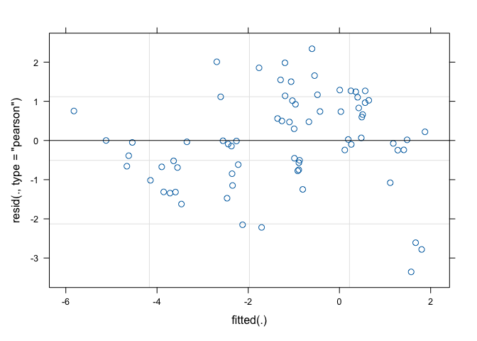<!-- -->

``` r
summary(mod_a)
```

    ## Linear mixed model fit by REML ['lmerMod']
    ## Formula: log(Daily_SongRate) ~ n_Day + (1 | Individual) + (1 | n_Group)
    ##    Data: db
    ## 
    ## REML criterion at convergence: 246.3
    ## 
    ## Scaled residuals: 
    ##      Min       1Q   Median       3Q      Max 
    ## -2.37438 -0.47955 -0.00732  0.66075  1.65702 
    ## 
    ## Random effects:
    ##  Groups     Name        Variance Std.Dev.
    ##  Individual (Intercept) 3.063    1.750   
    ##  n_Group    (Intercept) 0.000    0.000   
    ##  Residual               1.996    1.413   
    ## Number of obs: 72, groups:  Individual, 11; n_Group, 2
    ## 
    ## Fixed effects:
    ##             Estimate Std. Error t value
    ## (Intercept)   -7.379      1.570  -4.701
    ## n_Day2         4.086      1.770   2.308
    ## n_Day3         3.355      1.657   2.025
    ## n_Day4         4.635      1.577   2.940
    ## n_Day5         4.516      1.570   2.876
    ## n_Day6         5.626      1.549   3.631
    ## n_Day7         5.540      1.546   3.584
    ## n_Day8         5.516      1.593   3.463
    ## n_Day9         5.761      1.593   3.616
    ## n_Day10        6.992      1.593   4.389
    ## n_Day11        6.788      1.593   4.261
    ## n_Day12        6.920      1.593   4.344
    ## n_Day13        6.689      1.593   4.199
    ## n_Day14        6.623      1.615   4.100

    ## 
    ## Correlation matrix not shown by default, as p = 14 > 12.
    ## Use print(x, correlation=TRUE)  or
    ##     vcov(x)        if you need it

    ## optimizer (nloptwrap) convergence code: 0 (OK)
    ## boundary (singular) fit: see help('isSingular')

``` r
plot.new()
par(mfrow=c(2,2))
qqnorm(resid(mod_a))
qqline(resid(mod_a))
qqnorm(ranef(mod_a)$"Individual"[,1])   # random effect
qqline(ranef(mod_a)$"Individual"[,1])
qqnorm(ranef(mod_a)$"n_Group"[,1])   # random effect
qqline(ranef(mod_a)$"n_Group"[,1])
scatter.smooth(fitted(mod_a), resid(mod_a))
```

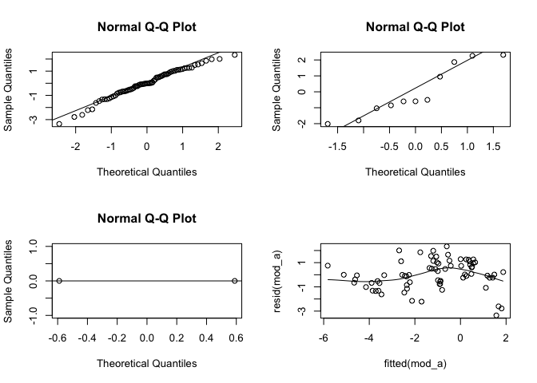<!-- -->

``` r
new_data_mod_a <- expand.grid(n_Day = levels(db$n_Day)) # fix effect
xmat <- model.matrix(~ n_Day, data=new_data_mod_a)  # fix effect
new_data_mod_a$fit <- xmat%*%fixef(mod_a)

nsim <- 10000
bsim <- arm::sim(mod_a, n.sim=nsim ) #simulation of the model 10000 times

## To get the mean estimate of the fixed effects parameters apply(bsim@fixef, 2, mean)
apply(bsim@fixef, 2, mean)
```

    ## (Intercept)      n_Day2      n_Day3      n_Day4      n_Day5      n_Day6 
    ##   -7.376240    4.086695    3.322681    4.632873    4.507461    5.621345 
    ##      n_Day7      n_Day8      n_Day9     n_Day10     n_Day11     n_Day12 
    ##    5.530629    5.495771    5.757120    6.986314    6.785582    6.913652 
    ##     n_Day13     n_Day14 
    ##    6.681919    6.605466

``` r
## To get the 95% credible Interval estimate of the fixed effects parameters apply(bsim@fixef, 2, quantile, prob=c(0.025, 0.975))
apply(bsim@fixef, 2, quantile, prob=c(0.025, 0.975))
```

    ##       (Intercept)    n_Day2      n_Day3   n_Day4   n_Day5   n_Day6   n_Day7
    ## 2.5%   -10.520208 0.5205409 -0.04049957 1.468797 1.338055 2.434439 2.411461
    ## 97.5%   -4.231163 7.6160574  6.63064973 7.769741 7.622234 8.674446 8.630998
    ##         n_Day8   n_Day9   n_Day10  n_Day11   n_Day12  n_Day13  n_Day14
    ## 2.5%  2.282866 2.575266  3.762377  3.57862  3.695879 3.478860 3.339175
    ## 97.5% 8.665943 8.952333 10.255048 10.05208 10.108365 9.867048 9.832812

``` r
Ind_b_CrI = apply(bsim@fixef, 2, quantile, prob=c(0.025, 0.975)) 

Ind_b = mod_a@beta
x = as.data.frame(VarCorr(mod_a))
Ind_random_Bird = x[1, 4]
Ind_random_Group = x[2, 4]
Ind_residual = x[3, 4]
Ind_random_Bird_CrI = quantile(apply(bsim@ranef$Individual[,,1],1,var),prob=c(0.025, 0.975))
Ind_random_Group_CrI = quantile(apply(bsim@ranef$n_Group[,,1],1,var),prob=c(0.025, 0.975))
Ind_residual_CrI = quantile(bsim@sigma^2,c(0.025, 0.975))


fitmat <- matrix(ncol=nsim, nrow=nrow(new_data_mod_a))
for(i in 1:nsim) fitmat[,i] <- xmat %*% bsim@fixef[i,]    # fitted values
new_data_mod_a$lower <- apply(fitmat, 1, quantile, prob=0.025)
new_data_mod_a$upper <- apply(fitmat, 1, quantile, prob=0.975)
new_data_mod_a$fit <- apply(fitmat, 1, mean)

new_data_mod_a$fit_exp <- exp(new_data_mod_a$fit)        # transform back from log
new_data_mod_a$upper_exp <- exp(new_data_mod_a$upper)    # transform back from log
new_data_mod_a$lower_exp <- exp(new_data_mod_a$lower)    # transform back from log

w = 0.35
grey_point_size = 0.5
mean_point_size = 1
errorbar_wd = 1
errorbar_hori = 0
dodge = position_jitter(width = 0.05,height = 0)

errorbar_col = "darkorange" # for grey raw data

Daily_SongRate_p = ggplot(new_data_mod_a) +
  # need this layer to set up
  geom_point(data = new_data_mod_a,
             aes(x = n_Day, y = fit_exp), color='black', size=mean_point_size) +
  # raw data
  geom_point(data = db, 
             aes(x = as.numeric(n_Day)+w, y = Daily_SongRate),
             position = dodge, alpha = 0.4, size = grey_point_size) +
  # CI
  geom_errorbar(data = new_data_mod_a,
                aes(x = n_Day, ymax = upper_exp, ymin = lower_exp),
                width = errorbar_hori, size = errorbar_wd,
                color = errorbar_col) +
  # estimate
  geom_point(data = new_data_mod_a,
             aes(x = n_Day, y = fit_exp), color='black', size=mean_point_size) +
  xlab('Day after testosterone implantation') +
  ylab(y_lab) + theme_classic() +
  theme(legend.position = 'none') ; Daily_SongRate_p
```

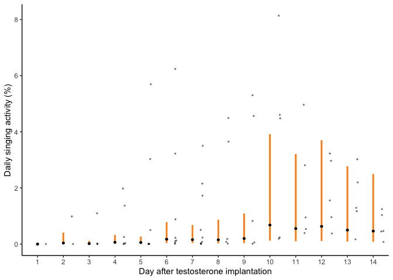<!-- -->

``` r
# posterior probabilities
Daily_SongRate_pp = pp(new_data_mod_a); Daily_SongRate_pp
```

    ## # A tibble: 91 × 4
    ##    DayN1 DayN2    pp `sig (2>1)`
    ##    <fct> <fct> <dbl> <chr>      
    ##  1 1     2     0.988 sig        
    ##  2 1     3     0.974 sig        
    ##  3 1     4     0.998 sig        
    ##  4 1     5     0.997 sig        
    ##  5 1     6     0.999 sig        
    ##  6 1     7     1.00  sig        
    ##  7 1     8     0.999 sig        
    ##  8 1     9     1.00  sig        
    ##  9 1     10    1.00  sig        
    ## 10 1     11    1     sig        
    ## # ℹ 81 more rows

``` r
# estimates and credible intervals
DailySongRate_n_Day_df_t = rbind(cbind("Var" = "DailySongRate", "Parameter" = levels(db$n_Day), 
                   "Estimate" = Ind_b, t(Ind_b_CrI)),
             cbind("Var" = "DailySongRate", "Parameter" = "random_Bird", 
                   "Estimate" =  Ind_random_Bird, t(Ind_random_Bird_CrI)),
             cbind("Var" = "DailySongRate", "Parameter" = "random_Group", 
                   "Estimate" =  Ind_random_Group, t(Ind_random_Group_CrI)),
             cbind("Var" = "DailySongRate", "Parameter" = "residual", 
                   "Estimate" =  Ind_residual, t(Ind_residual_CrI))); DailySongRate_n_Day_df_t
```

    ##             Var             Parameter      Estimate          
    ## (Intercept) "DailySongRate" "1"            "-7.3791021001253"
    ## n_Day2      "DailySongRate" "2"            "4.08594654644509"
    ## n_Day3      "DailySongRate" "3"            "3.35462229534187"
    ## n_Day4      "DailySongRate" "4"            "4.63507349100919"
    ## n_Day5      "DailySongRate" "5"            "4.51553689570965"
    ## n_Day6      "DailySongRate" "6"            "5.62592324686639"
    ## n_Day7      "DailySongRate" "7"            "5.54041616839918"
    ## n_Day8      "DailySongRate" "8"            "5.51614653142636"
    ## n_Day9      "DailySongRate" "9"            "5.7605397839007" 
    ## n_Day10     "DailySongRate" "10"           "6.99246273143844"
    ## n_Day11     "DailySongRate" "11"           "6.78806961609057"
    ## n_Day12     "DailySongRate" "12"           "6.92024094135906"
    ## n_Day13     "DailySongRate" "13"           "6.68931378383811"
    ## n_Day14     "DailySongRate" "14"           "6.62289785459073"
    ##             "DailySongRate" "random_Bird"  "3.06271716750642"
    ##             "DailySongRate" "random_Group" "0"               
    ##             "DailySongRate" "residual"     "1.99565782522923"
    ##             2.5%                  97.5%              
    ## (Intercept) "-10.5202081671249"   "-4.23116321237014"
    ## n_Day2      "0.520540933458506"   "7.61605738777396" 
    ## n_Day3      "-0.0404995709415105" "6.63064972920907" 
    ## n_Day4      "1.46879715261157"    "7.76974145127626" 
    ## n_Day5      "1.33805497684626"    "7.62223441316813" 
    ## n_Day6      "2.434439174217"      "8.67444604532436" 
    ## n_Day7      "2.41146058640355"    "8.63099760657148" 
    ## n_Day8      "2.28286555182477"    "8.66594348985332" 
    ## n_Day9      "2.57526635669323"    "8.95233292826387" 
    ## n_Day10     "3.76237701851348"    "10.2550484511168" 
    ## n_Day11     "3.57861981349923"    "10.0520849891274" 
    ## n_Day12     "3.69587858946181"    "10.1083650072562" 
    ## n_Day13     "3.47885996399957"    "9.86704760252191" 
    ## n_Day14     "3.3391746185941"     "9.83281223121226" 
    ##             "1.66773124116106"    "6.22002163905965" 
    ##             "0"                   "0"                
    ##             "1.42891774147679"    "2.98538251179996"

### Fig. 1D, Supplementary Table 2 and 3

``` r
db = Song_data 

head(db)
```

    ## # A tibble: 6 × 12
    ##   Ind   Individual Group n_Group FisrtDate  n_Day StartTime  Daily_SongRate
    ##   <chr>      <dbl> <fct>   <dbl> <chr>      <dbl> <chr>               <dbl>
    ## 1 b1             1 T7d         1 2014/11/26     2 2014/11/28        0.00574
    ## 2 b1             1 T7d         1 2014/11/26     4 2014/11/30        0.00736
    ## 3 b1             1 T7d         1 2014/11/26     5 2014/12/1         0.00636
    ## 4 b1             1 T7d         1 2014/11/26     6 2014/12/2         0.225  
    ## 5 b1             1 T7d         1 2014/11/26     6 2014/12/2         0.225  
    ## 6 b1             1 T7d         1 2014/11/26     6 2014/12/2         0.225  
    ## # ℹ 4 more variables: SongLen <dbl>, SylperSong <dbl>, RepetitionRate <dbl>,
    ## #   slope <dbl>

``` r
db$n_Group = factor(db$n_Group)
length(unique(db$n_Group))
```

    ## [1] 2

``` r
db$n_Day = factor(db$n_Day)
db$n_Day = droplevels(db$n_Day)
length(unique(db$n_Day))
```

    ## [1] 14

``` r
db$Individual = factor(db$Individual)
db$Individual <- droplevels(db$Individual)
length(unique(db$Individual))
```

    ## [1] 11

``` r
y_lab = 'Song length (s)'

## deciding using sqrt or not and evaluating model
mod_a <- lmer(data = db, log(SongLen) ~ n_Day + (1|Individual) + (1|n_Group) ) # log

plot(mod_a)  
```

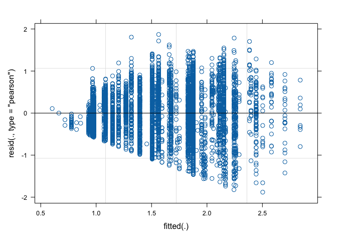<!-- -->

``` r
summary(mod_a)
```

    ## Linear mixed model fit by REML ['lmerMod']
    ## Formula: log(SongLen) ~ n_Day + (1 | Individual) + (1 | n_Group)
    ##    Data: db
    ## 
    ## REML criterion at convergence: 8725.2
    ## 
    ## Scaled residuals: 
    ##     Min      1Q  Median      3Q     Max 
    ## -3.4517 -0.6105  0.0224  0.6575  3.4318 
    ## 
    ## Random effects:
    ##  Groups     Name        Variance Std.Dev.
    ##  Individual (Intercept) 0.220583 0.46966 
    ##  n_Group    (Intercept) 0.009648 0.09823 
    ##  Residual               0.296844 0.54483 
    ## Number of obs: 5320, groups:  Individual, 11; n_Group, 2
    ## 
    ## Fixed effects:
    ##             Estimate Std. Error t value
    ## (Intercept)   0.4089     0.5709   0.716
    ## n_Day2        0.3041     0.5472   0.556
    ## n_Day3        0.5392     0.5476   0.985
    ## n_Day4        0.6543     0.5460   1.198
    ## n_Day5        0.9000     0.5454   1.650
    ## n_Day6        1.0116     0.5455   1.854
    ## n_Day7        1.1655     0.5457   2.136
    ## n_Day8        1.2128     0.5458   2.222
    ## n_Day9        1.1768     0.5455   2.157
    ## n_Day10       1.2127     0.5453   2.224
    ## n_Day11       1.3195     0.5457   2.418
    ## n_Day12       1.5037     0.5459   2.755
    ## n_Day13       1.3056     0.5461   2.391
    ## n_Day14       1.7633     0.5476   3.220

    ## 
    ## Correlation matrix not shown by default, as p = 14 > 12.
    ## Use print(x, correlation=TRUE)  or
    ##     vcov(x)        if you need it

``` r
plot.new()
```

<!-- -->

``` r
par(mfrow=c(2,2))
qqnorm(resid(mod_a))
qqline(resid(mod_a))
qqnorm(ranef(mod_a)$"n_Group"[,1])   # random effect
qqline(ranef(mod_a)$"n_Group"[,1])
scatter.smooth(fitted(mod_a), resid(mod_a))


new_data_mod_a <- expand.grid(n_Day = levels(db$n_Day)) # fix effect
xmat <- model.matrix(~ n_Day, data=new_data_mod_a)  # fix effect
new_data_mod_a$fit <- xmat%*%fixef(mod_a)

nsim <- 10000
bsim <- arm::sim(mod_a, n.sim=nsim ) #simulation of the model 10000 times

## To get the mean estimate of the fixed effects parameters apply(bsim@fixef, 2, mean)
apply(bsim@fixef, 2, mean)
```

    ## (Intercept)      n_Day2      n_Day3      n_Day4      n_Day5      n_Day6 
    ##   0.4092558   0.3029485   0.5383058   0.6534125   0.8983456   1.0104641 
    ##      n_Day7      n_Day8      n_Day9     n_Day10     n_Day11     n_Day12 
    ##   1.1642563   1.2111899   1.1750750   1.2108248   1.3175639   1.5022223 
    ##     n_Day13     n_Day14 
    ##   1.3042543   1.7616227

``` r
## To get the 95% credible Interval estimate of the fixed effects parameters apply(bsim@fixef, 2, quantile, prob=c(0.025, 0.975))
apply(bsim@fixef, 2, quantile, prob=c(0.025, 0.975))
```

    ##       (Intercept)     n_Day2     n_Day3     n_Day4    n_Day5      n_Day6
    ## 2.5%   -0.7089293 -0.7694128 -0.5239299 -0.4161014 -0.174475 -0.06077867
    ## 97.5%   1.5228870  1.3706858  1.5920354  1.7137823  1.957964  2.06961977
    ##           n_Day7   n_Day8     n_Day9  n_Day10   n_Day11   n_Day12  n_Day13
    ## 2.5%  0.09501727 0.144774 0.09604011 0.143458 0.2545565 0.4325037 0.240153
    ## 97.5% 2.23084078 2.273637 2.24135191 2.275507 2.3734739 2.5537226 2.365844
    ##        n_Day14
    ## 2.5%  0.694054
    ## 97.5% 2.825975

``` r
Ind_b_CrI = apply(bsim@fixef, 2, quantile, prob=c(0.025, 0.975)) 

Ind_b = mod_a@beta
x = as.data.frame(VarCorr(mod_a))
Ind_random_Bird = x[1, 4]
Ind_random_Group = x[2, 4]
Ind_residual = x[3, 4]
Ind_random_Bird_CrI = quantile(apply(bsim@ranef$Individual[,,1],1,var),prob=c(0.025, 0.975))
Ind_random_Group_CrI = quantile(apply(bsim@ranef$n_Group[,,1],1,var),prob=c(0.025, 0.975))
Ind_residual_CrI = quantile(bsim@sigma^2,c(0.025, 0.975))


fitmat <- matrix(ncol=nsim, nrow=nrow(new_data_mod_a))
for(i in 1:nsim) fitmat[,i] <- xmat %*% bsim@fixef[i,]    # fitted values
new_data_mod_a$lower <- apply(fitmat, 1, quantile, prob=0.025)
new_data_mod_a$upper <- apply(fitmat, 1, quantile, prob=0.975)
new_data_mod_a$fit <- apply(fitmat, 1, mean)
new_data_mod_a$fit_exp <- exp(new_data_mod_a$fit)        # transform back from log
new_data_mod_a$upper_exp <- exp(new_data_mod_a$upper)    # transform back from log
new_data_mod_a$lower_exp <- exp(new_data_mod_a$lower)    # transform back from log

w = 0.35
grey_point_size = 0.5
mean_point_size = 1
errorbar_wd = 1
errorbar_hori = 0
dodge = position_jitter(width = 0.05,height = 0)

errorbar_col = "darkorange" # for grey raw data

SongLen_p = ggplot(new_data_mod_a) +
  # need this layer to set up
  geom_point(data = new_data_mod_a,
             aes(x = n_Day, y = fit_exp), color='black', size=mean_point_size) +
  # raw data
  geom_point(data = db, 
             aes(x = as.numeric(n_Day)+w, y = SongLen),
             position = dodge, alpha = 0.4, size = grey_point_size, color = 'grey50') +
  # CI
  geom_errorbar(data = new_data_mod_a,
                aes(x = n_Day, ymax = upper_exp, ymin = lower_exp),
                width = errorbar_hori, size = errorbar_wd,
                color = errorbar_col) +
  # estimate
  geom_point(data = new_data_mod_a,
             aes(x = n_Day, y = fit_exp), color='black', size=mean_point_size) +
  xlab('Day after testosterone implantation') +
  ylab(y_lab) + theme_classic() +
  theme(legend.position = 'none') ; SongLen_p

SongLen_p = SongLen_p +  scale_y_break(c(13, 20), scales = 0.25) +
  theme(axis.title.y = element_text(angle = 90)); SongLen_p
```

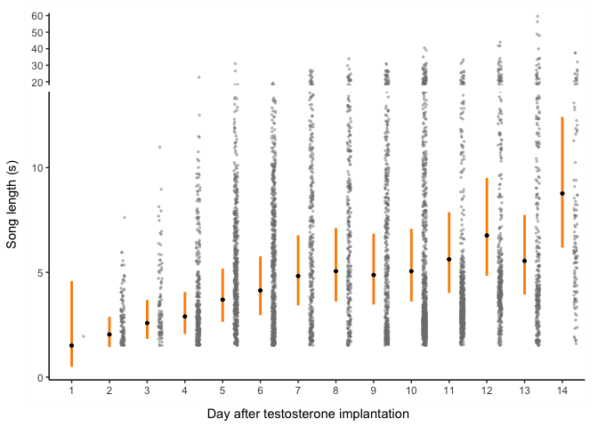<!-- -->

``` r
# posterior probabilities
SongLen_pp = pp(new_data_mod_a); SongLen_pp
```

    ## # A tibble: 91 × 4
    ##    DayN1 DayN2    pp `sig (2>1)`
    ##    <fct> <fct> <dbl> <chr>      
    ##  1 1     2     0.713 <NA>       
    ##  2 1     3     0.842 <NA>       
    ##  3 1     4     0.888 <NA>       
    ##  4 1     5     0.951 sig        
    ##  5 1     6     0.969 sig        
    ##  6 1     7     0.984 sig        
    ##  7 1     8     0.987 sig        
    ##  8 1     9     0.985 sig        
    ##  9 1     10    0.987 sig        
    ## 10 1     11    0.992 sig        
    ## # ℹ 81 more rows

``` r
# estimates and credible intervals
SongLen_n_Day_df_t = rbind(cbind("Var" = "SongLen", "Parameter" = levels(db$n_Day), 
                   "Estimate" = Ind_b, t(Ind_b_CrI)),
             cbind("Var" = "SongLen", "Parameter" = "random_Bird", 
                   "Estimate" =  Ind_random_Bird, t(Ind_random_Bird_CrI)),
             cbind("Var" = "SongLen", "Parameter" = "random_Group", 
                   "Estimate" =  Ind_random_Group, t(Ind_random_Group_CrI)),
             cbind("Var" = "SongLen", "Parameter" = "residual", 
                   "Estimate" =  Ind_residual, t(Ind_residual_CrI))); SongLen_n_Day_df_t
```

    ##             Var       Parameter      Estimate             
    ## (Intercept) "SongLen" "1"            "0.408877621533778"  
    ## n_Day2      "SongLen" "2"            "0.30411997187164"   
    ## n_Day3      "SongLen" "3"            "0.539235224482263"  
    ## n_Day4      "SongLen" "4"            "0.654280080200714"  
    ## n_Day5      "SongLen" "5"            "0.900018269066106"  
    ## n_Day6      "SongLen" "6"            "1.01163943350999"   
    ## n_Day7      "SongLen" "7"            "1.16546571618205"   
    ## n_Day8      "SongLen" "8"            "1.21279167216877"   
    ## n_Day9      "SongLen" "9"            "1.17676528524999"   
    ## n_Day10     "SongLen" "10"           "1.21268375091389"   
    ## n_Day11     "SongLen" "11"           "1.31946360738765"   
    ## n_Day12     "SongLen" "12"           "1.50369536397137"   
    ## n_Day13     "SongLen" "13"           "1.30560271589117"   
    ## n_Day14     "SongLen" "14"           "1.76334274472485"   
    ##             "SongLen" "random_Bird"  "0.220583038095147"  
    ##             "SongLen" "random_Group" "0.00964832741236533"
    ##             "SongLen" "residual"     "0.296843980879307"  
    ##             2.5%                   97.5%               
    ## (Intercept) "-0.708929290540515"   "1.52288700530185"  
    ## n_Day2      "-0.769412761206345"   "1.37068579031034"  
    ## n_Day3      "-0.523929946086565"   "1.59203544303972"  
    ## n_Day4      "-0.41610140260968"    "1.7137822610497"   
    ## n_Day5      "-0.17447497117897"    "1.95796434417528"  
    ## n_Day6      "-0.060778667231798"   "2.06961977082067"  
    ## n_Day7      "0.0950172669872607"   "2.23084078301628"  
    ## n_Day8      "0.144774034746233"    "2.27363660719728"  
    ## n_Day9      "0.0960401133169803"   "2.24135191486995"  
    ## n_Day10     "0.143458018368285"    "2.27550674691685"  
    ## n_Day11     "0.254556493256585"    "2.37347391626737"  
    ## n_Day12     "0.432503746286573"    "2.55372258607426"  
    ## n_Day13     "0.24015300984778"     "2.36584378990838"  
    ## n_Day14     "0.694053971334779"    "2.82597463835988"  
    ##             "0.153751921581596"    "0.381251855883199" 
    ##             "6.61197403207525e-06" "0.0369798371988763"
    ##             "0.285497268152727"    "0.308510859531702"

### Fig. 1E, Supplementary Table 2 and 3

``` r
db = Song_data 

head(db)
```

    ## # A tibble: 6 × 12
    ##   Ind   Individual Group n_Group FisrtDate  n_Day StartTime  Daily_SongRate
    ##   <chr>      <dbl> <fct>   <dbl> <chr>      <dbl> <chr>               <dbl>
    ## 1 b1             1 T7d         1 2014/11/26     2 2014/11/28        0.00574
    ## 2 b1             1 T7d         1 2014/11/26     4 2014/11/30        0.00736
    ## 3 b1             1 T7d         1 2014/11/26     5 2014/12/1         0.00636
    ## 4 b1             1 T7d         1 2014/11/26     6 2014/12/2         0.225  
    ## 5 b1             1 T7d         1 2014/11/26     6 2014/12/2         0.225  
    ## 6 b1             1 T7d         1 2014/11/26     6 2014/12/2         0.225  
    ## # ℹ 4 more variables: SongLen <dbl>, SylperSong <dbl>, RepetitionRate <dbl>,
    ## #   slope <dbl>

``` r
db$n_Group = factor(db$n_Group)
length(unique(db$n_Group))
```

    ## [1] 2

``` r
db$n_Day = factor(db$n_Day)
db$n_Day = droplevels(db$n_Day)
length(unique(db$n_Day))
```

    ## [1] 14

``` r
db$Individual = factor(db$Individual)
db$Individual <- droplevels(db$Individual)
length(unique(db$Individual))
```

    ## [1] 11

``` r
y_lab = 'Number of syllables per song'

## deciding using sqrt or not and evaluating model
mod_a <- lmer(data = db, log(SylperSong) ~ n_Day + (1|Individual) + (1|n_Group) ) # log

plot(mod_a)  
```

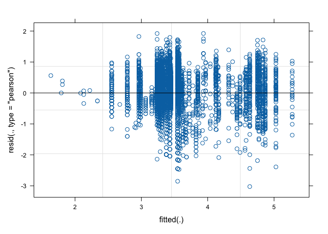<!-- -->

``` r
summary(mod_a)
```

    ## Linear mixed model fit by REML ['lmerMod']
    ## Formula: log(SylperSong) ~ n_Day + (1 | Individual) + (1 | n_Group)
    ##    Data: db
    ## 
    ## REML criterion at convergence: 10032
    ## 
    ## Scaled residuals: 
    ##     Min      1Q  Median      3Q     Max 
    ## -4.9108 -0.4943  0.0199  0.6202  3.1212 
    ## 
    ## Random effects:
    ##  Groups     Name        Variance Std.Dev.
    ##  Individual (Intercept) 0.52923  0.7275  
    ##  n_Group    (Intercept) 0.03383  0.1839  
    ##  Residual               0.37934  0.6159  
    ## Number of obs: 5320, groups:  Individual, 11; n_Group, 2
    ## 
    ## Fixed effects:
    ##             Estimate Std. Error t value
    ## (Intercept)   1.6716     0.6716   2.489
    ## n_Day2        0.7608     0.6186   1.230
    ## n_Day3        0.9960     0.6190   1.609
    ## n_Day4        1.1709     0.6172   1.897
    ## n_Day5        1.4455     0.6166   2.344
    ## n_Day6        1.4918     0.6167   2.419
    ## n_Day7        1.5831     0.6169   2.566
    ## n_Day8        1.6382     0.6170   2.655
    ## n_Day9        1.7761     0.6167   2.880
    ## n_Day10       1.7543     0.6164   2.846
    ## n_Day11       1.8710     0.6168   3.033
    ## n_Day12       2.0325     0.6171   3.294
    ## n_Day13       1.8382     0.6174   2.977
    ## n_Day14       2.2782     0.6190   3.680

    ## 
    ## Correlation matrix not shown by default, as p = 14 > 12.
    ## Use print(x, correlation=TRUE)  or
    ##     vcov(x)        if you need it

``` r
plot.new()
par(mfrow=c(2,2))
qqnorm(resid(mod_a))
qqline(resid(mod_a))
qqnorm(ranef(mod_a)$"Individual"[,1])   # random effect
qqline(ranef(mod_a)$"Individual"[,1])
qqnorm(ranef(mod_a)$"n_Group"[,1])   # random effect
qqline(ranef(mod_a)$"n_Group"[,1])
scatter.smooth(fitted(mod_a), resid(mod_a))
```

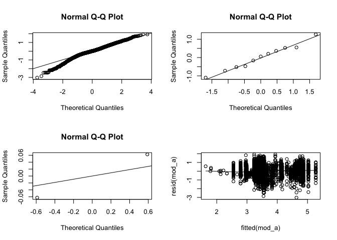<!-- -->

``` r
new_data_mod_a <- expand.grid(n_Day = levels(db$n_Day)) # fix effect
xmat <- model.matrix(~ n_Day, data=new_data_mod_a)  # fix effect
new_data_mod_a$fit <- xmat%*%fixef(mod_a)

nsim <- 10000
bsim <- arm::sim(mod_a, n.sim=nsim ) #simulation of the model 10000 times

## To get the mean estimate of the fixed effects parameters apply(bsim@fixef, 2, mean)
apply(bsim@fixef, 2, mean)
```

    ## (Intercept)      n_Day2      n_Day3      n_Day4      n_Day5      n_Day6 
    ##   1.6777063   0.7608066   0.9966235   1.1720741   1.4468619   1.4929589 
    ##      n_Day7      n_Day8      n_Day9     n_Day10     n_Day11     n_Day12 
    ##   1.5838454   1.6390861   1.7765632   1.7548743   1.8720123   2.0332842 
    ##     n_Day13     n_Day14 
    ##   1.8387920   2.2782687

``` r
## To get the 95% credible Interval estimate of the fixed effects parameters apply(bsim@fixef, 2, quantile, prob=c(0.025, 0.975))
apply(bsim@fixef, 2, quantile, prob=c(0.025, 0.975))
```

    ##       (Intercept)    n_Day2    n_Day3      n_Day4    n_Day5    n_Day6    n_Day7
    ## 2.5%    0.3667992 -0.449152 -0.199233 -0.02860305 0.2472865 0.2975313 0.3918615
    ## 97.5%   2.9722200  1.966072  2.197217  2.36464757 2.6464446 2.6895921 2.7758199
    ##          n_Day8    n_Day9   n_Day10   n_Day11   n_Day12  n_Day13  n_Day14
    ## 2.5%  0.4370571 0.5802467 0.5615665 0.6713161 0.8297493 0.642091 1.078920
    ## 97.5% 2.8402207 2.9711784 2.9558156 3.0635226 3.2287156 3.041078 3.481456

``` r
Ind_b_CrI = apply(bsim@fixef, 2, quantile, prob=c(0.025, 0.975)) 

Ind_b = mod_a@beta
x = as.data.frame(VarCorr(mod_a))
Ind_random_Bird = x[1, 4]
Ind_random_Group = x[2, 4]
Ind_residual = x[3, 4]
Ind_random_Bird_CrI = quantile(apply(bsim@ranef$Individual[,,1],1,var),prob=c(0.025, 0.975))
Ind_random_Group_CrI = quantile(apply(bsim@ranef$n_Group[,,1],1,var),prob=c(0.025, 0.975))
Ind_residual_CrI = quantile(bsim@sigma^2,c(0.025, 0.975))


fitmat <- matrix(ncol=nsim, nrow=nrow(new_data_mod_a))
for(i in 1:nsim) fitmat[,i] <- xmat %*% bsim@fixef[i,]    # fitted values
new_data_mod_a$lower <- apply(fitmat, 1, quantile, prob=0.025)
new_data_mod_a$upper <- apply(fitmat, 1, quantile, prob=0.975)
new_data_mod_a$fit <- apply(fitmat, 1, mean)

new_data_mod_a$fit_exp <- exp(new_data_mod_a$fit)        # transform back from log
new_data_mod_a$upper_exp <- exp(new_data_mod_a$upper)    # transform back from log
new_data_mod_a$lower_exp <- exp(new_data_mod_a$lower)    # transform back from log

w = 0.35
grey_point_size = 0.5
mean_point_size = 1
errorbar_wd = 1
errorbar_hori = 0
dodge = position_jitter(width = 0.05,height = 0)

errorbar_col = "darkorange" # for grey raw data

SylperSong_p = ggplot(new_data_mod_a) +
  # need this layer to set up
  geom_point(data = new_data_mod_a,
             aes(x = n_Day, y = fit_exp), color='black', size=mean_point_size) +
  # raw data
  geom_point(data = db, 
             aes(x = as.numeric(n_Day)+w, y = SylperSong),
             position = dodge, alpha = 0.4, size = grey_point_size, color = 'grey50') +
  # CI
  geom_errorbar(data = new_data_mod_a,
                aes(x = n_Day, ymax = upper_exp, ymin = lower_exp),
                width = errorbar_hori, size = errorbar_wd,
                color = errorbar_col) +
  # estimate
  geom_point(data = new_data_mod_a,
             aes(x = n_Day, y = fit_exp), color='black', size=mean_point_size) +
  xlab('Day after testosterone implantation') +
  ylab(y_lab) + theme_classic() +
  theme(legend.position = 'none') ; SylperSong_p
```

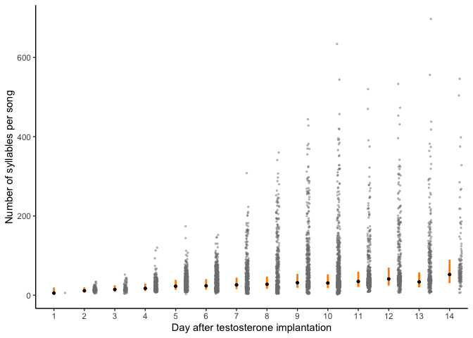<!-- -->

``` r
SylperSong_p = SylperSong_p +  scale_y_break(c(90, 200), scales = 0.25) +
  theme(axis.title.y = element_text(angle = 90)); SylperSong_p
```

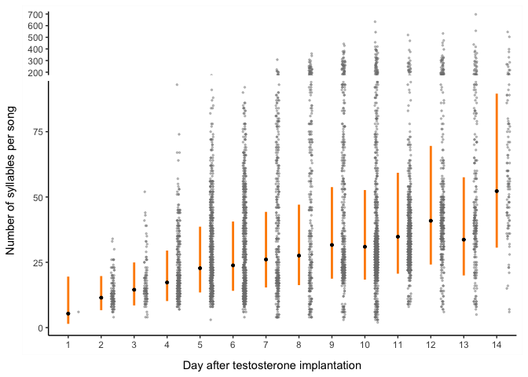<!-- -->

``` r
# posterior probabilities
SylperSong_pp = pp(new_data_mod_a); SylperSong_pp
```

    ## # A tibble: 91 × 4
    ##    DayN1 DayN2    pp `sig (2>1)`
    ##    <fct> <fct> <dbl> <chr>      
    ##  1 1     2     0.887 <NA>       
    ##  2 1     3     0.945 <NA>       
    ##  3 1     4     0.972 sig        
    ##  4 1     5     0.992 sig        
    ##  5 1     6     0.993 sig        
    ##  6 1     7     0.996 sig        
    ##  7 1     8     0.996 sig        
    ##  8 1     9     0.998 sig        
    ##  9 1     10    0.998 sig        
    ## 10 1     11    0.998 sig        
    ## # ℹ 81 more rows

``` r
# estimates and credible intervals
SylperSong_n_Day_df_t = rbind(cbind("Var" = "SongLen", "Parameter" = levels(db$n_Day), 
                   "Estimate" = Ind_b, t(Ind_b_CrI)),
             cbind("Var" = "SongLen", "Parameter" = "random_Bird", 
                   "Estimate" =  Ind_random_Bird, t(Ind_random_Bird_CrI)),
             cbind("Var" = "SongLen", "Parameter" = "random_Group", 
                   "Estimate" =  Ind_random_Group, t(Ind_random_Group_CrI)),
             cbind("Var" = "SongLen", "Parameter" = "residual", 
                   "Estimate" =  Ind_residual, t(Ind_residual_CrI))); SylperSong_n_Day_df_t
```

    ##             Var       Parameter      Estimate            
    ## (Intercept) "SongLen" "1"            "1.67163422006944"  
    ## n_Day2      "SongLen" "2"            "0.760753041771838" 
    ## n_Day3      "SongLen" "3"            "0.99604557541803"  
    ## n_Day4      "SongLen" "4"            "1.17094566731166"  
    ## n_Day5      "SongLen" "5"            "1.44552798536124"  
    ## n_Day6      "SongLen" "6"            "1.49181176096037"  
    ## n_Day7      "SongLen" "7"            "1.58312243590543"  
    ## n_Day8      "SongLen" "8"            "1.63824492022871"  
    ## n_Day9      "SongLen" "9"            "1.77612339401822"  
    ## n_Day10     "SongLen" "10"           "1.75433258609659"  
    ## n_Day11     "SongLen" "11"           "1.87100027991533"  
    ## n_Day12     "SongLen" "12"           "2.03248691056055"  
    ## n_Day13     "SongLen" "13"           "1.83821771924995"  
    ## n_Day14     "SongLen" "14"           "2.27821057166394"  
    ##             "SongLen" "random_Bird"  "0.529234620363393" 
    ##             "SongLen" "random_Group" "0.0338322307377061"
    ##             "SongLen" "residual"     "0.379343951398784" 
    ##             2.5%                   97.5%              
    ## (Intercept) "0.366799194905605"    "2.97221997881394" 
    ## n_Day2      "-0.449152017454275"   "1.966072290327"   
    ## n_Day3      "-0.199233010932617"   "2.19721690784442" 
    ## n_Day4      "-0.0286030482658145"  "2.36464756567012" 
    ## n_Day5      "0.247286453557895"    "2.64644463730845" 
    ## n_Day6      "0.297531264942298"    "2.68959210646879" 
    ## n_Day7      "0.391861543711674"    "2.77581994197138" 
    ## n_Day8      "0.437057141776921"    "2.84022067375397" 
    ## n_Day9      "0.580246745028163"    "2.97117843122995" 
    ## n_Day10     "0.561566478044506"    "2.95581563639469" 
    ## n_Day11     "0.671316113300703"    "3.06352257124484" 
    ## n_Day12     "0.829749331221887"    "3.22871560678356" 
    ## n_Day13     "0.642091012943715"    "3.04107838857491" 
    ## n_Day14     "1.07891964868698"     "3.48145588429272" 
    ##             "0.319029308269996"    "0.972723101449872"
    ##             "2.54810223019876e-05" "0.135997234020799"
    ##             "0.364889601715051"    "0.393951785292804"

### Fig. 1F, Supplementary Table 2 and 3

``` r
db = Song_data 

head(db)
```

    ## # A tibble: 6 × 12
    ##   Ind   Individual Group n_Group FisrtDate  n_Day StartTime  Daily_SongRate
    ##   <chr>      <dbl> <fct>   <dbl> <chr>      <dbl> <chr>               <dbl>
    ## 1 b1             1 T7d         1 2014/11/26     2 2014/11/28        0.00574
    ## 2 b1             1 T7d         1 2014/11/26     4 2014/11/30        0.00736
    ## 3 b1             1 T7d         1 2014/11/26     5 2014/12/1         0.00636
    ## 4 b1             1 T7d         1 2014/11/26     6 2014/12/2         0.225  
    ## 5 b1             1 T7d         1 2014/11/26     6 2014/12/2         0.225  
    ## 6 b1             1 T7d         1 2014/11/26     6 2014/12/2         0.225  
    ## # ℹ 4 more variables: SongLen <dbl>, SylperSong <dbl>, RepetitionRate <dbl>,
    ## #   slope <dbl>

``` r
db$n_Group = factor(db$n_Group)
length(unique(db$n_Group))
```

    ## [1] 2

``` r
db$n_Day = factor(db$n_Day)
db$n_Day = droplevels(db$n_Day)
length(unique(db$n_Day))
```

    ## [1] 14

``` r
db$Individual = factor(db$Individual)
db$Individual <- droplevels(db$Individual)
length(unique(db$Individual))
```

    ## [1] 11

``` r
y_lab = 'Repetition rate (syl/s)'

## deciding using sqrt or not and evaluating model
mod_a <- lmer(data = db, log(RepetitionRate) ~ n_Day + (1|Individual) + (1|n_Group) ) # log

plot(mod_a)  
```

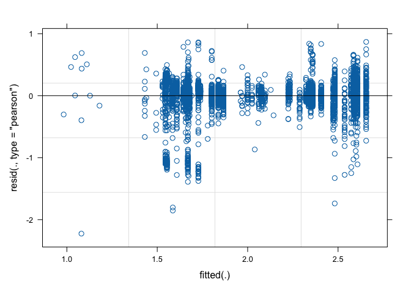<!-- -->

``` r
summary(mod_a)
```

    ## Linear mixed model fit by REML ['lmerMod']
    ## Formula: log(RepetitionRate) ~ n_Day + (1 | Individual) + (1 | n_Group)
    ##    Data: db
    ## 
    ## REML criterion at convergence: 399.7
    ## 
    ## Scaled residuals: 
    ##     Min      1Q  Median      3Q     Max 
    ## -8.9628 -0.2291  0.0701  0.4366  3.4940 
    ## 
    ## Random effects:
    ##  Groups     Name        Variance  Std.Dev. 
    ##  Individual (Intercept) 2.132e-01 4.618e-01
    ##  n_Group    (Intercept) 7.309e-09 8.549e-05
    ##  Residual               6.166e-02 2.483e-01
    ## Number of obs: 5320, groups:  Individual, 11; n_Group, 2
    ## 
    ## Fixed effects:
    ##             Estimate Std. Error t value
    ## (Intercept)   1.2789     0.2868   4.460
    ## n_Day2        0.4566     0.2494   1.831
    ## n_Day3        0.4578     0.2496   1.835
    ## n_Day4        0.5167     0.2488   2.077
    ## n_Day5        0.5452     0.2486   2.193
    ## n_Day6        0.4801     0.2486   1.931
    ## n_Day7        0.4171     0.2487   1.677
    ## n_Day8        0.4254     0.2487   1.710
    ## n_Day9        0.5992     0.2486   2.410
    ## n_Day10       0.5414     0.2485   2.178
    ## n_Day11       0.5513     0.2487   2.217
    ## n_Day12       0.5288     0.2488   2.126
    ## n_Day13       0.5328     0.2489   2.141
    ## n_Day14       0.5151     0.2496   2.064

    ## 
    ## Correlation matrix not shown by default, as p = 14 > 12.
    ## Use print(x, correlation=TRUE)  or
    ##     vcov(x)        if you need it

``` r
plot.new()
par(mfrow=c(2,2))
qqnorm(resid(mod_a))
qqline(resid(mod_a))
qqnorm(ranef(mod_a)$"Individual"[,1])   # random effect
qqline(ranef(mod_a)$"Individual"[,1])
qqnorm(ranef(mod_a)$"n_Group"[,1])   # random effect
qqline(ranef(mod_a)$"n_Group"[,1])
scatter.smooth(fitted(mod_a), resid(mod_a))
```

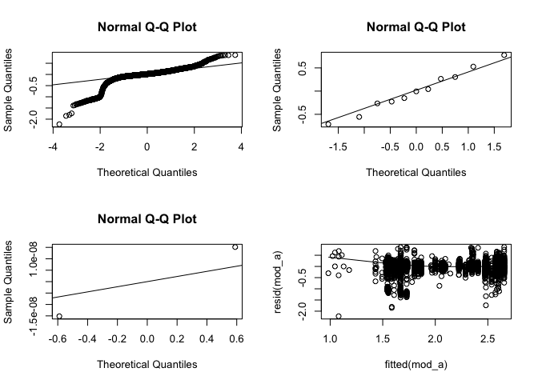<!-- -->

``` r
new_data_mod_a <- expand.grid(n_Day = levels(db$n_Day)) # fix effect
xmat <- model.matrix(~ n_Day, data=new_data_mod_a)  # fix effect
new_data_mod_a$fit <- xmat%*%fixef(mod_a)

nsim <- 10000
bsim <- arm::sim(mod_a, n.sim=nsim ) #simulation of the model 10000 times

## To get the mean estimate of the fixed effects parameters apply(bsim@fixef, 2, mean)
apply(bsim@fixef, 2, mean)
```

    ## (Intercept)      n_Day2      n_Day3      n_Day4      n_Day5      n_Day6 
    ##   1.2813134   0.4526886   0.4529814   0.5127431   0.5410758   0.4760409 
    ##      n_Day7      n_Day8      n_Day9     n_Day10     n_Day11     n_Day12 
    ##   0.4129545   0.4216376   0.5951470   0.5372381   0.5471886   0.5247618 
    ##     n_Day13     n_Day14 
    ##   0.5286752   0.5111410

``` r
## To get the 95% credible Interval estimate of the fixed effects parameters apply(bsim@fixef, 2, quantile, prob=c(0.025, 0.975))
apply(bsim@fixef, 2, quantile, prob=c(0.025, 0.975))
```

    ##       (Intercept)     n_Day2      n_Day3     n_Day4     n_Day5      n_Day6
    ## 2.5%     0.718168 -0.0434310 -0.04202458 0.01730549 0.04667729 -0.01457926
    ## 97.5%    1.849516  0.9345233  0.93960645 0.99327622 1.02015719  0.95869458
    ##            n_Day7      n_Day8    n_Day9    n_Day10    n_Day11    n_Day12
    ## 2.5%  -0.07724549 -0.07056545 0.1045413 0.04403377 0.05455622 0.03595687
    ## 97.5%  0.89106131  0.90287018 1.0730255 1.01779929 1.02544551 1.00493856
    ##          n_Day13   n_Day14
    ## 2.5%  0.03387384 0.0176947
    ## 97.5% 1.01018935 0.9953373

``` r
Ind_b_CrI = apply(bsim@fixef, 2, quantile, prob=c(0.025, 0.975)) 

Ind_b = mod_a@beta
x = as.data.frame(VarCorr(mod_a))
Ind_random_Bird = x[1, 4]
Ind_random_Group = x[2, 4]
Ind_residual = x[3, 4]
Ind_random_Bird_CrI = quantile(apply(bsim@ranef$Individual[,,1],1,var),prob=c(0.025, 0.975))
Ind_random_Group_CrI = quantile(apply(bsim@ranef$n_Group[,,1],1,var),prob=c(0.025, 0.975))
Ind_residual_CrI = quantile(bsim@sigma^2,c(0.025, 0.975))


fitmat <- matrix(ncol=nsim, nrow=nrow(new_data_mod_a))
for(i in 1:nsim) fitmat[,i] <- xmat %*% bsim@fixef[i,]    # fitted values
new_data_mod_a$lower <- apply(fitmat, 1, quantile, prob=0.025)
new_data_mod_a$upper <- apply(fitmat, 1, quantile, prob=0.975)
new_data_mod_a$fit <- apply(fitmat, 1, mean)

new_data_mod_a$fit_exp <- exp(new_data_mod_a$fit)        # transform back from log
new_data_mod_a$upper_exp <- exp(new_data_mod_a$upper)    # transform back from log
new_data_mod_a$lower_exp <- exp(new_data_mod_a$lower)    # transform back from log

w = 0.35
grey_point_size = 0.5
mean_point_size = 1
errorbar_wd = 1
errorbar_hori = 0
dodge = position_jitter(width = 0.05,height = 0)

errorbar_col = "darkorange" # for grey raw data

RepetitionRate_p = ggplot(new_data_mod_a) +
  # need this layer to set up
  geom_point(data = new_data_mod_a,
             aes(x = n_Day, y = fit_exp), color='black', size=mean_point_size) +
  # raw data
  geom_point(data = db, 
             aes(x = as.numeric(n_Day)+w, y = RepetitionRate),
             position = dodge, alpha = 0.4, size = grey_point_size, color = 'grey50') +
  # CI
  geom_errorbar(data = new_data_mod_a,
                aes(x = n_Day, ymax = upper_exp, ymin = lower_exp),
                width = errorbar_hori, size = errorbar_wd,
                color = errorbar_col) +
  # estimate
  geom_point(data = new_data_mod_a,
             aes(x = n_Day, y = fit_exp), color='black', size=mean_point_size) +
  xlab('Day after testosterone implantation') +
  ylab(y_lab) + theme_classic() +
  theme(legend.position = 'none') ; RepetitionRate_p
```

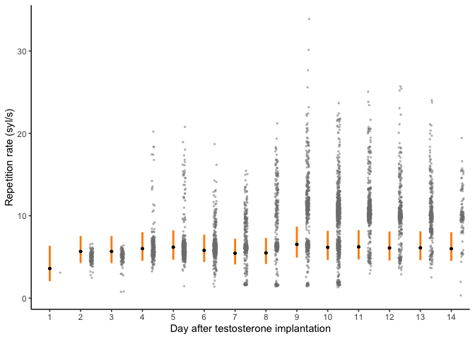<!-- -->

``` r
RepetitionRate_p = RepetitionRate_p + 
  scale_y_break(c(10, 20), scales = 0.25) +
  theme(axis.title.y = element_text(angle = 90)); RepetitionRate_p
```

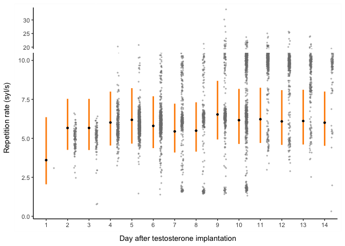<!-- -->

``` r
# posterior probabilities
RepetitionRate_pp = pp(new_data_mod_a); RepetitionRate_pp
```

    ## # A tibble: 91 × 4
    ##    DayN1 DayN2    pp `sig (2>1)`
    ##    <fct> <fct> <dbl> <chr>      
    ##  1 1     2     0.963 sig        
    ##  2 1     3     0.964 sig        
    ##  3 1     4     0.979 sig        
    ##  4 1     5     0.984 sig        
    ##  5 1     6     0.970 sig        
    ##  6 1     7     0.948 <NA>       
    ##  7 1     8     0.952 sig        
    ##  8 1     9     0.990 sig        
    ##  9 1     10    0.984 sig        
    ## 10 1     11    0.984 sig        
    ## # ℹ 81 more rows

``` r
# estimates and credible intervals
RepetitionRate_n_Day_df_t = rbind(cbind("Var" = "SongLen", "Parameter" = levels(db$n_Day), 
                   "Estimate" = Ind_b, t(Ind_b_CrI)),
             cbind("Var" = "SongLen", "Parameter" = "random_Bird", 
                   "Estimate" =  Ind_random_Bird, t(Ind_random_Bird_CrI)),
             cbind("Var" = "SongLen", "Parameter" = "random_Group", 
                   "Estimate" =  Ind_random_Group, t(Ind_random_Group_CrI)),
             cbind("Var" = "SongLen", "Parameter" = "residual", 
                   "Estimate" =  Ind_residual, t(Ind_residual_CrI))); RepetitionRate_n_Day_df_t
```

    ##             Var       Parameter      Estimate              
    ## (Intercept) "SongLen" "1"            "1.27892807573066"    
    ## n_Day2      "SongLen" "2"            "0.45661789706015"    
    ## n_Day3      "SongLen" "3"            "0.457841440178297"   
    ## n_Day4      "SongLen" "4"            "0.516717599934909"   
    ## n_Day5      "SongLen" "5"            "0.545167287019524"   
    ## n_Day6      "SongLen" "6"            "0.480102048966866"   
    ## n_Day7      "SongLen" "7"            "0.417144155805901"   
    ## n_Day8      "SongLen" "8"            "0.4254081752437"     
    ## n_Day9      "SongLen" "9"            "0.599227862418063"   
    ## n_Day10     "SongLen" "10"           "0.541363057461123"   
    ## n_Day11     "SongLen" "11"           "0.551276604749326"   
    ## n_Day12     "SongLen" "12"           "0.528823797804851"   
    ## n_Day13     "SongLen" "13"           "0.532806213676433"   
    ## n_Day14     "SongLen" "14"           "0.515106856602381"   
    ##             "SongLen" "random_Bird"  "0.213235216775422"   
    ##             "SongLen" "random_Group" "7.30851497383764e-09"
    ##             "SongLen" "residual"     "0.0616556185889664"  
    ##             2.5%                   97.5%                
    ## (Intercept) "0.718167974854135"    "1.84951597666236"   
    ## n_Day2      "-0.043431000480094"   "0.934523325355138"  
    ## n_Day3      "-0.042024579111452"   "0.939606454905728"  
    ## n_Day4      "0.0173054870625054"   "0.993276216494179"  
    ## n_Day5      "0.0466772914089888"   "1.02015718812108"   
    ## n_Day6      "-0.0145792560565177"  "0.958694583372544"  
    ## n_Day7      "-0.0772454909960212"  "0.891061312666665"  
    ## n_Day8      "-0.0705654478936435"  "0.902870179236031"  
    ## n_Day9      "0.104541305397277"    "1.07302546566605"   
    ## n_Day10     "0.0440337700509245"   "1.01779929353601"   
    ## n_Day11     "0.0545562150146702"   "1.02544551376663"   
    ## n_Day12     "0.0359568653619376"   "1.00493855765702"   
    ## n_Day13     "0.0338738446323589"   "1.01018935071293"   
    ## n_Day14     "0.0176946971766176"   "0.995337296894517"  
    ##             "0.142438673287976"    "0.438307517595552"  
    ##             "4.93597064952009e-12" "2.0025021601515e-08"
    ##             "0.0593833935853113"   "0.0641458259815963"

### Fig. 1G

``` r
library(tidyverse) # v.2.0.0
library(PMCMRplus)

path = paste0(getwd(), "/Data/HVC_volume.tsv")
HVC = read_tsv(path)
```

    ## Rows: 41 Columns: 4
    ## ── Column specification ────────────────────────────────────────────────────────
    ## Delimiter: "\t"
    ## chr (1): Group
    ## dbl (3): ProcessNum, HVC Volume (mm3), HVC_nor
    ## 
    ## ℹ Use `spec()` to retrieve the full column specification for this data.
    ## ℹ Specify the column types or set `show_col_types = FALSE` to quiet this message.

``` r
HVC$Group = factor(HVC$Group, levels = c("CON", "T1h", "T3h", "T8h", "T3d", "T7d", "T14d"))

HVC %>% group_by(Group) %>% summarise( count = length(unique(ProcessNum)),
                                         mean = mean(`HVC Volume (mm3)`, na.rm = T), 
                                         sd = sd(`HVC Volume (mm3)`, na.rm = T))
```

    ## # A tibble: 7 × 4
    ##   Group count   mean     sd
    ##   <fct> <int>  <dbl>  <dbl>
    ## 1 CON       6 0.103  0.0395
    ## 2 T1h       6 0.0947 0.0419
    ## 3 T3h       6 0.123  0.0223
    ## 4 T8h       6 0.114  0.0381
    ## 5 T3d       5 0.112  0.0128
    ## 6 T7d       6 0.146  0.0730
    ## 7 T14d      6 0.253  0.0866

``` r
w = 0.25
HVCb = ggplot(HVC, aes(y = `HVC Volume (mm3)`, x = Group)) + 
  geom_boxplot( outlier.colour = 'red', outlier.size = 0.5, width = 0.2) + 
  geom_point( position = position_nudge(x = +w), size = 0.25) + 
  scale_color_manual(values = rep("black", 2)) +
  scale_y_continuous(name = expression(HVC*" "*volume*" ("*mm^3*")")) + 
  theme_classic(); HVCb
```

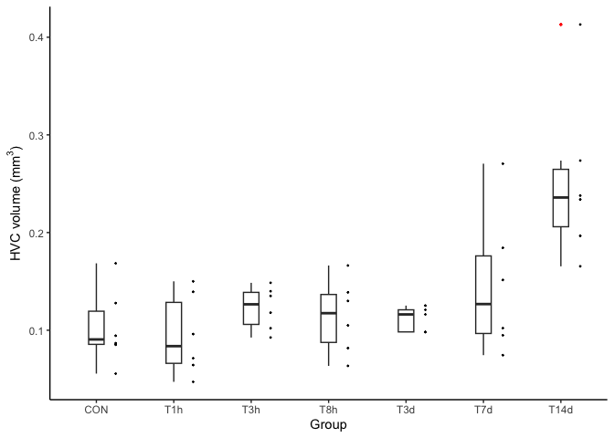<!-- -->

``` r
# The Kruskal???Wallis test (One-way ANOVA on ranks)
kruskal.test(`HVC Volume (mm3)` ~ Group, data = HVC) 
```

    ## 
    ##  Kruskal-Wallis rank sum test
    ## 
    ## data:  HVC Volume (mm3) by Group
    ## Kruskal-Wallis chi-squared = 16.145, df = 6, p-value = 0.01299

``` r
# Kruskal-Wallis chi-squared = 16.467, df = 6, p-value = 0.01145 

# post-hoc
kwAllPairsDunnTest(`HVC Volume (mm3)` ~ Group, data = HVC, p.adjust.method = "holm")
```

    ## 
    ##  Pairwise comparisons using Dunn's all-pairs test

    ## data: HVC Volume (mm3) by Group

    ##      CON   T1h   T3h   T8h   T3d   T7d  
    ## T1h  1.000 -     -     -     -     -    
    ## T3h  1.000 1.000 -     -     -     -    
    ## T8h  1.000 1.000 1.000 -     -     -    
    ## T3d  1.000 1.000 1.000 1.000 -     -    
    ## T7d  1.000 1.000 1.000 1.000 1.000 -    
    ## T14d 0.019 0.011 0.352 0.123 0.150 0.687

    ## 
    ## P value adjustment method: holm

    ## alternative hypothesis: two.sided

``` r
#       CON   T1h   T3h   T8h   T3d   T7d  
# T1h  1.000 -     -     -     -     -    
# T3h  1.000 1.000 -     -     -     -    
# T8h  1.000 1.000 1.000 -     -     -    
# T3d  1.000 1.000 1.000 1.000 -     -    
# T7d  1.000 1.000 1.000 1.000 1.000 -    
# T14d 0.027 0.014 0.425 0.030 0.224 0.815
```

### Fig. 1 - Figure supplement 2A

``` r
library(tidyverse) # v.2.0.0
set.seed(100)

path = paste0(getwd(), "/Data/DayLv_data.tsv")
SongRate = read_tsv(path)
```

    ## Rows: 72 Columns: 6
    ## ── Column specification ────────────────────────────────────────────────────────
    ## Delimiter: "\t"
    ## chr (2): Ind, Group
    ## dbl (4): Individual, n_Group, n_Day, Daily_SongRate
    ## 
    ## ℹ Use `spec()` to retrieve the full column specification for this data.
    ## ℹ Specify the column types or set `show_col_types = FALSE` to quiet this message.

``` r
SongRate$Group = factor(SongRate$Group, levels = c("CON", "T1h", "T3h", "T8h", "T3d", "T7d", "T14d"))

db = SongRate 
db$n_Group = factor(db$n_Group)
db$n_Day = factor(db$n_Day)

# show individual
db$Ind = gsub('b', "bird ", db$Ind) 
db$Ind = factor(db$Ind, levels = paste0('bird ', 1:12))

y_lab = 'Daily singing activity (%)'

w = 0.35
grey_point_size = 0.5
mean_point_size = 1
errorbar_wd = 1
errorbar_hori = 0
dodge = position_jitter(width = 0.05,height = 0)

Daily_SongRate_p = ggplot(data = db, aes(x = as.numeric(n_Day), y = Daily_SongRate,
                                    color = as.factor(Ind))) +
  # raw data
  geom_point(position = dodge, alpha = 0.5, size = grey_point_size) +
  scale_x_continuous(breaks = seq(0, 14, by = 2), limits = c(NA, 14)) +
  facet_wrap(.~Ind, drop = FALSE, nrow = 2 ) +
  xlab('Day after testosterone implantation') +
  ylab(y_lab) +
  guides(color = guide_legend(ncol=3)) +
  theme_classic() + 
  theme(panel.border = element_rect(size = 0.2, fill = 'transparent'),
        legend.position = 'none'); Daily_SongRate_p
```

    ## Warning: The `size` argument of `element_rect()` is deprecated as of ggplot2 3.4.0.
    ## ℹ Please use the `linewidth` argument instead.
    ## This warning is displayed once every 8 hours.
    ## Call `lifecycle::last_lifecycle_warnings()` to see where this warning was
    ## generated.

    ## Warning: Removed 3 rows containing missing values (`geom_point()`).

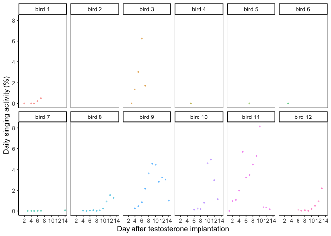<!-- -->

### Fig. 1 - Figure supplement 2B

``` r
library(tidyverse) # v.2.0.0
set.seed(100)

path = paste0(getwd(), "/Data/SongLv_data.tsv")
Song_data = read_tsv(path)
```

    ## Rows: 5320 Columns: 12
    ## ── Column specification ────────────────────────────────────────────────────────
    ## Delimiter: "\t"
    ## chr (4): Ind, Group, FisrtDate, StartTime
    ## dbl (8): Individual, n_Group, n_Day, Daily_SongRate, SongLen, SylperSong, Re...
    ## 
    ## ℹ Use `spec()` to retrieve the full column specification for this data.
    ## ℹ Specify the column types or set `show_col_types = FALSE` to quiet this message.

``` r
Song_data$Group = factor(Song_data$Group, levels = c("CON", "T1h", "T3h", "T8h", "T3d", "T7d", "T14d"))

db = Song_data 

db$n_Group = factor(db$n_Group)
db$n_Day = factor(db$n_Day)

# show individual
db$Ind = gsub('b', "bird ", db$Ind)
db$Ind = factor(db$Ind, levels = paste0('bird ', 1:12))

y_lab = 'Song length (s)'

SongLen_p = ggplot(db) +
  # raw data
  geom_point(aes(x = as.numeric(n_Day), y = SongLen,
                 color = as.factor(Ind)),
             position = dodge, alpha = 0.5, size = grey_point_size) +
  # scale_colour_manual(values = col_palette) +
  scale_x_continuous(breaks = seq(0, 14, by = 2), limits = c(NA, 14)) +
  facet_wrap(.~Ind, drop = FALSE, nrow = 2 ) +
  xlab('Day after testosterone implantation') +
  ylab(y_lab) +
  theme_classic() + 
  theme(panel.border = element_rect(size = 0.2, fill = 'transparent'),
        legend.position = 'none'); SongLen_p
```

    ## Warning: Removed 59 rows containing missing values (`geom_point()`).

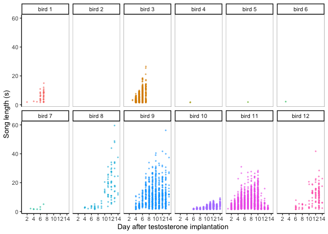<!-- -->

### Fig. 1 - Figure supplement 2C

``` r
library(tidyverse) # v.2.0.0
set.seed(100)

path = paste0(getwd(), "/Data/SongLv_data.tsv")
Song_data = read_tsv(path)
```

    ## Rows: 5320 Columns: 12
    ## ── Column specification ────────────────────────────────────────────────────────
    ## Delimiter: "\t"
    ## chr (4): Ind, Group, FisrtDate, StartTime
    ## dbl (8): Individual, n_Group, n_Day, Daily_SongRate, SongLen, SylperSong, Re...
    ## 
    ## ℹ Use `spec()` to retrieve the full column specification for this data.
    ## ℹ Specify the column types or set `show_col_types = FALSE` to quiet this message.

``` r
Song_data$Group = factor(Song_data$Group, levels = c("CON", "T1h", "T3h", "T8h", "T3d", "T7d", "T14d"))

db = Song_data 

db$n_Group = factor(db$n_Group)
db$n_Day = factor(db$n_Day)

# show individual
db$Ind = gsub('b', "bird ", db$Ind)
db$Ind = factor(db$Ind, levels = paste0('bird ', 1:12))

y_lab = 'Repetition rate (syl/s)'

RepetitionRate_p = ggplot(db, aes(x = as.numeric(n_Day), y = RepetitionRate,
                             color = as.factor(Ind))) +
  # raw data
  geom_point(position = dodge, alpha = 0.5, size = grey_point_size) +
  # scale_colour_manual(values = col_palette) +
  scale_x_continuous(breaks = seq(0, 14, by = 2), limits = c(NA, 14)) +
  facet_wrap(.~Ind, drop = FALSE, nrow = 2 ) +
  xlab('Day after testosterone implantation') +
  ylab(y_lab) +
  theme_classic() + 
  theme(panel.border = element_rect(size = 0.2, fill = 'transparent'),
        legend.position = 'none'); RepetitionRate_p
```

    ## Warning: Removed 59 rows containing missing values (`geom_point()`).

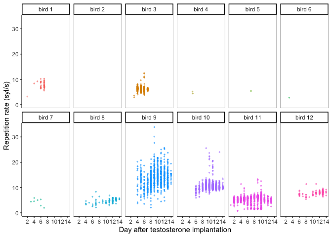<!-- -->

### Fig. 1 - Figure supplement 2D

``` r
library(tidyverse) # v.2.0.0
set.seed(100)

path = paste0(getwd(), "/Data/SongLv_data.tsv")
Song_data = read_tsv(path)
```

    ## Rows: 5320 Columns: 12
    ## ── Column specification ────────────────────────────────────────────────────────
    ## Delimiter: "\t"
    ## chr (4): Ind, Group, FisrtDate, StartTime
    ## dbl (8): Individual, n_Group, n_Day, Daily_SongRate, SongLen, SylperSong, Re...
    ## 
    ## ℹ Use `spec()` to retrieve the full column specification for this data.
    ## ℹ Specify the column types or set `show_col_types = FALSE` to quiet this message.

``` r
Song_data$Group = factor(Song_data$Group, levels = c("CON", "T1h", "T3h", "T8h", "T3d", "T7d", "T14d"))

db = Song_data 

db$n_Group = factor(db$n_Group)
db$n_Day = factor(db$n_Day)

# show individual
db$Ind = gsub('b', "bird ", db$Ind)
db$Ind = factor(db$Ind, levels = paste0('bird ', 1:12))

y_lab = 'Number of syllables per song'

SylperSong_p = ggplot(db, aes(x = as.numeric(n_Day), y = SylperSong,
                           color = as.factor(Ind))) +
  # raw data
  geom_point(position = dodge, alpha = 0.5, size = grey_point_size) +
  # scale_colour_manual(values = col_palette) +
  scale_x_continuous(breaks = seq(0, 14, by = 2), limits = c(NA, 14)) +
  facet_wrap(.~Ind, drop = FALSE, nrow = 2 ) +
  xlab('Day after testosterone implantation') +
  ylab(y_lab) +
  theme_classic() + 
  theme(panel.border = element_rect(size = 0.2, fill = 'transparent'),
        legend.position = 'none'); SylperSong_p
```

    ## Warning: Removed 59 rows containing missing values (`geom_point()`).

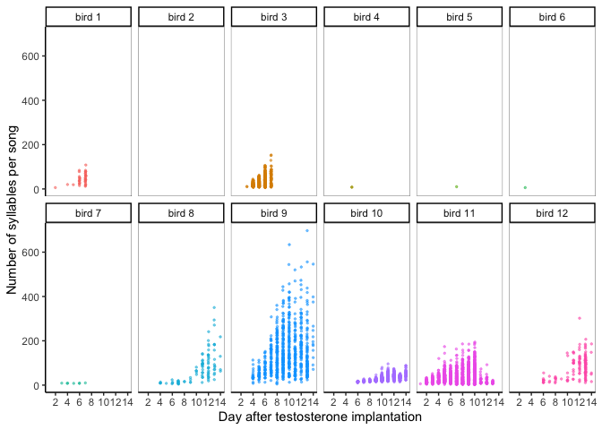<!-- -->

### Fig. 1 - Figure supplement 3A, Supplementary Table 2 and 3

``` r
library(tidyverse) # v.2.0.0
set.seed(100)

path = paste0(getwd(), "/Data/DayLv_data.tsv")
SongRate = read_tsv(path)
```

    ## Rows: 72 Columns: 6
    ## ── Column specification ────────────────────────────────────────────────────────
    ## Delimiter: "\t"
    ## chr (2): Ind, Group
    ## dbl (4): Individual, n_Group, n_Day, Daily_SongRate
    ## 
    ## ℹ Use `spec()` to retrieve the full column specification for this data.
    ## ℹ Specify the column types or set `show_col_types = FALSE` to quiet this message.

``` r
SongRate$Group = factor(SongRate$Group, levels = c("CON", "T1h", "T3h", "T8h", "T3d", "T7d", "T14d"))

db = SongRate %>% 
  filter(n_Day <= 7) 

db$Individual <- factor(db$Individual)
db$Individual <- droplevels(db$Individual)
db$n_Group = factor(db$n_Group)
db$Group <- droplevels(db$Group)

y_lab = 'Daily singing activity (%)'

# 1. deciding using sqrt or not and evaluating model
rm(mod_a)
mod_a <- lmer(data = db, log(Daily_SongRate) ~ Group + (1|Individual) ) # log

plot(mod_a)  
```

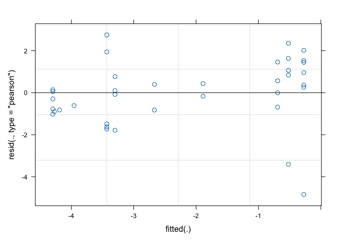<!-- -->

``` r
summary(mod_a)
```

    ## Linear mixed model fit by REML ['lmerMod']
    ## Formula: log(Daily_SongRate) ~ Group + (1 | Individual)
    ##    Data: db
    ## 
    ## REML criterion at convergence: 156
    ## 
    ## Scaled residuals: 
    ##      Min       1Q   Median       3Q      Max 
    ## -2.80064 -0.47398  0.05675  0.55310  1.58985 
    ## 
    ## Random effects:
    ##  Groups     Name        Variance Std.Dev.
    ##  Individual (Intercept) 3.340    1.828   
    ##  Residual               2.992    1.730   
    ## Number of obs: 37, groups:  Individual, 11
    ## 
    ## Fixed effects:
    ##             Estimate Std. Error t value
    ## (Intercept)   -3.274      1.009  -3.244
    ## GroupT14d      1.088      1.312   0.829
    ## 
    ## Correlation of Fixed Effects:
    ##           (Intr)
    ## GroupT14d -0.769

``` r
plot.new()
```

<!-- -->

``` r
par(mfrow=c(3,2))
qqnorm(resid(mod_a))
qqline(resid(mod_a))
qqnorm(ranef(mod_a)$"Individual"[,1])   # random effect
qqline(ranef(mod_a)$"Individual"[,1])
scatter.smooth(fitted(mod_a), resid(mod_a))

new_data_mod_a <- expand.grid(Group = levels(db$Group)) # fix effect
xmat <- model.matrix(~ Group, data=new_data_mod_a)  # fix effect
new_data_mod_a$fit <- xmat%*%fixef(mod_a)

nsim <- 10000
bsim <- arm::sim(mod_a, n.sim=nsim ) #simulation of the model 10000 times
## To get the mean estimate of the fixed effects parameters apply(bsim@fixef, 2, mean)
apply(bsim@fixef, 2, mean)
```

    ## (Intercept)   GroupT14d 
    ##   -3.285881    1.107672

``` r
## To get the 95% credible Interval estimate of the fixed effects parameters apply(bsim@fixef, 2, quantile, prob=c(0.025, 0.975))
apply(bsim@fixef, 2, quantile, prob=c(0.025, 0.975))
```

    ##       (Intercept) GroupT14d
    ## 2.5%    -5.277471 -1.587227
    ## 97.5%   -1.228605  3.769234

``` r
Ind_b_CrI = apply(bsim@fixef, 2, quantile, prob=c(0.025, 0.975)) 

Ind_b = mod_a@beta
x = as.data.frame(VarCorr(mod_a))
Ind_random = x[1, 4]
Ind_residual = x[2, 4]
Ind_random_CrI = quantile(apply(bsim@ranef$Individual[,,1],1,var),prob=c(0.025, 0.975))
Ind_residual_CrI = quantile(bsim@sigma^2,c(0.025, 0.975))

fitmat <- matrix(ncol=nsim, nrow=nrow(new_data_mod_a))
for(i in 1:nsim) fitmat[,i] <- xmat %*% bsim@fixef[i,]    # fitted values
new_data_mod_a$lower <- apply(fitmat, 1, quantile, prob=0.025)
new_data_mod_a$upper <- apply(fitmat, 1, quantile, prob=0.975)
new_data_mod_a$fit <- apply(fitmat, 1, mean)
new_data_mod_a$fit_exp <- exp(new_data_mod_a$fit)        # transform back from log
new_data_mod_a$upper_exp <- exp(new_data_mod_a$upper)    # transform back from log
new_data_mod_a$lower_exp <- exp(new_data_mod_a$lower)    # transform back from log

w = 0.25
grey_point_size = 0.2
mean_point_size = 1
errorbar_wd = 1
errorbar_hori = 0
dodge = position_jitter(width = 0.1, height = 0)

errorbar_col = "darkorange" # for grey raw data

Daily_SongRate_Grp_p = ggplot(new_data_mod_a) +
  # need this layer to set up
  geom_point(data = new_data_mod_a,
             aes(x = Group, y = fit_exp), color='black', size=mean_point_size) +
  # raw data
  geom_point(data = db, 
             aes(x = as.numeric(Group)+w, y = Daily_SongRate),
             position = dodge, alpha = 0.5, size = grey_point_size, color = "grey50") +
  # CI
  geom_errorbar(data = new_data_mod_a,
                aes(x = Group, ymax = upper_exp, ymin = lower_exp),
                width = errorbar_hori, size = errorbar_wd,
                color = errorbar_col) +
  # estimate
  geom_point(data = new_data_mod_a,
             aes(x = Group, y = fit_exp), color='black', size=mean_point_size) +
  xlab('Group') +
  ylab(y_lab) +
  theme_classic() ; Daily_SongRate_Grp_p
```

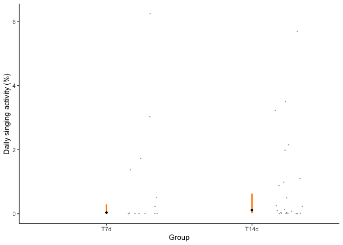<!-- -->

``` r
# posterior probabilities
Daily_SongRate_Grp_pp = pp(new_data_mod_a)

# estimates and credible intervals
Daily_SongRate_Grp_df_t = rbind(cbind("Var" = "Daily_SongRate", "Parameter" = levels(db$Group), 
                   "Estimate" = Ind_b, t(Ind_b_CrI)),
             cbind("Var" = "Daily_SongRate", "Parameter" = "random", 
                   "Estimate" =  Ind_random, t(Ind_random_CrI)),
             cbind("Var" = "Daily_SongRate", "Parameter" = "residual", 
                   "Estimate" =  Ind_residual, t(Ind_residual_CrI)))
```

### Fig. 1 - Figure supplement 3B, Supplementary Table 2 and 3

``` r
library(tidyverse) # v.2.0.0
set.seed(100)

path = paste0(getwd(), "/Data/SongLv_data.tsv")
Song_data = read_tsv(path)
```

    ## Rows: 5320 Columns: 12
    ## ── Column specification ────────────────────────────────────────────────────────
    ## Delimiter: "\t"
    ## chr (4): Ind, Group, FisrtDate, StartTime
    ## dbl (8): Individual, n_Group, n_Day, Daily_SongRate, SongLen, SylperSong, Re...
    ## 
    ## ℹ Use `spec()` to retrieve the full column specification for this data.
    ## ℹ Specify the column types or set `show_col_types = FALSE` to quiet this message.

``` r
Song_data$Group = factor(Song_data$Group, levels = c("CON", "T1h", "T3h", "T8h", "T3d", "T7d", "T14d"))

db = Song_data %>% 
  filter(n_Day <= 7)
  
db$Group = factor(db$Group, levels = c("T7d", "T14d"))
db$Individual <- factor(db$Individual)
db$Individual <- droplevels(db$Individual)

y_lab = 'Song length (s)'

# 1. deciding using sqrt or not and evaluating model
rm(mod_a)
mod_a <- lmer(data = db, log(SongLen) ~ Group + (1|Individual) ) # log

plot(mod_a)  
```

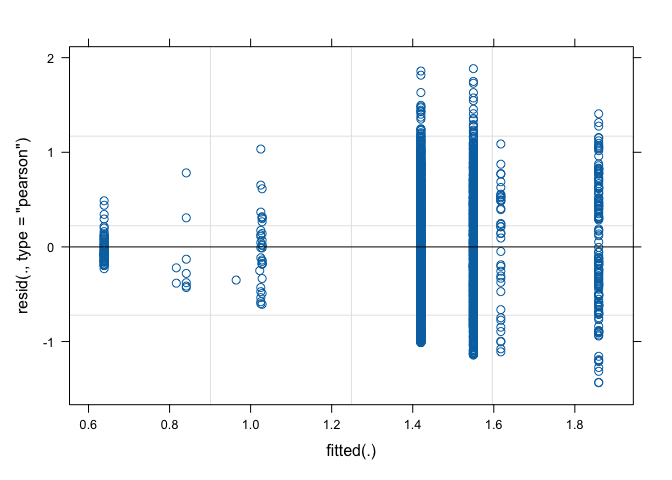<!-- -->

``` r
summary(mod_a)
```

    ## Linear mixed model fit by REML ['lmerMod']
    ## Formula: log(SongLen) ~ Group + (1 | Individual)
    ##    Data: db
    ## 
    ## REML criterion at convergence: 3754.2
    ## 
    ## Scaled residuals: 
    ##      Min       1Q   Median       3Q      Max 
    ## -2.38001 -0.80281 -0.06113  0.77028  3.12359 
    ## 
    ## Random effects:
    ##  Groups     Name        Variance Std.Dev.
    ##  Individual (Intercept) 0.2115   0.4599  
    ##  Residual               0.3637   0.6031  
    ## Number of obs: 2038, groups:  Individual, 11
    ## 
    ## Fixed effects:
    ##             Estimate Std. Error t value
    ## (Intercept)  1.16821    0.25590   4.565
    ## GroupT14d   -0.01124    0.32168  -0.035
    ## 
    ## Correlation of Fixed Effects:
    ##           (Intr)
    ## GroupT14d -0.795

``` r
plot.new()
```

<!-- -->

``` r
par(mfrow=c(3,2))
qqnorm(resid(mod_a))
qqline(resid(mod_a))
qqnorm(ranef(mod_a)$"Individual"[,1])   # random effect
qqline(ranef(mod_a)$"Individual"[,1])
scatter.smooth(fitted(mod_a), resid(mod_a))
```

    ## Warning in simpleLoess(y, x, w, span, degree = degree, parametric = FALSE, :
    ## pseudoinverse used at 1.4201

    ## Warning in simpleLoess(y, x, w, span, degree = degree, parametric = FALSE, :
    ## neighborhood radius 0.12956

    ## Warning in simpleLoess(y, x, w, span, degree = degree, parametric = FALSE, :
    ## reciprocal condition number 0

    ## Warning in simpleLoess(y, x, w, span, degree = degree, parametric = FALSE, :
    ## pseudoinverse used at 1.4201

    ## Warning in simpleLoess(y, x, w, span, degree = degree, parametric = FALSE, :
    ## neighborhood radius 0.12956

    ## Warning in simpleLoess(y, x, w, span, degree = degree, parametric = FALSE, :
    ## reciprocal condition number 0

    ## Warning in simpleLoess(y, x, w, span, degree = degree, parametric = FALSE, :
    ## pseudoinverse used at 1.4201

    ## Warning in simpleLoess(y, x, w, span, degree = degree, parametric = FALSE, :
    ## neighborhood radius 0.12956

    ## Warning in simpleLoess(y, x, w, span, degree = degree, parametric = FALSE, :
    ## reciprocal condition number 0

    ## Warning in simpleLoess(y, x, w, span, degree = degree, parametric = FALSE, :
    ## pseudoinverse used at 1.4201

    ## Warning in simpleLoess(y, x, w, span, degree = degree, parametric = FALSE, :
    ## neighborhood radius 0.12956

    ## Warning in simpleLoess(y, x, w, span, degree = degree, parametric = FALSE, :
    ## reciprocal condition number 0

    ## Warning in simpleLoess(y, x, w, span, degree = degree, parametric = FALSE, :
    ## pseudoinverse used at 1.4201

    ## Warning in simpleLoess(y, x, w, span, degree = degree, parametric = FALSE, :
    ## neighborhood radius 0.12956

    ## Warning in simpleLoess(y, x, w, span, degree = degree, parametric = FALSE, :
    ## reciprocal condition number 0

``` r
new_data_mod_a <- expand.grid(Group = levels(db$Group)) # fix effect
xmat <- model.matrix(~ Group, data=new_data_mod_a)  # fix effect
new_data_mod_a$fit <- xmat%*%fixef(mod_a)

nsim <- 10000
bsim <- arm::sim(mod_a, n.sim=nsim ) #simulation of the model 10000 times
## To get the mean estimate of the fixed effects parameters apply(bsim@fixef, 2, mean)
apply(bsim@fixef, 2, mean)
```

    ## (Intercept)   GroupT14d 
    ##  1.17071758 -0.01220977

``` r
## To get the 95% credible Interval estimate of the fixed effects parameters apply(bsim@fixef, 2, quantile, prob=c(0.025, 0.975))
apply(bsim@fixef, 2, quantile, prob=c(0.025, 0.975))
```

    ##       (Intercept)  GroupT14d
    ## 2.5%    0.6758596 -0.6382133
    ## 97.5%   1.6728030  0.6198373

``` r
Ind_b_CrI = apply(bsim@fixef, 2, quantile, prob=c(0.025, 0.975)) 

Ind_b = mod_a@beta
x = as.data.frame(VarCorr(mod_a))
Ind_random = x[1, 4]
Ind_residual = x[2, 4]
Ind_random_CrI = quantile(apply(bsim@ranef$Individual[,,1],1,var),prob=c(0.025, 0.975))
Ind_residual_CrI = quantile(bsim@sigma^2,c(0.025, 0.975))

fitmat <- matrix(ncol=nsim, nrow=nrow(new_data_mod_a))
for(i in 1:nsim) fitmat[,i] <- xmat %*% bsim@fixef[i,]    # fitted values
new_data_mod_a$lower <- apply(fitmat, 1, quantile, prob=0.025)
new_data_mod_a$upper <- apply(fitmat, 1, quantile, prob=0.975)
new_data_mod_a$fit <- apply(fitmat, 1, mean)
new_data_mod_a$fit_exp <- exp(new_data_mod_a$fit)        # transform back from log
new_data_mod_a$upper_exp <- exp(new_data_mod_a$upper)    # transform back from log
new_data_mod_a$lower_exp <- exp(new_data_mod_a$lower)    # transform back from log

w = 0.25
grey_point_size = 0.2
mean_point_size = 1
errorbar_wd = 1
errorbar_hori = 0
dodge = position_jitter(width = 0.1, height = 0)

errorbar_col = "darkorange" # for grey raw data

SongLen_Grp_p = ggplot(new_data_mod_a) +
  # need this layer to set up
  geom_point(data = new_data_mod_a,
             aes(x = Group, y = fit_exp), color='black', size=mean_point_size) +
  # raw data
  geom_point(data = db, 
             aes(x = as.numeric(Group)+w, y = SongLen),
             position = dodge, alpha = 0.1, size = grey_point_size, color = "grey50") +
  # CI
  geom_errorbar(data = new_data_mod_a,
                aes(x = Group, ymax = upper_exp, ymin = lower_exp),
                width = errorbar_hori, size = errorbar_wd,
                color = errorbar_col) +
  # estimate
  geom_point(data = new_data_mod_a,
             aes(x = Group, y = fit_exp), color='black', size=mean_point_size) +
  xlab('Group') +
  ylab(y_lab) +
  theme_classic() ; SongLen_Grp_p
```

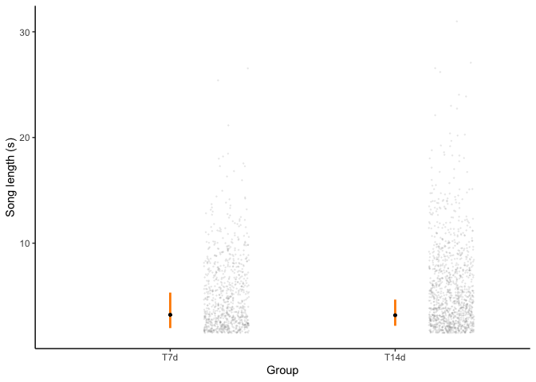<!-- -->

``` r
# posterior probabilities
SongLen_Grp_pp = pp(new_data_mod_a)

# estimates and credible intervals
SongLen_Grp_df_t = rbind(cbind("Var" = "SongLen", "Parameter" = levels(db$Group), 
                   "Estimate" = Ind_b, t(Ind_b_CrI)),
             cbind("Var" = "SongLen", "Parameter" = "random", 
                   "Estimate" =  Ind_random, t(Ind_random_CrI)),
             cbind("Var" = "SongLen", "Parameter" = "residual", 
                   "Estimate" =  Ind_residual, t(Ind_residual_CrI)))
```

### Fig. 1 - Figure supplement 3C, Supplementary Table 2 and 3

``` r
library(tidyverse) # v.2.0.0
set.seed(100)

path = paste0(getwd(), "/Data/SongLv_data.tsv")
Song_data = read_tsv(path)
```

    ## Rows: 5320 Columns: 12
    ## ── Column specification ────────────────────────────────────────────────────────
    ## Delimiter: "\t"
    ## chr (4): Ind, Group, FisrtDate, StartTime
    ## dbl (8): Individual, n_Group, n_Day, Daily_SongRate, SongLen, SylperSong, Re...
    ## 
    ## ℹ Use `spec()` to retrieve the full column specification for this data.
    ## ℹ Specify the column types or set `show_col_types = FALSE` to quiet this message.

``` r
Song_data$Group = factor(Song_data$Group, levels = c("CON", "T1h", "T3h", "T8h", "T3d", "T7d", "T14d"))

db = Song_data %>% 
  filter(n_Day <= 7)

db$Individual <- factor(db$Individual)
db$Individual <- droplevels(db$Individual)
db$Group = factor(db$Group, levels = c("T7d", "T14d"))

y_lab = 'Repetition rate (syl/s)'

# 1. deciding using sqrt or not and evaluating model
rm(mod_a)
mod_a <- lmer(data = db, log(RepetitionRate) ~ Group + (1|Individual) ) # log

plot(mod_a)  
```

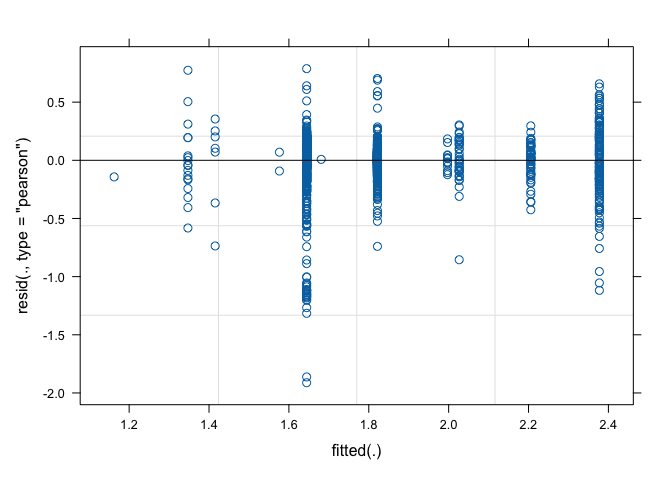<!-- -->

``` r
summary(mod_a)
```

    ## Linear mixed model fit by REML ['lmerMod']
    ## Formula: log(RepetitionRate) ~ Group + (1 | Individual)
    ##    Data: db
    ## 
    ## REML criterion at convergence: -466.3
    ## 
    ## Scaled residuals: 
    ##     Min      1Q  Median      3Q     Max 
    ## -8.9694 -0.2368  0.1255  0.4480  3.6955 
    ## 
    ## Random effects:
    ##  Groups     Name        Variance Std.Dev.
    ##  Individual (Intercept) 0.15657  0.3957  
    ##  Residual               0.04544  0.2132  
    ## Number of obs: 2038, groups:  Individual, 11
    ## 
    ## Fixed effects:
    ##             Estimate Std. Error t value
    ## (Intercept)   1.6535     0.1883   8.781
    ## GroupT14d     0.1777     0.2488   0.714
    ## 
    ## Correlation of Fixed Effects:
    ##           (Intr)
    ## GroupT14d -0.757

``` r
plot.new()
```

<!-- -->

``` r
par(mfrow=c(3,2))
qqnorm(resid(mod_a))
qqline(resid(mod_a))
qqnorm(ranef(mod_a)$"Individual"[,1])   # random effect
qqline(ranef(mod_a)$"Individual"[,1])
scatter.smooth(fitted(mod_a), resid(mod_a))

new_data_mod_a <- expand.grid(Group = levels(db$Group)) # fix effect
xmat <- model.matrix(~ Group, data=new_data_mod_a)  # fix effect
new_data_mod_a$fit <- xmat%*%fixef(mod_a)

nsim <- 10000
bsim <- arm::sim(mod_a, n.sim=nsim ) #simulation of the model 10000 times
## To get the mean estimate of the fixed effects parameters apply(bsim@fixef, 2, mean)
apply(bsim@fixef, 2, mean)
```

    ## (Intercept)   GroupT14d 
    ##   1.6554856   0.1768977

``` r
## To get the 95% credible Interval estimate of the fixed effects parameters apply(bsim@fixef, 2, quantile, prob=c(0.025, 0.975))
apply(bsim@fixef, 2, quantile, prob=c(0.025, 0.975))
```

    ##       (Intercept)  GroupT14d
    ## 2.5%     1.291070 -0.3073349
    ## 97.5%    2.027081  0.6658051

``` r
Ind_b_CrI = apply(bsim@fixef, 2, quantile, prob=c(0.025, 0.975)) 

Ind_b = mod_a@beta
x = as.data.frame(VarCorr(mod_a))
Ind_random = x[1, 4]
Ind_residual = x[2, 4]
Ind_random_CrI = quantile(apply(bsim@ranef$Individual[,,1],1,var),prob=c(0.025, 0.975))
Ind_residual_CrI = quantile(bsim@sigma^2,c(0.025, 0.975))

# quantile(apply(bsim@ranef$lugar[,,1],1,var),prob=c(0.025, 0.5, 0.975))
# quantile(bsim@sigma^2,c(0.025,0.5,0.975))

fitmat <- matrix(ncol=nsim, nrow=nrow(new_data_mod_a))
for(i in 1:nsim) fitmat[,i] <- xmat %*% bsim@fixef[i,]    # fitted values
new_data_mod_a$lower <- apply(fitmat, 1, quantile, prob=0.025)
new_data_mod_a$upper <- apply(fitmat, 1, quantile, prob=0.975)
new_data_mod_a$fit <- apply(fitmat, 1, mean)
new_data_mod_a$fit_exp <- exp(new_data_mod_a$fit)        # transform back from log
new_data_mod_a$upper_exp <- exp(new_data_mod_a$upper)    # transform back from log
new_data_mod_a$lower_exp <- exp(new_data_mod_a$lower)    # transform back from log

w = 0.25
grey_point_size = 0.2
mean_point_size = 1
errorbar_wd = 1
errorbar_hori = 0
dodge = position_jitter(width = 0.1, height = 0)

errorbar_col = "darkorange" # for grey raw data

RepetitionRate_Grp_p = ggplot(new_data_mod_a) +
  # need this layer to set up
  geom_point(data = new_data_mod_a,
             aes(x = Group, y = fit_exp), color='black', size=mean_point_size) +
  # raw data
  geom_point(data = db, 
             aes(x = as.numeric(Group)+w, y = RepetitionRate),
             position = dodge, alpha = 0.1, size = grey_point_size, color = "grey50") +
  # CI
  geom_errorbar(data = new_data_mod_a,
                aes(x = Group, ymax = upper_exp, ymin = lower_exp),
                width = errorbar_hori, size = errorbar_wd,
                color = errorbar_col) +
  # estimate
  geom_point(data = new_data_mod_a,
             aes(x = Group, y = fit_exp), color='black', size=mean_point_size) +
  xlab('Group') +
  ylab(y_lab) +
  theme_classic() ; RepetitionRate_Grp_p
```

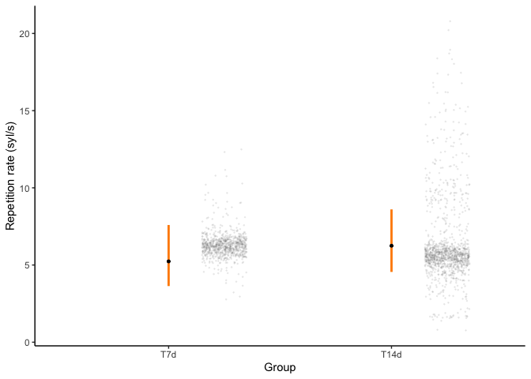<!-- -->

``` r
# posterior probabilities
RepetitionRate_Grp_pp = pp(new_data_mod_a)

# estimates and credible intervals
RepetitionRate_Grp_df_t = rbind(cbind("Var" = "RepetitionRate", "Parameter" = levels(db$Group), 
                   "Estimate" = Ind_b, t(Ind_b_CrI)),
             cbind("Var" = "RepetitionRate", "Parameter" = "random", 
                   "Estimate" =  Ind_random, t(Ind_random_CrI)),
             cbind("Var" = "RepetitionRate", "Parameter" = "residual", 
                   "Estimate" =  Ind_residual, t(Ind_residual_CrI)))
```

### Fig. 1 - Figure supplement 3D, Supplementary Table 2 and 3

``` r
library(tidyverse) # v.2.0.0
set.seed(100)

path = paste0(getwd(), "/Data/SongLv_data.tsv")
Song_data = read_tsv(path)
```

    ## Rows: 5320 Columns: 12
    ## ── Column specification ────────────────────────────────────────────────────────
    ## Delimiter: "\t"
    ## chr (4): Ind, Group, FisrtDate, StartTime
    ## dbl (8): Individual, n_Group, n_Day, Daily_SongRate, SongLen, SylperSong, Re...
    ## 
    ## ℹ Use `spec()` to retrieve the full column specification for this data.
    ## ℹ Specify the column types or set `show_col_types = FALSE` to quiet this message.

``` r
Song_data$Group = factor(Song_data$Group, levels = c("CON", "T1h", "T3h", "T8h", "T3d", "T7d", "T14d"))

db = Song_data %>% 
  filter(n_Day <= 7)

db$Individual <- factor(db$Individual)
db$Individual <- droplevels(db$Individual)

db$Group = factor(db$Group, levels = c("T7d", "T14d"))

y_lab = 'Number of syllables per song'

# 1. deciding using sqrt or not and evaluating model
rm(mod_a)
mod_a <- lmer(data = db, log(SylperSong) ~ Group + (1|Individual) ) # log

plot(mod_a)  
```

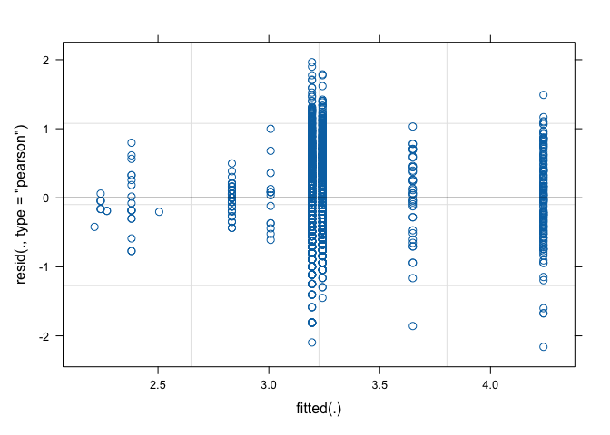<!-- -->

``` r
summary(mod_a)
```

    ## Linear mixed model fit by REML ['lmerMod']
    ## Formula: log(SylperSong) ~ Group + (1 | Individual)
    ##    Data: db
    ## 
    ## REML criterion at convergence: 3949.7
    ## 
    ## Scaled residuals: 
    ##     Min      1Q  Median      3Q     Max 
    ## -3.4184 -0.7431 -0.0263  0.7422  3.1094 
    ## 
    ## Random effects:
    ##  Groups     Name        Variance Std.Dev.
    ##  Individual (Intercept) 0.5323   0.7296  
    ##  Residual               0.3991   0.6317  
    ## Number of obs: 2038, groups:  Individual, 11
    ## 
    ## Fixed effects:
    ##             Estimate Std. Error t value
    ## (Intercept)   2.7760     0.3718   7.467
    ## GroupT14d     0.2069     0.4797   0.431
    ## 
    ## Correlation of Fixed Effects:
    ##           (Intr)
    ## GroupT14d -0.775

``` r
plot.new()
```

<!-- -->

``` r
par(mfrow=c(3,2))
qqnorm(resid(mod_a))
qqline(resid(mod_a))
qqnorm(ranef(mod_a)$"Individual"[,1])   # random effect
qqline(ranef(mod_a)$"Individual"[,1])
scatter.smooth(fitted(mod_a), resid(mod_a))
```

    ## Warning in simpleLoess(y, x, w, span, degree = degree, parametric = FALSE, :
    ## pseudoinverse used at 3.1947

    ## Warning in simpleLoess(y, x, w, span, degree = degree, parametric = FALSE, :
    ## neighborhood radius 0.047368

    ## Warning in simpleLoess(y, x, w, span, degree = degree, parametric = FALSE, :
    ## reciprocal condition number 0

    ## Warning in simpleLoess(y, x, w, span, degree = degree, parametric = FALSE, :
    ## There are other near singularities as well. 0.0022437

    ## Warning in simpleLoess(y, x, w, span, degree = degree, parametric = FALSE, :
    ## pseudoinverse used at 3.1947

    ## Warning in simpleLoess(y, x, w, span, degree = degree, parametric = FALSE, :
    ## neighborhood radius 0.047368

    ## Warning in simpleLoess(y, x, w, span, degree = degree, parametric = FALSE, :
    ## reciprocal condition number 0

    ## Warning in simpleLoess(y, x, w, span, degree = degree, parametric = FALSE, :
    ## There are other near singularities as well. 0.0022437

    ## Warning in simpleLoess(y, x, w, span, degree = degree, parametric = FALSE, :
    ## pseudoinverse used at 3.1947

    ## Warning in simpleLoess(y, x, w, span, degree = degree, parametric = FALSE, :
    ## neighborhood radius 0.047368

    ## Warning in simpleLoess(y, x, w, span, degree = degree, parametric = FALSE, :
    ## reciprocal condition number 0

    ## Warning in simpleLoess(y, x, w, span, degree = degree, parametric = FALSE, :
    ## There are other near singularities as well. 0.0022437

    ## Warning in simpleLoess(y, x, w, span, degree = degree, parametric = FALSE, :
    ## pseudoinverse used at 3.1947

    ## Warning in simpleLoess(y, x, w, span, degree = degree, parametric = FALSE, :
    ## neighborhood radius 0.047368

    ## Warning in simpleLoess(y, x, w, span, degree = degree, parametric = FALSE, :
    ## reciprocal condition number 0

    ## Warning in simpleLoess(y, x, w, span, degree = degree, parametric = FALSE, :
    ## There are other near singularities as well. 0.0022437

    ## Warning in simpleLoess(y, x, w, span, degree = degree, parametric = FALSE, :
    ## pseudoinverse used at 3.1947

    ## Warning in simpleLoess(y, x, w, span, degree = degree, parametric = FALSE, :
    ## neighborhood radius 0.047368

    ## Warning in simpleLoess(y, x, w, span, degree = degree, parametric = FALSE, :
    ## reciprocal condition number 0

    ## Warning in simpleLoess(y, x, w, span, degree = degree, parametric = FALSE, :
    ## There are other near singularities as well. 0.0022437

``` r
new_data_mod_a <- expand.grid(Group = levels(db$Group)) # fix effect
xmat <- model.matrix(~ Group, data=new_data_mod_a)  # fix effect
new_data_mod_a$fit <- xmat%*%fixef(mod_a)

nsim <- 10000
bsim <- arm::sim(mod_a, n.sim=nsim ) #simulation of the model 10000 times
## To get the mean estimate of the fixed effects parameters apply(bsim@fixef, 2, mean)
apply(bsim@fixef, 2, mean)
```

    ## (Intercept)   GroupT14d 
    ##   2.7797062   0.2054179

``` r
## To get the 95% credible Interval estimate of the fixed effects parameters apply(bsim@fixef, 2, quantile, prob=c(0.025, 0.975))
apply(bsim@fixef, 2, quantile, prob=c(0.025, 0.975))
```

    ##       (Intercept) GroupT14d
    ## 2.5%     2.060408 -0.728030
    ## 97.5%    3.512578  1.147878

``` r
Ind_b_CrI = apply(bsim@fixef, 2, quantile, prob=c(0.025, 0.975)) 

Ind_b = mod_a@beta
x = as.data.frame(VarCorr(mod_a))
Ind_random = x[1, 4]
Ind_residual = x[2, 4]
Ind_random_CrI = quantile(apply(bsim@ranef$Individual[,,1],1,var),prob=c(0.025, 0.975))
Ind_residual_CrI = quantile(bsim@sigma^2,c(0.025, 0.975))

# quantile(apply(bsim@ranef$lugar[,,1],1,var),prob=c(0.025, 0.5, 0.975))
# quantile(bsim@sigma^2,c(0.025,0.5,0.975))

fitmat <- matrix(ncol=nsim, nrow=nrow(new_data_mod_a))
for(i in 1:nsim) fitmat[,i] <- xmat %*% bsim@fixef[i,]    # fitted values
new_data_mod_a$lower <- apply(fitmat, 1, quantile, prob=0.025)
new_data_mod_a$upper <- apply(fitmat, 1, quantile, prob=0.975)
new_data_mod_a$fit <- apply(fitmat, 1, mean)
new_data_mod_a$fit_exp <- exp(new_data_mod_a$fit)        # transform back from log
new_data_mod_a$upper_exp <- exp(new_data_mod_a$upper)    # transform back from log
new_data_mod_a$lower_exp <- exp(new_data_mod_a$lower)    # transform back from log

w = 0.25
grey_point_size = 0.2
mean_point_size = 1
errorbar_wd = 1
errorbar_hori = 0
dodge = position_jitter(width = 0.1, height = 0)

errorbar_col = "darkorange" # for grey raw data

SylperSong_Grp_p = ggplot(new_data_mod_a) +
  # need this layer to set up
  geom_point(data = new_data_mod_a,
             aes(x = Group, y = fit_exp), color='black', size=mean_point_size) +
  # raw data
  geom_point(data = db, 
             aes(x = as.numeric(Group)+w, y = SylperSong),
             position = dodge, alpha = 0.1, size = grey_point_size, color = 'grey50') +
  # CI
  geom_errorbar(data = new_data_mod_a,
                aes(x = Group, ymax = upper_exp, ymin = lower_exp),
                width = errorbar_hori, size = errorbar_wd,
                color = errorbar_col) +
  # estimate
  geom_point(data = new_data_mod_a,
             aes(x = Group, y = fit_exp), color='black', size=mean_point_size) +
  xlab('Group') +
  ylab(y_lab) +
  theme_classic() ; SylperSong_Grp_p
```

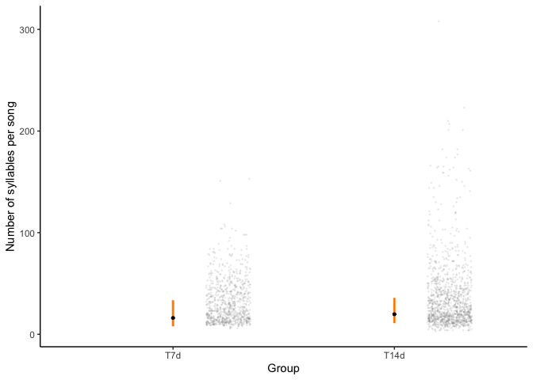<!-- -->

``` r
# posterior probabilities
SylperSong_Grp_pp = pp(new_data_mod_a)
# estimates and credible intervals
SylperSong_Grp_df_t = rbind(cbind("Var" = "SylperSong", "Parameter" = levels(db$Group), 
                   "Estimate" = Ind_b, t(Ind_b_CrI)),
             cbind("Var" = "SylperSong", "Parameter" = "random", 
                   "Estimate" =  Ind_random, t(Ind_random_CrI)),
             cbind("Var" = "SylperSong", "Parameter" = "residual", 
                   "Estimate" =  Ind_residual, t(Ind_residual_CrI)))
```

### Fig. 1 - Figure supplement 4A

``` r
library(tidyverse) # v.2.0.0
library(PMCMRplus) # 1.9.4
path =  paste0(getwd(), "/Data/Physiological_measurements.tsv")
Weights = read_tsv(path)
```

    ## Rows: 42 Columns: 5
    ## ── Column specification ────────────────────────────────────────────────────────
    ## Delimiter: "\t"
    ## chr (1): Group
    ## dbl (4): ProcessNum, Brain (mg), Body Weight (g), Oviduct (mg)
    ## 
    ## ℹ Use `spec()` to retrieve the full column specification for this data.
    ## ℹ Specify the column types or set `show_col_types = FALSE` to quiet this message.

``` r
Weights$Group <- factor(Weights$Group, levels = c("CON", "T1h", "T3h", "T8h", "T3d", "T7d", "T14d"))

w = 0.25
BodyWeightb = ggplot(Weights, aes(y = `Body Weight (g)`, x = Group)) + 
  geom_boxplot( outlier.colour = 'red', outlier.size = 0.5, width = 0.2) + 
  geom_point( position = position_nudge(x = w), size = 0.25) + 
  scale_color_manual(values = rep("black", 2)) +
  scale_y_continuous(name = "Body weight (g)" ) +
  theme_classic() ; BodyWeightb
```

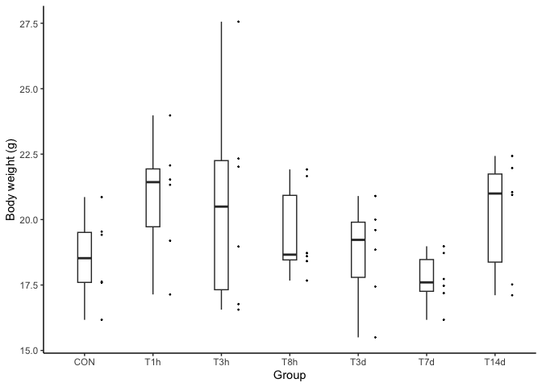<!-- -->

``` r
# The Kruskal???Wallis test (One-way ANOVA on ranks)
kruskal.test(`Body Weight (g)` ~ Group, data = Weights) 
```

    ## 
    ##  Kruskal-Wallis rank sum test
    ## 
    ## data:  Body Weight (g) by Group
    ## Kruskal-Wallis chi-squared = 7.4647, df = 6, p-value = 0.28

``` r
# Kruskal-Wallis chi-squared = 7.3905, df = 6, p-value = 0.2862
```

### Fig. 1 - Figure supplement 4B

``` r
library(tidyverse) # v.2.0.0
library(PMCMRplus) # 1.9.4
path =  paste0(getwd(), "/Data/Physiological_measurements.tsv")
Weights = read_tsv(path)
```

    ## Rows: 42 Columns: 5
    ## ── Column specification ────────────────────────────────────────────────────────
    ## Delimiter: "\t"
    ## chr (1): Group
    ## dbl (4): ProcessNum, Brain (mg), Body Weight (g), Oviduct (mg)
    ## 
    ## ℹ Use `spec()` to retrieve the full column specification for this data.
    ## ℹ Specify the column types or set `show_col_types = FALSE` to quiet this message.

``` r
Weights$Group <- factor(Weights$Group, levels = c("CON", "T1h", "T3h", "T8h", "T3d", "T7d", "T14d"))

w = 0.25
BrainWeightb = ggplot(Weights, aes(y = `Brain (mg)`, x = Group)) + 
  geom_boxplot( outlier.colour = 'red', outlier.size = 0.5, width = 0.2) + 
  geom_point( position = position_nudge(x = w), size = 0.25) + 
  scale_color_manual(values = rep("black", 2)) +
  scale_y_continuous(name = "Brain weight (mg)") +
  theme_classic() ; BrainWeightb
```

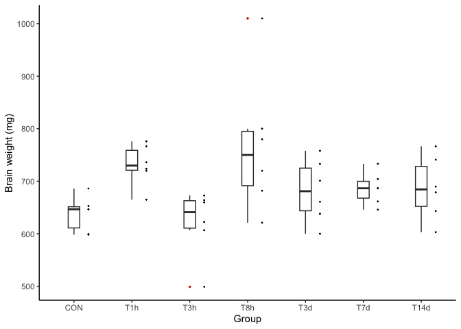<!-- -->

``` r
# The Kruskal???Wallis test (One-way ANOVA on ranks)
kruskal.test(`Brain (mg)` ~ Group, data = Weights) 
```

    ## 
    ##  Kruskal-Wallis rank sum test
    ## 
    ## data:  Brain (mg) by Group
    ## Kruskal-Wallis chi-squared = 15.704, df = 6, p-value = 0.01543

``` r
# Kruskal-Wallis chi-squared = 15.704, df = 6, p-value = 0.01543


kwAllPairsDunnTest(`Brain (mg)` ~ Group, data = Weights, p.adjust.method="holm")
```

    ## Warning in kwAllPairsDunnTest.default(c(653, 646.7, 599.3, 686.2, 646.5, : Ties
    ## are present. z-quantiles were corrected for ties.

    ## 
    ##  Pairwise comparisons using Dunn's all-pairs test
    ## 
    ## data: Brain (mg) by Group

    ##      CON   T1h   T3h   T8h   T3d   T7d  
    ## T1h  0.080 -     -     -     -     -    
    ## T3h  1.000 0.082 -     -     -     -    
    ## T8h  0.134 1.000 0.136 -     -     -    
    ## T3d  1.000 1.000 1.000 1.000 -     -    
    ## T7d  1.000 1.000 1.000 1.000 1.000 -    
    ## T14d 1.000 1.000 1.000 1.000 1.000 1.000

    ## 
    ## P value adjustment method: holm
    ## alternative hypothesis: two.sided

``` r
#      CON   T1h   T3h   T8h   T3d   T7d  
# T1h  0.080 -     -     -     -     -    
# T3h  1.000 0.082 -     -     -     -    
# T8h  0.134 1.000 0.136 -     -     -    
# T3d  1.000 1.000 1.000 1.000 -     -    
# T7d  1.000 1.000 1.000 1.000 1.000 -    
# T14d 1.000 1.000 1.000 1.000 1.000 1.000
```

### Fig. 1 - Figure supplement 4C

``` r
library(tidyverse) # v.2.0.0
library(PMCMRplus) # 1.9.4
path =  paste0(getwd(), "/Data/Physiological_measurements.tsv")
Weights = read_tsv(path)
```

    ## Rows: 42 Columns: 5
    ## ── Column specification ────────────────────────────────────────────────────────
    ## Delimiter: "\t"
    ## chr (1): Group
    ## dbl (4): ProcessNum, Brain (mg), Body Weight (g), Oviduct (mg)
    ## 
    ## ℹ Use `spec()` to retrieve the full column specification for this data.
    ## ℹ Specify the column types or set `show_col_types = FALSE` to quiet this message.

``` r
Weights$Group <- factor(Weights$Group, levels = c("CON", "T1h", "T3h", "T8h", "T3d", "T7d", "T14d"))

w = 0.25
OviductWeightb = ggplot(Weights, aes(y = `Oviduct (mg)`, x = Group)) + 
  geom_boxplot( outlier.colour = 'red', outlier.size = 0.5, width = 0.2) + 
  geom_point( position = position_nudge(x = w), size = 0.25) + 
  scale_color_manual(values = rep("black", 2)) +
  scale_y_continuous(name = "Oviduct weight (mg)" ) +
  theme_classic() ; OviductWeightb
```

    ## Warning: Removed 12 rows containing non-finite values (`stat_boxplot()`).

    ## Warning: Removed 12 rows containing missing values (`geom_point()`).

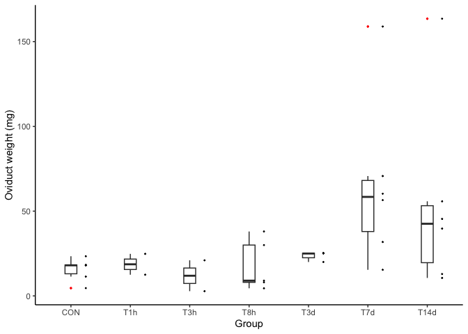<!-- -->

``` r
# The Kruskal???Wallis test (One-way ANOVA on ranks)
kruskal.test(`Oviduct (mg)` ~ Group , data = Weights) 
```

    ## 
    ##  Kruskal-Wallis rank sum test
    ## 
    ## data:  Oviduct (mg) by Group
    ## Kruskal-Wallis chi-squared = 11.58, df = 6, p-value = 0.07202

``` r
# Kruskal-Wallis chi-squared = 11.58, df = 6, p-value = 0.07202
```

### Fig. 1 - Figure supplement 4D

``` r
library(tidyverse) # v.2.0.0
library(PMCMRplus) # 1.9.4
path = paste0(getwd(), "/Data/HVC_volume.tsv")
HVC = read_tsv(path)
```

    ## Rows: 41 Columns: 4
    ## ── Column specification ────────────────────────────────────────────────────────
    ## Delimiter: "\t"
    ## chr (1): Group
    ## dbl (3): ProcessNum, HVC Volume (mm3), HVC_nor
    ## 
    ## ℹ Use `spec()` to retrieve the full column specification for this data.
    ## ℹ Specify the column types or set `show_col_types = FALSE` to quiet this message.

``` r
HVC$Group = factor(HVC$Group, levels = c("CON", "T1h", "T3h", "T8h", "T3d", "T7d", "T14d"))

w = 0.25
HVCnorb = ggplot(HVC, aes(y = HVC_nor, x = Group)) + 
  geom_boxplot( outlier.colour = 'red', outlier.size = 0.5, width = 0.2) + 
  geom_point( position = position_nudge(x = w), size = 0.25) + 
  scale_color_manual(values = rep("black", 2)) +
  scale_y_continuous(name = "Normalized HVC volume" ) +
  theme_classic() ; HVCnorb
```

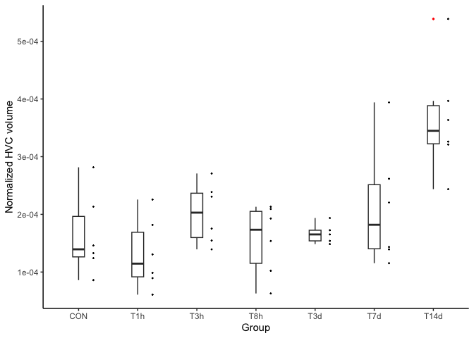<!-- -->

``` r
# The Kruskal???Wallis test (One-way ANOVA on ranks)
kruskal.test(HVC_nor ~ Group , data = HVC) 
```

    ## 
    ##  Kruskal-Wallis rank sum test
    ## 
    ## data:  HVC_nor by Group
    ## Kruskal-Wallis chi-squared = 17.317, df = 6, p-value = 0.008186

``` r
# Kruskal-Wallis chi-squared = 17.317, df = 6, p-value = 0.008186

kwAllPairsDunnTest(HVC_nor ~ Group, data = HVC, p.adjust.method = "holm") 
```

    ## 
    ##  Pairwise comparisons using Dunn's all-pairs test
    ## 
    ## data: HVC_nor by Group

    ##      CON    T1h    T3h    T8h    T3d    T7d   
    ## T1h  1.0000 -      -      -      -      -     
    ## T3h  1.0000 1.0000 -      -      -      -     
    ## T8h  1.0000 1.0000 1.0000 -      -      -     
    ## T3d  1.0000 1.0000 1.0000 1.0000 -      -     
    ## T7d  1.0000 1.0000 1.0000 1.0000 1.0000 -     
    ## T14d 0.0442 0.0043 0.9625 0.0455 0.2068 0.4253

    ## 
    ## P value adjustment method: holm
    ## alternative hypothesis: two.sided

``` r
#        CON    T1h    T3h    T8h    T3d    T7d   
# T1h  1.0000 -      -      -      -      -     
# T3h  1.0000 1.0000 -      -      -      -     
# T8h  1.0000 1.0000 1.0000 -      -      -     
# T3d  1.0000 1.0000 1.0000 1.0000 -      -     
# T7d  1.0000 1.0000 1.0000 1.0000 1.0000 -     
# T14d 0.0442 0.0043 0.9625 0.0455 0.2068 0.4253
```
