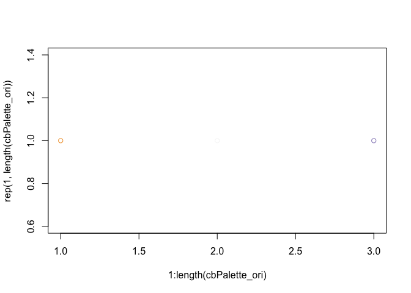
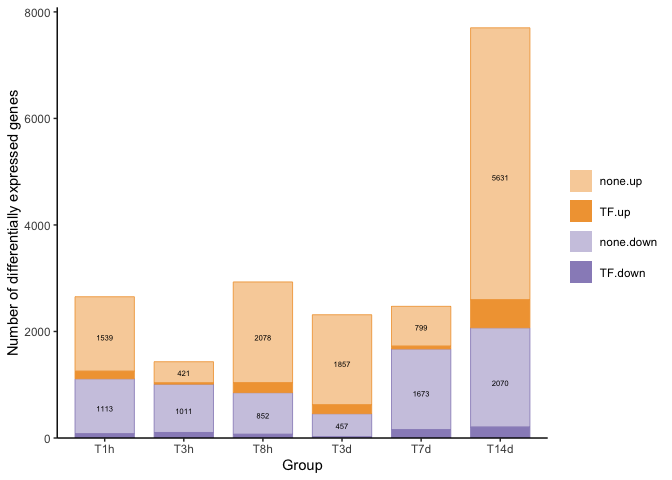
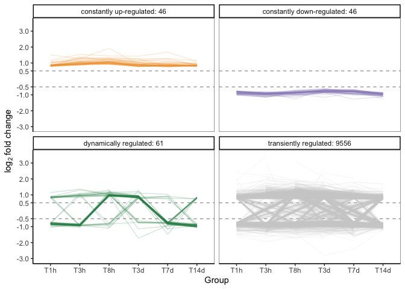
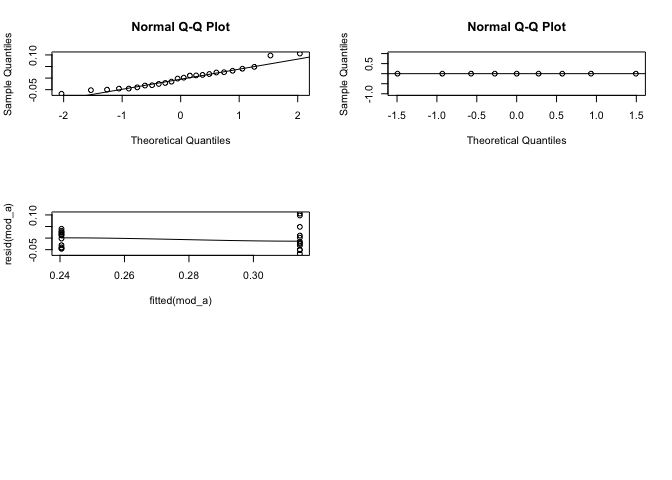
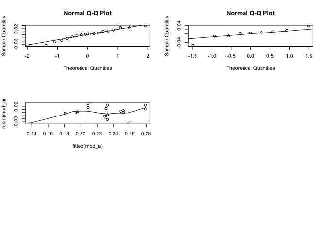
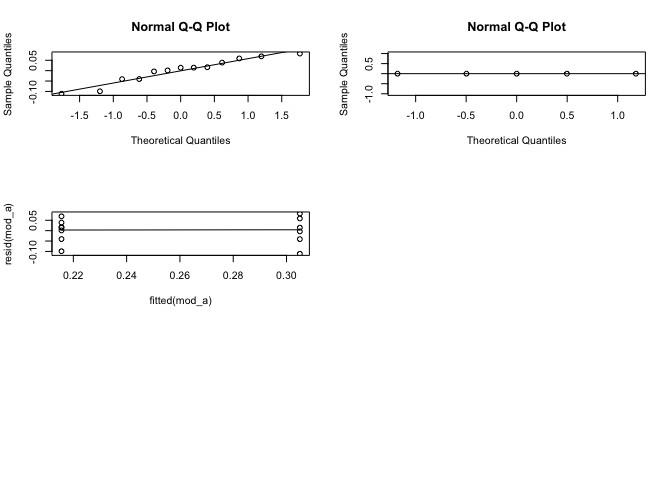
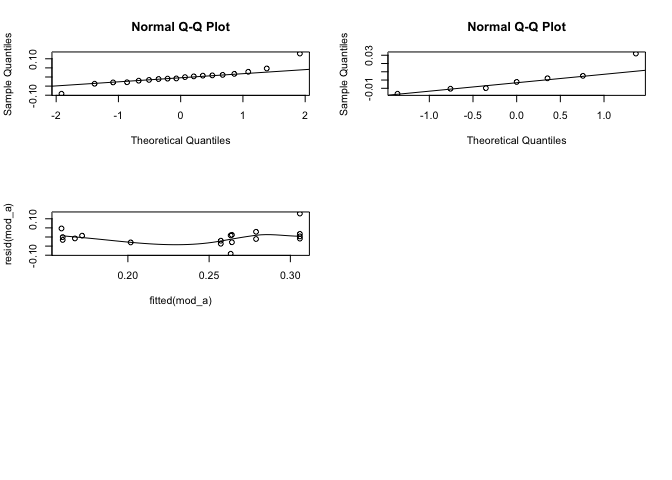
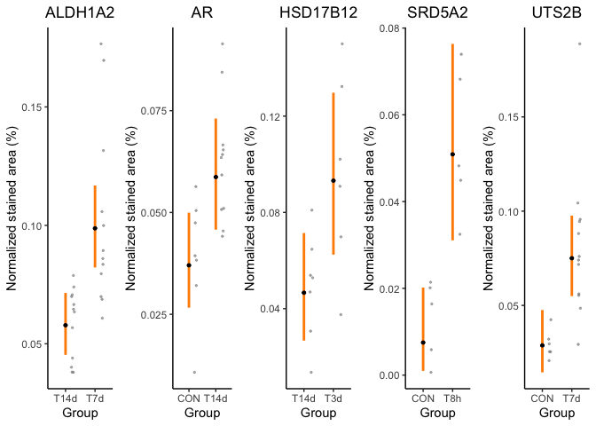
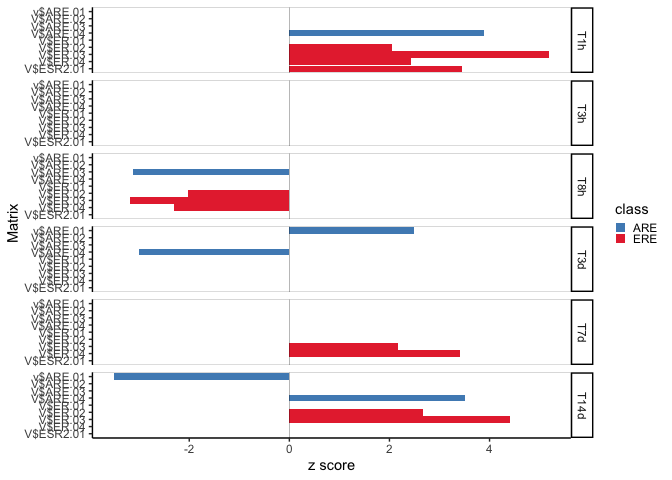

Figure 2 and related supplement tables
================
Meng-Ching Ko (MaggieMCKO)
05/06/2023

This [R Markdown](http://rmarkdown.rstudio.com) Notebook contain codes
for reproducing Fig.2 and related supplement tables of Ko et
al. (<https://www.biorxiv.org/content/10.1101/2022.06.13.495861v1>).
Data deposited on dryad: <https://doi.org/10.5061/dryad.5hqbzkh8c>

### Fig.2A

``` r
library(tidyverse) # v.2.0.0
```

    ## ── Attaching core tidyverse packages ──────────────────────── tidyverse 2.0.0 ──
    ## ✔ dplyr     1.1.2     ✔ readr     2.1.4
    ## ✔ forcats   1.0.0     ✔ stringr   1.5.0
    ## ✔ ggplot2   3.4.2     ✔ tibble    3.2.1
    ## ✔ lubridate 1.9.2     ✔ tidyr     1.3.0
    ## ✔ purrr     1.0.1     
    ## ── Conflicts ────────────────────────────────────────── tidyverse_conflicts() ──
    ## ✖ dplyr::filter() masks stats::filter()
    ## ✖ dplyr::lag()    masks stats::lag()
    ## ℹ Use the conflicted package (<http://conflicted.r-lib.org/>) to force all conflicts to become errors

``` r
library(RColorBrewer) # 1.1-3

## load data
path =  paste0(getwd(), "/Data/DiffExpression.tsv")
Expr = read_tsv(path)
```

    ## Rows: 19501 Columns: 11
    ## ── Column specification ────────────────────────────────────────────────────────
    ## Delimiter: "\t"
    ## chr (7): GeneSymbol, Group, regulatory.function, matrix.family, Chromosome, ...
    ## dbl (4): Coverage, LFC.ave, pval, padj
    ## 
    ## ℹ Use `spec()` to retrieve the full column specification for this data.
    ## ℹ Specify the column types or set `show_col_types = FALSE` to quiet this message.

``` r
Expr$Group = factor(Expr$Group, levels = c("T1h", "T3h", "T8h", "T3d", "T7d", "T14d"))


## prep data
Expr_TF = Expr %>% 
  mutate(Direction = ifelse(LFC.ave>0, "up", 'down')) %>% 
  group_by(Group, Direction, regulatory.function) %>% 
  tally()
Expr_TF$Direction = factor(Expr_TF$Direction, levels = c("up", "down"))

Expr_TF_lab = Expr %>% 
  mutate(Direction = ifelse(LFC.ave>0, "up", 'down')) %>% 
  group_by(Group, Direction) %>% 
  tally() %>% 
  pivot_wider(id_cols = Group, names_from = Direction, values_from = n) %>% 
  mutate(y_up = down + up/2,
         y_down = down/2)
  
## pick colors
cbPalette_ori = brewer.pal(n = 3, name = "PuOr")
color_up = cbPalette_ori[3]
color_dw = cbPalette_ori[1]
plot(1:length(cbPalette_ori), rep(1, length(cbPalette_ori)), col = cbPalette_ori)
```

<!-- -->

``` r
cbPalette = c(alpha(color_dw, alpha = .5), color_dw, # dw, dw_TF
              alpha(color_up, alpha = .5), color_up) # up, up_TF

FontSize = 2
p = ggplot(Expr_TF, aes(x = Group, y = n)) + 
  geom_bar(aes(fill = interaction(regulatory.function, Direction), color = Direction), stat="identity", 
           position=position_stack(reverse = F), width=.75, size = .3) +
  geom_text(data = Expr_TF_lab, 
            aes(x = Group, y = y_up, label = up), 
            color = "black", size = FontSize) +
  geom_text(data = Expr_TF_lab, 
            aes(x = Group, y = y_down, label = down), 
            color = "black", size = FontSize) +
  scale_fill_manual(values = cbPalette) + 
  scale_color_manual(values=c(color_dw, color_up)) +
  scale_y_continuous("Number of differentially expressed genes", 
                     expand = c(0,0,0.05,0)) +
  guides(fill = guide_legend(reverse = FALSE, nrow = 4, byrow = TRUE), colour = "none") + # reverse legend
  theme_classic() + 
  theme(strip.text.y = element_blank(), 
        legend.position = 'right',
        legend.title = element_blank()
  ); p
```

    ## Warning: Using `size` aesthetic for lines was deprecated in ggplot2 3.4.0.
    ## ℹ Please use `linewidth` instead.
    ## This warning is displayed once every 8 hours.
    ## Call `lifecycle::last_lifecycle_warnings()` to see where this warning was
    ## generated.

<!-- -->

### Fig.2B and Supplementary Table 4

``` r
library(tidyverse) # v.2.0.0

## load data
path =  paste0(getwd(), "/Data/DiffExpression.tsv")
Expr = read_tsv(path)
```

    ## Rows: 19501 Columns: 11
    ## ── Column specification ────────────────────────────────────────────────────────
    ## Delimiter: "\t"
    ## chr (7): GeneSymbol, Group, regulatory.function, matrix.family, Chromosome, ...
    ## dbl (4): Coverage, LFC.ave, pval, padj
    ## 
    ## ℹ Use `spec()` to retrieve the full column specification for this data.
    ## ℹ Specify the column types or set `show_col_types = FALSE` to quiet this message.

``` r
Expr$Group = factor(Expr$Group, levels = c("T1h", "T3h", "T8h", "T3d", "T7d", "T14d"))

# make wide
Expr_s = Expr %>% pivot_wider(id_cols = c(GeneSymbol, description), 
                              names_from = Group, values_from = `LFC.ave`) 
Expr_s$Category = apply(Expr_s[, 3:8], 1, function(s){
  if(any(is.na(s))){"transiently regulated"}else if(all(s>0)){"constantly up-regulated"
  }else if (all(s<0)){"constantly down-regulated"}else{"dynamically regulated"}
})
```

#### plot Fig.2B

``` r
# add count
Expr_s = Expr_s %>%
  group_by(Category) %>%
  mutate(count = n(),
         Category = paste0(Category, ": ", count))

# pick colors
cbPalette_ori = brewer.pal(n = 3, name = "PuOr")
color_up = cbPalette_ori[1] 
color_dw = cbPalette_ori[3]
plot(1:length(cbPalette_ori), rep(1, length(cbPalette_ori)), col = cbPalette_ori)
```

<!-- -->

``` r
Expr_s$Color = apply(Expr_s[, 3:8], 1, function(s){
  if(any(is.na(s))){"lightgrey"}else if(all(s>0)){color_up}else if (all(s<0)){color_dw}else{"seagreen4"}
})
table(Expr_s$Color)
```

    ## 
    ##   #998EC3   #F1A340 lightgrey seagreen4 
    ##        46        46      9556        61

``` r
Expr_s_l = gather(Expr_s, Group, LFC, T1h:T14d) %>% filter(! is.na(LFC))

order_category = sapply(c("constantly up-regulated", "constantly down-regulated", 
                          "dynamically regulated", "transiently regulated"), 
                        function(s){ unique(Expr_s$Category)[grep(s, unique(Expr_s$Category) )]})
Expr_s_l = within(Expr_s_l, Category <- factor(Category, levels = unique(order_category)))
Expr_s_l = within(Expr_s_l, Group <- factor(Group, levels = c("T1h", "T3h", "T8h", "T3d", "T7d", "T14d")))

range(Expr_s_l$LFC)
```

    ## [1] -2.78  3.40

``` r
levels(Expr_s_l$Category)
```

    ## [1] "constantly up-regulated: 46"   "constantly down-regulated: 46"
    ## [3] "dynamically regulated: 61"     "transiently regulated: 9556"

``` r
Line_p2 = ggplot(Expr_s_l, aes(x = Group, y = LFC, group = GeneSymbol, color = Category)) +
  geom_hline(yintercept = -0.5, size = 0.2, linetype = "dashed") +
  geom_hline(yintercept = 0.5, size = 0.2, linetype = "dashed") +
  geom_line(aes(alpha = Category)) +
  scale_color_manual(values = c(color_up, color_dw, "seagreen4", "lightgrey")) +
  scale_alpha_manual(values = c(0.2, 0.2, 0.2, 0.1)) +
  scale_y_continuous(name = expression('log'['2']*' fold change') , limits = c(-3, 3.5), 
                     breaks = c(-3, -2, -1, -0.5, 0.5, 1, 2, 3)) +
  facet_wrap(.~Category, nrow = 2) +
  # guides(alpha = 1) +
  guides(alpha = guide_legend(override.aes = list(alpha = 1)),
         color = guide_legend(nrow = 2, byrow = TRUE)
  ) + # reverse legend
  theme_classic() +
  theme(legend.position = 'none',
        panel.border = element_rect(color = 'grey50', fill = 'transparent'),
        axis.text.y = element_text(hjust = 1)) ; Line_p2
```

<!-- --> \####
Supplementary Table 4

``` r
Expr_s_filtered = Expr_s %>% filter(Category %in% c("constantly up-regulated", "constantly down-regulated", "dynamically regulated")) 
```

### Fig. 2F and Supplementary Table 2 and 3

``` r
library(tidyverse) # v.2.0.0
library(lme4) # 1.1-29
```

    ## Loading required package: Matrix

    ## 
    ## Attaching package: 'Matrix'

    ## The following objects are masked from 'package:tidyr':
    ## 
    ##     expand, pack, unpack

``` r
library(arm) # 1.7-19
```

    ## Loading required package: MASS

    ## 
    ## Attaching package: 'MASS'

    ## The following object is masked from 'package:dplyr':
    ## 
    ##     select

    ## 
    ## arm (Version 1.13-1, built: 2022-8-25)

    ## Working directory is /Users/maggie/ownCloud/Gahr/R/2015/TESTO2/Repos/github/TimeLapseTestoFemaleCanary/Analysis

``` r
library(gridExtra) # 2.3
```

    ## 
    ## Attaching package: 'gridExtra'

    ## The following object is masked from 'package:dplyr':
    ## 
    ##     combine

``` r
library(grid) # 4.1.2
set.seed(100)

## load data
path =  paste0(getwd(), "/Data/RNAscope_NormalizedStainedArea.tsv")
RNAscope = read_tsv(path)
```

    ## Rows: 84 Columns: 10

    ## ── Column specification ────────────────────────────────────────────────────────
    ## Delimiter: "\t"
    ## chr (3): Probe, Group, ori
    ## dbl (7): Individual, Slide, sum_slide, Area, n_particle, Density, percent_ar...
    ## 
    ## ℹ Use `spec()` to retrieve the full column specification for this data.
    ## ℹ Specify the column types or set `show_col_types = FALSE` to quiet this message.

``` r
probes = c("ALDH1A2", "AR", "HSD17B12", "SRD5A2", "UTS2B")
stats2 = lapply(probes, function(Probe_x){
  # Probe_x = probes[4]
  print(Probe_x)
  db = RNAscope %>% filter(Probe == Probe_x) 
  
  head(db)
  
  db$Group = factor(db$Group)
  db$Individual = factor(db$Individual)
  db$Slide = factor(db$Slide)
  
  db$Group <- droplevels(db$Group)
  db$Individual <- droplevels(db$Individual)
  db$Slide = droplevels(db$Slide)
  
  y_lab = "Normalized stained area (%)"
  
  # 1. deciding using sqrt or not and evaluating model
  mod_a <- lmer(data = db, sqrt(percent_area_slide) ~ Group + (1|Slide) ) # sqrt
  
  plot(mod_a)  
  summary(mod_a)
  
  plot.new()
  par(mfrow=c(3,2))
  qqnorm(resid(mod_a))
  qqline(resid(mod_a))
  qqnorm(ranef(mod_a)$"Slide"[,1])   # random effect
  qqline(ranef(mod_a)$"Slide"[,1])
  scatter.smooth(fitted(mod_a), resid(mod_a))
  
  new_data_mod_a <- expand.grid(Group = levels(db$Group)) # fix effect
  xmat <- model.matrix(~ Group, data=new_data_mod_a)  # fix effect
  new_data_mod_a$fit <- xmat%*%fixef(mod_a)
  
  nsim <- 10000
  bsim <- arm::sim(mod_a, n.sim=nsim ) #simulation of the model 10000 times
  ## To get the mean estimate of the fixed effects parameters apply(bsim@fixef, 2, mean)
  apply(bsim@fixef, 2, mean)
  ## To get the 95% credible Interval estimate of the fixed effects parameters apply(bsim@fixef, 2, quantile, prob=c(0.025, 0.975))
  apply(bsim@fixef, 2, quantile, prob=c(0.025, 0.975))
  
  Ind_b_CrI = apply(bsim@fixef, 2, quantile, prob=c(0.025, 0.975)) 
  
  Ind_b = mod_a@beta
  x = as.data.frame(VarCorr(mod_a)); x
  Ind_random_Slide = x[1, 4]
  # Ind_random_Group = x[2, 4]
  Ind_residual = x[2, 4]
  Ind_random_Slide_CrI = quantile(apply(bsim@ranef$Slide[,,1],1,var),prob=c(0.025, 0.975))
  # Ind_random_Group_CrI = quantile(apply(bsim@ranef$n_Group[,,1],1,var),prob=c(0.025, 0.975))
  Ind_residual_CrI = quantile(bsim@sigma^2,c(0.025, 0.975))
  
  df_t = rbind(cbind("Var" = Probe_x, "Parameter" = levels(db$Group), 
                     "Estimate" = Ind_b, t(Ind_b_CrI)),
               cbind("Var" = Probe_x, "Parameter" = "random_Slide", 
                     "Estimate" =  Ind_random_Slide, t(Ind_random_Slide_CrI)),
               cbind("Var" = Probe_x, "Parameter" = "residual", 
                     "Estimate" =  Ind_residual, t(Ind_residual_CrI)))
  
  fitmat <- matrix(ncol=nsim, nrow=nrow(new_data_mod_a))
  for(i in 1:nsim) fitmat[,i] <- xmat %*% bsim@fixef[i,]    # fitted values
  new_data_mod_a$lower <- apply(fitmat, 1, quantile, prob=0.025)
  new_data_mod_a$upper <- apply(fitmat, 1, quantile, prob=0.975)
  new_data_mod_a$fit <- apply(fitmat, 1, mean)
  new_data_mod_a$fit_sim<- (new_data_mod_a$fit)^2         # transform back from sqrt
  new_data_mod_a$upper_sim <- (new_data_mod_a$upper)^2   # transform back from sqrt
  new_data_mod_a$lower_sim <- (new_data_mod_a$lower)^2    # transform back from sqrt
  
  w = 0.25
  grey_point_size = 0.5
  mean_point_size = 1
  errorbar_wd = 1
  errorbar_hori = 0
  dodge = position_jitter(width = 0.05, height = 0)
  
  
  errorbar_col = "darkorange"
  
  plot_mod_a3 = ggplot(new_data_mod_a) +
    # need this layer to set up
    geom_point(data = new_data_mod_a,
               aes(x = Group, y = fit_sim), color='black', size=mean_point_size) +
    # raw data
    geom_point(data = db,
               aes(x = as.numeric(Group)+w, y = percent_area_slide),
               position = dodge, alpha = 0.5, size = grey_point_size,
               color = "grey50") +
    # CI
    geom_errorbar(data = new_data_mod_a,
                  aes(x = Group, ymax = upper_sim, ymin = lower_sim),
                  width = errorbar_hori, size = errorbar_wd,
                  color = errorbar_col) +
    # estimate
    geom_point(data = new_data_mod_a,
               aes(x = Group, y = fit_sim), color='black', size=mean_point_size) +
    ylab(y_lab) +
    ggtitle(Probe_x) +
    theme_classic() +
    theme(plot.title = element_text(hjust = 0.5)); plot_mod_a3
  
  pp = function(StimulatedTable){
    Dayn = 1:nrow(fitmat) # (row of fitmat)
    
    combi = combn(Dayn, 2)
    
    d = lapply(1:ncol(combi), function(combiN){
      # combiN = 1
      tmp = combi[, combiN]
      p = mean(fitmat[tmp[1],]<fitmat[tmp[2],])
      df = tibble("Group1" = (new_data_mod_a$Group[tmp[1]]), 
                  "Group2" = (new_data_mod_a$Group[tmp[2]]), "pp" = p)
    })
    
    dd = d %>% bind_rows() %>%
      mutate(`sig (2>1)` = ifelse(pp > 0.95, 'sig', NA))
    return(dd)
  }
  
  CI2 = Ind_b_CrI %>% t() %>% as.data.frame() %>% rownames_to_column
  df_t2 = df_t %>% as_tibble()
  
  return(list(plot_mod_a3, pp(new_data_mod_a), df_t2, CI2))
})
```

    ## [1] "ALDH1A2"

    ## boundary (singular) fit: see help('isSingular')

<!-- -->

    ## Warning in simpleLoess(y, x, w, span, degree = degree, parametric = FALSE, :
    ## pseudoinverse used at 0.24009

    ## Warning in simpleLoess(y, x, w, span, degree = degree, parametric = FALSE, :
    ## neighborhood radius 0.07432

    ## Warning in simpleLoess(y, x, w, span, degree = degree, parametric = FALSE, :
    ## reciprocal condition number 0

    ## Warning in simpleLoess(y, x, w, span, degree = degree, parametric = FALSE, :
    ## There are other near singularities as well. 0.0055235

    ## Warning in simpleLoess(y, x, w, span, degree = degree, parametric = FALSE, :
    ## pseudoinverse used at 0.24009

    ## Warning in simpleLoess(y, x, w, span, degree = degree, parametric = FALSE, :
    ## neighborhood radius 0.07432

    ## Warning in simpleLoess(y, x, w, span, degree = degree, parametric = FALSE, :
    ## reciprocal condition number 0

    ## Warning in simpleLoess(y, x, w, span, degree = degree, parametric = FALSE, :
    ## There are other near singularities as well. 0.0055235

    ## Warning in simpleLoess(y, x, w, span, degree = degree, parametric = FALSE, :
    ## pseudoinverse used at 0.24009

    ## Warning in simpleLoess(y, x, w, span, degree = degree, parametric = FALSE, :
    ## neighborhood radius 0.07432

    ## Warning in simpleLoess(y, x, w, span, degree = degree, parametric = FALSE, :
    ## reciprocal condition number 0

    ## Warning in simpleLoess(y, x, w, span, degree = degree, parametric = FALSE, :
    ## There are other near singularities as well. 0.0055235

    ## Warning in simpleLoess(y, x, w, span, degree = degree, parametric = FALSE, :
    ## pseudoinverse used at 0.24009

    ## Warning in simpleLoess(y, x, w, span, degree = degree, parametric = FALSE, :
    ## neighborhood radius 0.07432

    ## Warning in simpleLoess(y, x, w, span, degree = degree, parametric = FALSE, :
    ## reciprocal condition number 0

    ## Warning in simpleLoess(y, x, w, span, degree = degree, parametric = FALSE, :
    ## There are other near singularities as well. 0.0055235

    ## Warning in simpleLoess(y, x, w, span, degree = degree, parametric = FALSE, :
    ## pseudoinverse used at 0.24009

    ## Warning in simpleLoess(y, x, w, span, degree = degree, parametric = FALSE, :
    ## neighborhood radius 0.07432

    ## Warning in simpleLoess(y, x, w, span, degree = degree, parametric = FALSE, :
    ## reciprocal condition number 0

    ## Warning in simpleLoess(y, x, w, span, degree = degree, parametric = FALSE, :
    ## There are other near singularities as well. 0.0055235

    ## [1] "AR"

<!-- -->

    ## [1] "HSD17B12"

    ## boundary (singular) fit: see help('isSingular')

<!-- -->

    ## Warning in simpleLoess(y, x, w, span, degree = degree, parametric = FALSE, :
    ## pseudoinverse used at 0.21511

    ## Warning in simpleLoess(y, x, w, span, degree = degree, parametric = FALSE, :
    ## neighborhood radius 0.089894

    ## Warning in simpleLoess(y, x, w, span, degree = degree, parametric = FALSE, :
    ## reciprocal condition number 0

    ## Warning in simpleLoess(y, x, w, span, degree = degree, parametric = FALSE, :
    ## There are other near singularities as well. 0.0080809

    ## Warning in simpleLoess(y, x, w, span, degree = degree, parametric = FALSE, :
    ## pseudoinverse used at 0.21511

    ## Warning in simpleLoess(y, x, w, span, degree = degree, parametric = FALSE, :
    ## neighborhood radius 0.089894

    ## Warning in simpleLoess(y, x, w, span, degree = degree, parametric = FALSE, :
    ## reciprocal condition number 0

    ## Warning in simpleLoess(y, x, w, span, degree = degree, parametric = FALSE, :
    ## There are other near singularities as well. 0.0080809

    ## Warning in simpleLoess(y, x, w, span, degree = degree, parametric = FALSE, :
    ## pseudoinverse used at 0.21511

    ## Warning in simpleLoess(y, x, w, span, degree = degree, parametric = FALSE, :
    ## neighborhood radius 0.089894

    ## Warning in simpleLoess(y, x, w, span, degree = degree, parametric = FALSE, :
    ## reciprocal condition number 0

    ## Warning in simpleLoess(y, x, w, span, degree = degree, parametric = FALSE, :
    ## There are other near singularities as well. 0.0080809

    ## Warning in simpleLoess(y, x, w, span, degree = degree, parametric = FALSE, :
    ## pseudoinverse used at 0.21511

    ## Warning in simpleLoess(y, x, w, span, degree = degree, parametric = FALSE, :
    ## neighborhood radius 0.089894

    ## Warning in simpleLoess(y, x, w, span, degree = degree, parametric = FALSE, :
    ## reciprocal condition number 0

    ## Warning in simpleLoess(y, x, w, span, degree = degree, parametric = FALSE, :
    ## There are other near singularities as well. 0.0080809

    ## Warning in simpleLoess(y, x, w, span, degree = degree, parametric = FALSE, :
    ## pseudoinverse used at 0.21511

    ## Warning in simpleLoess(y, x, w, span, degree = degree, parametric = FALSE, :
    ## neighborhood radius 0.089894

    ## Warning in simpleLoess(y, x, w, span, degree = degree, parametric = FALSE, :
    ## reciprocal condition number 0

    ## Warning in simpleLoess(y, x, w, span, degree = degree, parametric = FALSE, :
    ## There are other near singularities as well. 0.0080809

    ## [1] "SRD5A2"

<!-- -->

    ## [1] "UTS2B"

<!-- --><!-- -->
\#### Supplementary Table 2 and 3 \##### CredibleInterval

``` r
pp_CI2 = lapply(1:length(stats2), function(i){
  # i=1
  stats2[[i]][[4]] %>% bind_cols("Probe" = probes[i])
}) %>% bind_rows(); pp_CI2
```

    ##        rowname       2.5%      97.5%    Probe
    ## 1  (Intercept) 0.21290552 0.26737741  ALDH1A2
    ## 2     GroupT7d 0.03501056 0.11366173  ALDH1A2
    ## 3  (Intercept) 0.16319230 0.22350084       AR
    ## 4    GroupT14d 0.01908306 0.08128143       AR
    ## 5  (Intercept) 0.16349877 0.26723482 HSD17B12
    ## 6     GroupT3d 0.01301835 0.16535073 HSD17B12
    ## 7  (Intercept) 0.03132731 0.14206668   SRD5A2
    ## 8     GroupT8h 0.08044988 0.19653478   SRD5A2
    ## 9  (Intercept) 0.12040494 0.21800954    UTS2B
    ## 10    GroupT7d 0.04953451 0.15956705    UTS2B

##### estimates

``` r
pp_est2 = lapply(1:length(stats2), function(i){
  # i=1
  stats2[[i]][[3]] %>% bind_cols("Probe" = probes[i])
}) %>% bind_rows(); pp_est2
```

    ## # A tibble: 20 × 6
    ##    Var      Parameter    Estimate             `2.5%`               `97.5%` Probe
    ##    <chr>    <chr>        <chr>                <chr>                <chr>   <chr>
    ##  1 ALDH1A2  T14d         0.240459113742941    0.212905517075523    0.2673… ALDH…
    ##  2 ALDH1A2  T7d          0.0739505750591057   0.0350105589825052   0.1136… ALDH…
    ##  3 ALDH1A2  random_Slide 0                    0                    0       ALDH…
    ##  4 ALDH1A2  residual     0.00211513918658714  0.00124151870386625  0.0042… ALDH…
    ##  5 AR       CON          0.19242561850096     0.163192297630712    0.2235… AR   
    ##  6 AR       T14d         0.0498418656272708   0.0190830629639255   0.0812… AR   
    ##  7 AR       random_Slide 0.000890386707195784 0.00036233702544036  0.0018… AR   
    ##  8 AR       residual     0.000554858772362795 0.00030461846475465  0.0012… AR   
    ##  9 HSD17B12 T14d         0.215556142517656    0.163498767965705    0.2672… HSD1…
    ## 10 HSD17B12 T3d          0.0894467470592462   0.013018347387143    0.1653… HSD1…
    ## 11 HSD17B12 random_Slide 0                    0                    0       HSD1…
    ## 12 HSD17B12 residual     0.00388157730337991  0.00194973486910682  0.0110… HSD1…
    ## 13 SRD5A2   CON          0.086678956165352    0.031327307078937    0.1420… SRD5…
    ## 14 SRD5A2   T8h          0.138464240106658    0.0804498762224548   0.1965… SRD5…
    ## 15 SRD5A2   random_Slide 0.0018336879539685   0.000773367851639041 0.0041… SRD5…
    ## 16 SRD5A2   residual     0.00047169757887482  0.00021783789131499  0.0017… SRD5…
    ## 17 UTS2B    CON          0.16968293418706     0.120404943523476    0.2180… UTS2B
    ## 18 UTS2B    T7d          0.104124139024731    0.0495345080017217   0.1595… UTS2B
    ## 19 UTS2B    random_Slide 0.00068740142729519  0.000176324059387745 0.0018… UTS2B
    ## 20 UTS2B    residual     0.00237103819153895  0.0013163407745966   0.0055… UTS2B

##### PostProbability

``` r
pp_summary2 = lapply(1:length(stats2), function(i){
  # i=1
  stats2[[i]][[2]] %>% bind_cols("Probe" = probes[i])
}) %>% bind_rows(); pp_summary2
```

    ## # A tibble: 5 × 5
    ##   Group1 Group2    pp `sig (2>1)` Probe   
    ##   <fct>  <fct>  <dbl> <chr>       <chr>   
    ## 1 T14d   T7d    1.00  sig         ALDH1A2 
    ## 2 CON    T14d   0.997 sig         AR      
    ## 3 T14d   T3d    0.988 sig         HSD17B12
    ## 4 CON    T8h    1.00  sig         SRD5A2  
    ## 5 CON    T7d    1.00  sig         UTS2B

#### Fig. 2F

``` r
plots2 =  lapply(1:length(stats2), function(i){
  # i=1
  p = stats2[[i]][[1]] #
  p
}) 

x = arrangeGrob(grobs = plots2, nrow = 1)
```

    ## Warning: Removed 1 rows containing missing values (`geom_point()`).

``` r
plot.new()
grid.draw(x)
```

<!-- -->

### Fig. 2 - Figure supplement 1

``` r
library(tidyverse) # v.2.0.0

## load data
path =  paste0(getwd(), "/Data/DiffExpression.tsv")
Expr = read_tsv(path)
```

    ## Rows: 19501 Columns: 11
    ## ── Column specification ────────────────────────────────────────────────────────
    ## Delimiter: "\t"
    ## chr (7): GeneSymbol, Group, regulatory.function, matrix.family, Chromosome, ...
    ## dbl (4): Coverage, LFC.ave, pval, padj
    ## 
    ## ℹ Use `spec()` to retrieve the full column specification for this data.
    ## ℹ Specify the column types or set `show_col_types = FALSE` to quiet this message.

``` r
Expr$Group = factor(Expr$Group, levels = c("T1h", "T3h", "T8h", "T3d", "T7d", "T14d"))

# make wide
Expr_s = Expr %>% pivot_wider(id_cols = c(GeneSymbol, description), 
                              names_from = Group, values_from = `LFC.ave`) 
Expr_s$`Number of regulated time points` =  apply(Expr_s[, 3:8], 1, function(s){
  sum(!is.na(s))
})

x = Expr_s %>% group_by(`Number of regulated time points`) %>% 
  tally(name = "Number of genes") %>% 
  mutate(class = ifelse(`Number of regulated time points` == 6, 'constantly regulated', 'transiently regulated'))
x$class <- factor(x$class, levels = c('transiently regulated', 'constantly regulated'))

p = ggplot(x, aes(x = `Number of regulated time points`, y = `Number of genes`)) +
  geom_col(aes(fill = class)) +
  geom_text(aes(label = `Number of genes`), vjust = -1, size = FontSize) +
  scale_y_continuous(expand = c(0,0,0.05,0)) + 
  scale_x_continuous(breaks = 1:6) + 
  scale_fill_manual(values = c('grey70', 'grey30')) +
  theme_classic() +
  theme(legend.position = c(0.7, 0.85)); p
```

<!-- -->

### Fig. 2 - Figure supplement 2A

``` r
tb = tibble("Matrix" = c("v$ARE.01",
                         "V$ARE.02",
                         "V$ARE.03",
                         "V$ARE.04",
                         "V$ER.01",
                         "V$ER.02",
                         "V$ER.03",
                         "V$ER.04",
                         "V$ESR2.01"),
            "T1h" = c(NA, NA, NA, 3.88, NA, 2.05, 5.19, 2.43, 3.45),
            "T3h" = rep(NA, 9),
            "T8h" = c(NA, NA, -3.13, NA, NA, -2.03, -3.19, -2.3, NA),
            "T3d" = c(2.5, NA, NA, -3, rep(NA, 5)),
            "T7d" = c(rep(NA, 6), 2.17, 3.41, NA), 
            "T14d" = c(-3.5, NA, NA, 3.5, NA, 2.68, 4.41, NA, NA))
tb_l = tb %>% pivot_longer(cols = matches("^T"), names_to = "TimePoint", values_to = "z score") %>% 
  mutate(class = ifelse(grepl("ARE", Matrix), "ARE", "ERE"))
tb_l$TimePoint <- factor(tb_l$TimePoint, levels = c("T1h", "T3h", "T8h", "T3d", "T7d", "T14d"))
tb_l$Matrix <- factor(tb_l$Matrix, levels = rev(c("v$ARE.01",
                                              "V$ARE.02",
                                              "V$ARE.03",
                                              "V$ARE.04",
                                              "V$ER.01",
                                              "V$ER.02",
                                              "V$ER.03",
                                              "V$ER.04",
                                              "V$ESR2.01")))
tb_l$class <- factor(tb_l$class, levels = c("ARE", "ERE"))

col = brewer.pal(n = 9, 'Set1')
er = col[1]
ar = col[2]

p = tb_l %>% 
  ggplot(aes(y = Matrix, x = `z score`)) +
  geom_col(aes(fill = class), alpha = 0.9) +
  geom_vline(xintercept = 0, size = 0.1) +
  scale_fill_manual(values = c(ar, er)) +
  facet_grid(TimePoint~. ) + theme_classic() +
  theme(panel.border = element_rect(color = "black", size = .1, fill = 'transparent'),
    legend.position = 'right',
    legend.key.size = unit(8, 'pt')); p
```

    ## Warning: The `size` argument of `element_rect()` is deprecated as of ggplot2 3.4.0.
    ## ℹ Please use the `linewidth` argument instead.
    ## This warning is displayed once every 8 hours.
    ## Call `lifecycle::last_lifecycle_warnings()` to see where this warning was
    ## generated.

    ## Warning: Removed 37 rows containing missing values (`position_stack()`).

<!-- -->
