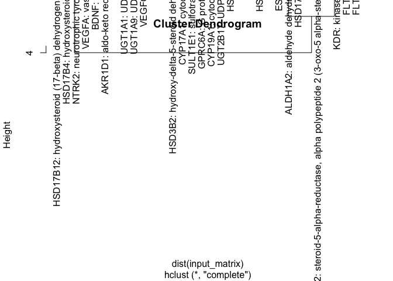
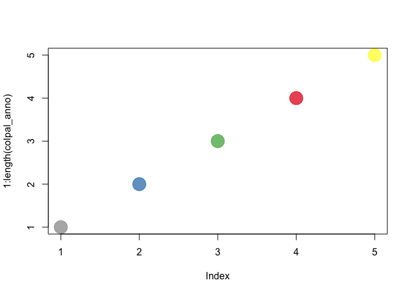
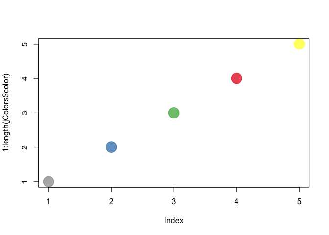
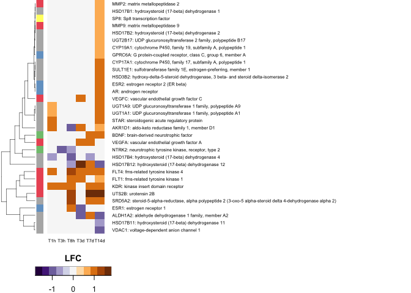
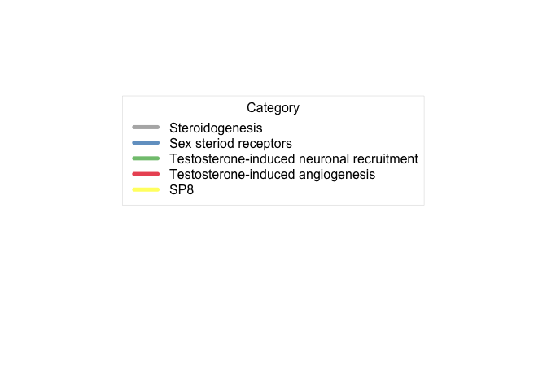
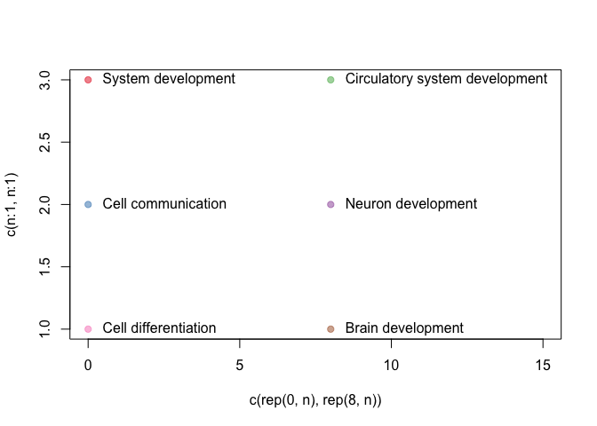
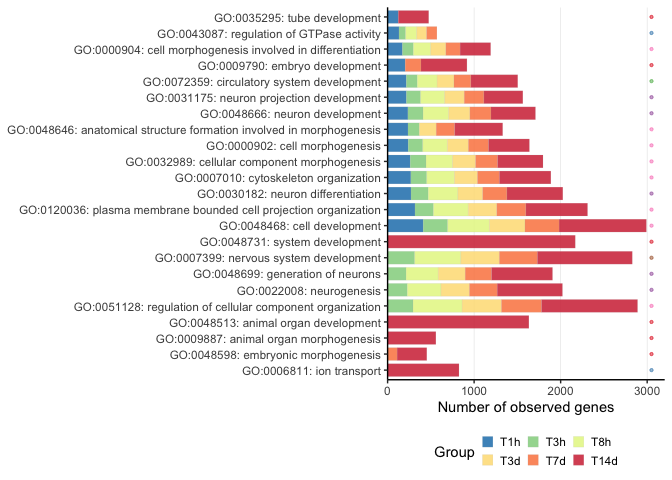
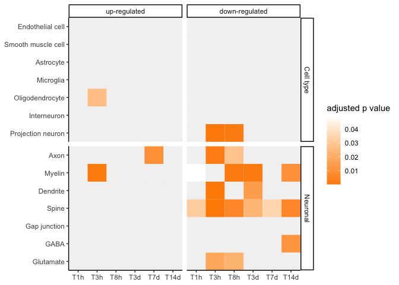
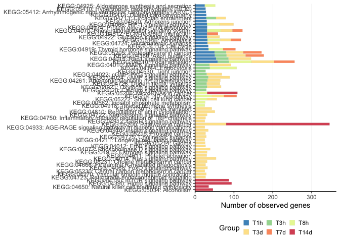
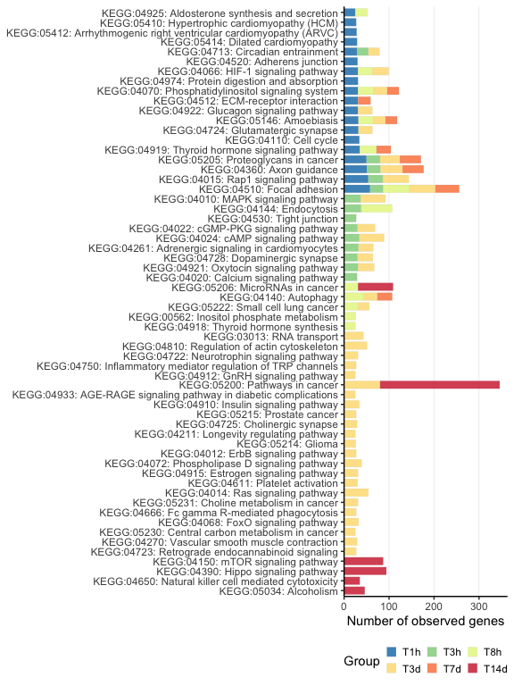

Figure 3 and related supplement tables
================
Meng-Ching Ko (MaggieMCKO)
05/06/2023

This [R Markdown](http://rmarkdown.rstudio.com) Notebook contain codes
for reproducing Fig.3 and related supplement tables of Ko et
al. (<https://www.biorxiv.org/content/10.1101/2022.06.13.495861v1>).
Data deposited on dryad: <https://doi.org/10.5061/dryad.5hqbzkh8c>

### Fig. 3A

#### load data

``` r
library(tidyverse) # v.2.0.0
```

    ## ── Attaching core tidyverse packages ──────────────────────── tidyverse 2.0.0 ──
    ## ✔ dplyr     1.1.2     ✔ readr     2.1.4
    ## ✔ forcats   1.0.0     ✔ stringr   1.5.0
    ## ✔ ggplot2   3.4.2     ✔ tibble    3.2.1
    ## ✔ lubridate 1.9.2     ✔ tidyr     1.3.0
    ## ✔ purrr     1.0.1     
    ## ── Conflicts ────────────────────────────────────────── tidyverse_conflicts() ──
    ## ✖ dplyr::filter() masks stats::filter()
    ## ✖ dplyr::lag()    masks stats::lag()
    ## ℹ Use the conflicted package (<http://conflicted.r-lib.org/>) to force all conflicts to become errors

``` r
library(gplots) # v3.1.3
```

    ## 
    ## Attaching package: 'gplots'
    ## 
    ## The following object is masked from 'package:stats':
    ## 
    ##     lowess

``` r
library(RColorBrewer) # v1.1-3

set.seed(100)

## load data
path =  paste0(getwd(), "/Data/DiffExpression.tsv")
Expr = read_tsv(path)
```

    ## Rows: 19501 Columns: 11
    ## ── Column specification ────────────────────────────────────────────────────────
    ## Delimiter: "\t"
    ## chr (6): GeneSymbol, Group, regulatory.function, Chromosome, description, po...
    ## dbl (4): Coverage, LFC.ave, pval, padj
    ## lgl (1): matrix.family
    ## 
    ## ℹ Use `spec()` to retrieve the full column specification for this data.
    ## ℹ Specify the column types or set `show_col_types = FALSE` to quiet this message.

``` r
# make wide
Expr_s = Expr %>% pivot_wider(id_cols = c(GeneSymbol, description), 
                              names_from = Group, values_from = `LFC.ave`) 
```

#### prep matrix

``` r
# target genes
targets = c("AR", "SRD5A2", "CYP19A1", "ESR1", "ESR2", "BDNF", "KDR", "FLT1", "FLT4", 
             "VEGFC", "VEGFA", "MMP2", "MMP9", "NTRK2", "NTRK1", "NGFR", 
             "UTS2B", "SULT1A1", "SULT1E1", "AKR1C2", "GPER1", "GPRC6A", 
             "SP8", "ABP", "SHBG", "HSD3B2", "CYP17A1", "HSD17B12", "SRD5A2", "SRD5A1", "SRD5A3", 
             "CYP19A1", "AKR1C4", "AKR1D1", "COMT",
             "HSD17B1", "HSD17B11", "HSD17B2", "HSD17B4", 
             "UGT1A1", "UGT1A8", "UGT1A9", "UGT2B17", 
             "ALDH1A2", "STAR", "TSPO", "VDAC1") 

# target genes expr
Expr_s_targets = Expr_s %>% filter(GeneSymbol %in% targets)

# prep matrix
input_matrix = Expr_s_targets[, 3:8] %>% as.matrix()
row.names(input_matrix) = paste0(Expr_s_targets$GeneSymbol, ": ", Expr_s_targets$description)
input_matrix[is.na(input_matrix)] = 0
```

#### prep annotations

``` r
# color for expression
col_pl = rev(brewer.pal(11,"PuOr"))

#  color for annotation
hc = hclust(dist(input_matrix))
plot(hc)
```

<!-- -->

``` r
str(hc)
```

    ## List of 7
    ##  $ merge      : int [1:31, 1:2] -21 -22 -17 -26 -5 -16 -23 2 -28 -18 ...
    ##  $ height     : num [1:31] 0 0.0025 0.005 0.005 0.01 ...
    ##  $ order      : int [1:32] 11 29 30 12 15 1 4 5 6 13 ...
    ##  $ labels     : chr [1:32] "AKR1D1: aldo-keto reductase family 1, member D1" "FLT4: fms-related tyrosine kinase 4" "KDR: kinase insert domain receptor" "STAR: steroidogenic acute regulatory protein" ...
    ##  $ method     : chr "complete"
    ##  $ call       : language hclust(d = dist(input_matrix))
    ##  $ dist.method: chr "euclidean"
    ##  - attr(*, "class")= chr "hclust"

``` r
hc_lab = hc$labels
hc_lab_sym = gsub("(.*): .*.$", "\\1", hc_lab); hc_lab_sym
```

    ##  [1] "AKR1D1"   "FLT4"     "KDR"      "STAR"     "UGT1A1"   "UGT1A9"  
    ##  [7] "ESR1"     "FLT1"     "SRD5A2"   "UTS2B"    "HSD17B12" "VEGFA"   
    ## [13] "VEGFC"    "ALDH1A2"  "BDNF"     "AR"       "CYP17A1"  "CYP19A1" 
    ## [19] "ESR2"     "GPRC6A"   "HSD17B1"  "HSD17B2"  "HSD3B2"   "MMP2"    
    ## [25] "MMP9"     "SP8"      "SULT1E1"  "UGT2B17"  "HSD17B4"  "NTRK2"   
    ## [31] "HSD17B11" "VDAC1"

``` r
## add annotation
sex_steriod_receptors = c("GPRC6A", "AR", "ESR1", "ESR2")
steroidogenesis = c("AKR1D1", "COMT", "CYP17A1",  "CYP19A1", 
                    "HSD17B1", "HSD17B11", "HSD17B12","HSD17B2",  "HSD17B4", "HSD3B2", 
                    "SRD5A1", "SRD5A2", "SRD5A3", "STAR", "SULT1E1", "TSPO", 
                    "UGT1A1", "UGT1A8", "UGT1A9", "UGT2B17", "VDAC1", "ALDH1A2")   
angio = c("FLT1", "FLT4", "KDR", "MMP2", "MMP9", "VEGFA", "VEGFC", "UTS2B")
neuro_recruit = c("BDNF", "NTRK2")

input_anno = sapply(hc_lab_sym , function(s){
  if(s%in% steroidogenesis){"Steroidogenesis"}else if(s %in% sex_steriod_receptors){
    "Sex steriod receptors"}else if (s%in%neuro_recruit){
      "Testosterone-induced neuronal recruitment"}else if(s %in% angio){
        "Testosterone-induced angiogenesis"}else{"SP8"}
})
length(input_anno) == nrow(input_matrix)
```

    ## [1] TRUE

``` r
# display.brewer.pal(9, name = 'Set1')
colpal_anno = brewer.pal(9, name = 'Set1')[c(9, 2, 3, 1,6, 8, 7,4,5)]
colpal_anno = alpha(colpal_anno, alpha = 0.75)
colpal_anno = colpal_anno[1:length(unique(input_anno))]
plot(1:length(colpal_anno),  col = colpal_anno, cex = 3, pch = 19)
```

<!-- -->

``` r
length(colpal_anno)
```

    ## [1] 5

``` r
length(unique(input_anno))
```

    ## [1] 5

``` r
funtobe = c("Steroidogenesis", "Sex steriod receptors", "Testosterone-induced neuronal recruitment",
            "Testosterone-induced angiogenesis", "SP8")
jColors <- data.frame(fun = funtobe, color = I(colpal_anno))
plot(1:length(jColors$color),  col = jColors$color, cex = 3, pch = 19)
```

<!-- -->

``` r
RowSideColors_fun = jColors$color[match(input_anno, jColors$fun)]
```

#### heatmap

``` r
par( lwd = 0.5)
heatmap.2(x = input_matrix, Rowv = T, Colv = F, dendrogram =  "row",
          col = col_pl,
          
          RowSideColors = RowSideColors_fun,
          na.rm = TRUE,
          na.color = "grey90",
          trace = "none",
          density.info = "none",
          key.title = "LFC",
          key.xlab = NA,
          key.ylab = "1",
          srtCol = 0,
          cexRow = 0.7,
          cexCol = 0.7,
          adjCol = 0.5,
          lmat = rbind(c(3, 1, 2, 0), c(5, 5, 5 ,4)), 
          lhei = c(.85, .15), 
          lwid = c(0.1, 0.03, 0.2, 0.8),
          margins =c(2, 2)
)
```

<!-- --> \#### legend

``` r
plot.new()
legend(x = 0.1, y = 0.9,      
       title = "Category",
       legend = jColors$fun, # category labels
       col = jColors$color,  # color key
       cex = 1, lty = 1,  # line style
       lwd = 5,          # line width,
       box.lwd = .1, 
       ncol = 1
) 
```

<!-- -->

### Fig.3B

``` r
library(tidyverse) # v.2.0.0

## load data
path = paste0(getwd(), "/Data/ClueGO_Top10.csv")
ClueGO_short = read_csv(file = path)
```

    ## Rows: 23 Columns: 34
    ## ── Column specification ────────────────────────────────────────────────────────
    ## Delimiter: ","
    ## chr (15): GOID, fun, GOTerm, GOGroups_T1h, GOGroups_T3h, GOGroups_T8h, GOGro...
    ## dbl (13): fun.ind, T1h, T3h, T8h, T3d, T7d, T14d, Nr..Genes_T1h, Nr..Genes_T...
    ## lgl  (6): OverViewTerm_T1h, OverViewTerm_T3h, OverViewTerm_T8h, OverViewTerm...
    ## 
    ## ℹ Use `spec()` to retrieve the full column specification for this data.
    ## ℹ Specify the column types or set `show_col_types = FALSE` to quiet this message.

``` r
## prep data
input = ClueGO_short %>% 
  mutate(`GO term` = paste(GOID, GOTerm, sep = ": ")) %>% 
  dplyr::select(`GO term`, fun.ind, fun, matches("Nr")) %>% 
  pivot_longer(cols = matches("Nr"), names_to = "Group", values_to = "value") %>% 
  mutate(Group = gsub("Nr..Genes_", "", Group))
input$Group = factor(input$Group, levels = c("T1h", "T3h", "T8h", "T3d", "T7d", "T14d"))

input = input %>% 
  ## sort by time
  arrange(Group, value )
input$`GO term` = factor(input$`GO term`, levels = rev(unique(input$`GO term`)))

## legend
colpal = c(brewer.pal(9, name = 'Set1')[c(1:2, 8, 3,4,7,5, 9)], brewer.pal(9, name = 'Set3')[-2])
# plot(1:length(colpal), col = colpal, pch = 19)
colpal = colpal[1:length(unique(input$fun))]
colpal_alpha = alpha(colpal, 0.5)

if(length(colpal) == length(unique(input$fun))){
  unique(input$fun)
  lab = unique(input$fun)
  lab = factor(lab, levels = lab);
  lab; length(lab)
  
  n = ceiling(length(lab)/2)
  plot(x = c(rep(0, n), rep(8, n)), y = c(n:1, n:1), col = alpha(colpal, 0.5), pch = 19, xlim = c(0, 15))
  text(x = c(rep(.2, n), rep(8.2, n)), y = c(n:1, n:1), lab, cex= 1, pos=4, col="black")

}
```

<!-- -->

#### plot

``` r
## colors for T groups
cbPalette = rev(brewer.pal(6, 'Spectral')) 
# plot(1:6, col = cbPalette, cex = 5, pch = 19)

jColors <- with(input, data.frame(fun = lab, color = I(colpal)))
RowSideColors_fun = jColors$color[match(input$fun, jColors$fun)]
input2 = cbind(input, RowSideColors_fun)

ymax = 3050
paper = ggplot(input2, aes(y = value, x = `GO term`)) +
  geom_bar(aes( fill = Group), stat = 'identity', 
           position= position_stack(reverse = TRUE), 
           width = .8, alpha = 0.9, color = 'grey', size = 0.05) + 
  geom_point(aes(x = `GO term`, y = ymax), 
             color = RowSideColors_fun, alpha = 0.1, size = 0.8) +
  coord_flip() +
  scale_fill_manual(values = cbPalette) +
  scale_y_continuous(name = "Number of observed genes", expand = c(0,0, 0.05, 0)) +
  guides(fill = guide_legend(nrow = 2, byrow = TRUE)) +
  theme_classic() + 
  theme(panel.grid.major.x = element_line(color = "grey90", size = .2),
                  axis.title.y = element_blank(),
                  legend.key.size = unit(8, 'pt'), 
                  legend.position = "bottom") ; paper
```

    ## Warning: Using `size` aesthetic for lines was deprecated in ggplot2 3.4.0.
    ## ℹ Please use `linewidth` instead.
    ## This warning is displayed once every 8 hours.
    ## Call `lifecycle::last_lifecycle_warnings()` to see where this warning was
    ## generated.

    ## Warning: The `size` argument of `element_line()` is deprecated as of ggplot2 3.4.0.
    ## ℹ Please use the `linewidth` argument instead.
    ## This warning is displayed once every 8 hours.
    ## Call `lifecycle::last_lifecycle_warnings()` to see where this warning was
    ## generated.

    ## Warning: Removed 37 rows containing missing values (`position_stack()`).

<!-- -->

### Fig.3C and Supplementary Table 9

``` r
library(tidyverse) # v.2.0.0

path =  paste0(getwd(), "/Data/DiffExpression.tsv")
Expr = read_tsv(path)
```

    ## Rows: 19501 Columns: 11
    ## ── Column specification ────────────────────────────────────────────────────────
    ## Delimiter: "\t"
    ## chr (6): GeneSymbol, Group, regulatory.function, Chromosome, description, po...
    ## dbl (4): Coverage, LFC.ave, pval, padj
    ## lgl (1): matrix.family
    ## 
    ## ℹ Use `spec()` to retrieve the full column specification for this data.
    ## ℹ Specify the column types or set `show_col_types = FALSE` to quiet this message.

``` r
Expr$Group = factor(Expr$Group, levels = c("T1h", "T3h", "T8h", "T3d", "T7d", "T14d"))

path = paste0(getwd(), "/Data/CellType_GeneList.tsv")
cell_type_gene_lists_df = read_tsv(path)
```

    ## Rows: 12901 Columns: 4
    ## ── Column specification ────────────────────────────────────────────────────────
    ## Delimiter: "\t"
    ## chr (4): CellType, Identifier, GeneSymbol, PANTHERfamily
    ## 
    ## ℹ Use `spec()` to retrieve the full column specification for this data.
    ## ℹ Specify the column types or set `show_col_types = FALSE` to quiet this message.

``` r
cell_typeS = c( 
  # vessel
  "Endothelial cell", "Fibroblast", "Pericyte", "Smooth muscle cell",
  # Glia
  "Glial", "Astrocyte", "Microglia", "Oligodendrocyte", 
  # neuron
  "Neuron", "Neuronal", "Interneuron", "Projection neuron", 
  # neuronal process
  "Axon", "Axon hillock", "Myelin", "Dendrite", "Spine" , "Gap junction", 
  # neurotransmitters
  "Adrenergic receptor", "Epinephrine", "Norepinephrine", 
  "Dopamine receptor", "Dopamine", "GABA receptor", "GABA", 
  "Glutamate receptor", "Glutamate", "Glycine receptor", "Glycine", 
  "Histamine receptor", "Histamine", "Serotonin receptor", "Serotonin",
  # Genesis
  "Neural stem cell", "Radial glial cell")

groups = c("T1h", "T3h", "T8h", "T3d", "T7d", "T14d")

# color for Time points
cbPalette = rev(brewer.pal(length(groups), 'Spectral'))
# plot(1:length(cbPalette), col = cbPalette, pch = 19, cex = 3)

## expectation standardize to expectation value [function] 
Plot_gene_expectationRatio = function(temp_cell_type, interest_dir, padj, return_plot){
  # temp_cell_type = cell_typeS[1]
  # interest_dir = 'up'
  # padj = 'fdr'
  
  print(temp_cell_type)
  interest_dir_in_fun = interest_dir
  print(interest_dir_in_fun)
  if(interest_dir_in_fun == "up"){ dir_title = "up-regulated"}else 
    if(interest_dir_in_fun == "dw"){ dir_title = "down-regulated"}else{ dir_title = "" }
  
  temp_cell_type_list = cell_type_gene_lists_df %>% filter(CellType == temp_cell_type)
  
  temp_intersectS = 
    sapply(X = 1:length(groups), interest_dir2 = interest_dir_in_fun, 
           FUN = function(j, interest_dir2){
             print(paste0("j = ", j))
             
             temp_up = Expr %>% filter(Group == groups[j], LFC.ave > 0) %>% pull(GeneSymbol)
             temp_dw = Expr %>% filter(Group == groups[j], LFC.ave < 0) %>% pull(GeneSymbol )
             
             if(interest_dir2 == "up"){ temp_updw = temp_up}else 
               if(interest_dir2 == "dw"){ temp_updw = temp_dw}else{
                 temp_updw = c(temp_up, temp_dw) }
             # print(paste0("length:", length(temp_updw)))
             
             temp = intersect(temp_updw, temp_cell_type_list$GeneSymbol) ;
             count = length(temp);
             len_timepoint = length(unique(temp_updw)) ;
             len_cell_list = length(unique(temp_cell_type_list$GeneSymbol)) ;
             len_universe = 12018 # gene expressed in HVC
             # canary genome: https://www.ncbi.nlm.nih.gov/genome/annotation_euk/Serinus_canaria/101/#FeatureCountsStats;
             expect = len_timepoint*len_cell_list/len_universe ;
             
             mat <- matrix(
               c(count,                       # gene in list & in the interested category
                 len_timepoint - count,       # gene in list but in the interested category
                 len_cell_list,               # gene in universe & in the interested category
                 len_universe - len_cell_list # gene in universe but not in the interested category
               ),  
               nrow = 2);
             fr <- fisher.test(mat, alternative = "greater")
             # print(expect)
             return(c(count, expect, signif(fr$p.value, 10) )) 
             })
  
  temp_intersectS = as.data.frame(t(temp_intersectS));
  names(temp_intersectS) = c("Gene count", "Expectation", "P-value");
  temp_intersectS$`Time point` = groups;
  temp_intersectS$`Search term` = temp_cell_type;
  temp_intersectS$Substraction = temp_intersectS$`Gene count`- temp_intersectS$Expectation;
  temp_intersectS$Ratio = temp_intersectS$Substraction/temp_intersectS$Expectation*100
  temp_intersectS$FDR = p.adjust(temp_intersectS$`P-value`, method = padj) # bonferroni, fdr
  temp_intersectS$Significance = ifelse(temp_intersectS$FDR < 0.05, '*', NA) # bonferroni, fdr
  temp_intersectS = within(temp_intersectS, `Time point` <- factor(`Time point`, levels = groups))
  temp_intersectS = cbind(temp_intersectS, "Direction" = interest_dir_in_fun)
  
  if(return_plot == TRUE){
    ggplot(temp_intersectS, aes(x = `Time point`, y = Ratio, fill = `Time point`)) +
      geom_col() +
      geom_hline(yintercept = 0, color = "darkgrey", size = 0.25) +
      geom_text(data = subset(temp_intersectS, su = FDR < 0.05), label = "*") +
      scale_fill_manual(values = cbPalette) +
      scale_y_continuous(name = "Enrichment\nscore") +
      ggtitle(paste(temp_cell_type, dir_title, sep = "\n")) +
      theme_m + 
      theme(plot.title = element_text(hjust = 0.5),
            axis.text.x = element_blank(),
            axis.ticks.x = element_blank()
            ) ;
  }else{temp_intersectS}
}
```

#### Supplementary Table 9

``` r
interest_dir_in = c("up", "dw")
multiple_correction_method = "fdr"

plot_out = mapply(rep(cell_typeS, each = length(interest_dir_in)), 
                  interest_dir = rep(interest_dir_in, length(cell_typeS)),
                  padj = multiple_correction_method, 
                  return_plot = FALSE,
                  FUN = Plot_gene_expectationRatio, SIMPLIFY = FALSE)
```

    ## [1] "Endothelial cell"
    ## [1] "up"
    ## [1] "j = 1"
    ## [1] "j = 2"
    ## [1] "j = 3"
    ## [1] "j = 4"
    ## [1] "j = 5"
    ## [1] "j = 6"
    ## [1] "Endothelial cell"
    ## [1] "dw"
    ## [1] "j = 1"
    ## [1] "j = 2"
    ## [1] "j = 3"
    ## [1] "j = 4"
    ## [1] "j = 5"
    ## [1] "j = 6"
    ## [1] "Fibroblast"
    ## [1] "up"
    ## [1] "j = 1"
    ## [1] "j = 2"
    ## [1] "j = 3"
    ## [1] "j = 4"
    ## [1] "j = 5"
    ## [1] "j = 6"
    ## [1] "Fibroblast"
    ## [1] "dw"
    ## [1] "j = 1"
    ## [1] "j = 2"
    ## [1] "j = 3"
    ## [1] "j = 4"
    ## [1] "j = 5"
    ## [1] "j = 6"
    ## [1] "Pericyte"
    ## [1] "up"
    ## [1] "j = 1"
    ## [1] "j = 2"
    ## [1] "j = 3"
    ## [1] "j = 4"
    ## [1] "j = 5"
    ## [1] "j = 6"
    ## [1] "Pericyte"
    ## [1] "dw"
    ## [1] "j = 1"
    ## [1] "j = 2"
    ## [1] "j = 3"
    ## [1] "j = 4"
    ## [1] "j = 5"
    ## [1] "j = 6"
    ## [1] "Smooth muscle cell"
    ## [1] "up"
    ## [1] "j = 1"
    ## [1] "j = 2"
    ## [1] "j = 3"
    ## [1] "j = 4"
    ## [1] "j = 5"
    ## [1] "j = 6"
    ## [1] "Smooth muscle cell"
    ## [1] "dw"
    ## [1] "j = 1"
    ## [1] "j = 2"
    ## [1] "j = 3"
    ## [1] "j = 4"
    ## [1] "j = 5"
    ## [1] "j = 6"
    ## [1] "Glial"
    ## [1] "up"
    ## [1] "j = 1"
    ## [1] "j = 2"
    ## [1] "j = 3"
    ## [1] "j = 4"
    ## [1] "j = 5"
    ## [1] "j = 6"
    ## [1] "Glial"
    ## [1] "dw"
    ## [1] "j = 1"
    ## [1] "j = 2"
    ## [1] "j = 3"
    ## [1] "j = 4"
    ## [1] "j = 5"
    ## [1] "j = 6"
    ## [1] "Astrocyte"
    ## [1] "up"
    ## [1] "j = 1"
    ## [1] "j = 2"
    ## [1] "j = 3"
    ## [1] "j = 4"
    ## [1] "j = 5"
    ## [1] "j = 6"
    ## [1] "Astrocyte"
    ## [1] "dw"
    ## [1] "j = 1"
    ## [1] "j = 2"
    ## [1] "j = 3"
    ## [1] "j = 4"
    ## [1] "j = 5"
    ## [1] "j = 6"
    ## [1] "Microglia"
    ## [1] "up"
    ## [1] "j = 1"
    ## [1] "j = 2"
    ## [1] "j = 3"
    ## [1] "j = 4"
    ## [1] "j = 5"
    ## [1] "j = 6"
    ## [1] "Microglia"
    ## [1] "dw"
    ## [1] "j = 1"
    ## [1] "j = 2"
    ## [1] "j = 3"
    ## [1] "j = 4"
    ## [1] "j = 5"
    ## [1] "j = 6"
    ## [1] "Oligodendrocyte"
    ## [1] "up"
    ## [1] "j = 1"
    ## [1] "j = 2"
    ## [1] "j = 3"
    ## [1] "j = 4"
    ## [1] "j = 5"
    ## [1] "j = 6"
    ## [1] "Oligodendrocyte"
    ## [1] "dw"
    ## [1] "j = 1"
    ## [1] "j = 2"
    ## [1] "j = 3"
    ## [1] "j = 4"
    ## [1] "j = 5"
    ## [1] "j = 6"
    ## [1] "Neuron"
    ## [1] "up"
    ## [1] "j = 1"
    ## [1] "j = 2"
    ## [1] "j = 3"
    ## [1] "j = 4"
    ## [1] "j = 5"
    ## [1] "j = 6"
    ## [1] "Neuron"
    ## [1] "dw"
    ## [1] "j = 1"
    ## [1] "j = 2"
    ## [1] "j = 3"
    ## [1] "j = 4"
    ## [1] "j = 5"
    ## [1] "j = 6"
    ## [1] "Neuronal"
    ## [1] "up"
    ## [1] "j = 1"
    ## [1] "j = 2"
    ## [1] "j = 3"
    ## [1] "j = 4"
    ## [1] "j = 5"
    ## [1] "j = 6"
    ## [1] "Neuronal"
    ## [1] "dw"
    ## [1] "j = 1"
    ## [1] "j = 2"
    ## [1] "j = 3"
    ## [1] "j = 4"
    ## [1] "j = 5"
    ## [1] "j = 6"
    ## [1] "Interneuron"
    ## [1] "up"
    ## [1] "j = 1"
    ## [1] "j = 2"
    ## [1] "j = 3"
    ## [1] "j = 4"
    ## [1] "j = 5"
    ## [1] "j = 6"
    ## [1] "Interneuron"
    ## [1] "dw"
    ## [1] "j = 1"
    ## [1] "j = 2"
    ## [1] "j = 3"
    ## [1] "j = 4"
    ## [1] "j = 5"
    ## [1] "j = 6"
    ## [1] "Projection neuron"
    ## [1] "up"
    ## [1] "j = 1"
    ## [1] "j = 2"
    ## [1] "j = 3"
    ## [1] "j = 4"
    ## [1] "j = 5"
    ## [1] "j = 6"
    ## [1] "Projection neuron"
    ## [1] "dw"
    ## [1] "j = 1"
    ## [1] "j = 2"
    ## [1] "j = 3"
    ## [1] "j = 4"
    ## [1] "j = 5"
    ## [1] "j = 6"
    ## [1] "Axon"
    ## [1] "up"
    ## [1] "j = 1"
    ## [1] "j = 2"
    ## [1] "j = 3"
    ## [1] "j = 4"
    ## [1] "j = 5"
    ## [1] "j = 6"
    ## [1] "Axon"
    ## [1] "dw"
    ## [1] "j = 1"
    ## [1] "j = 2"
    ## [1] "j = 3"
    ## [1] "j = 4"
    ## [1] "j = 5"
    ## [1] "j = 6"
    ## [1] "Axon hillock"
    ## [1] "up"
    ## [1] "j = 1"
    ## [1] "j = 2"
    ## [1] "j = 3"
    ## [1] "j = 4"
    ## [1] "j = 5"
    ## [1] "j = 6"
    ## [1] "Axon hillock"
    ## [1] "dw"
    ## [1] "j = 1"
    ## [1] "j = 2"
    ## [1] "j = 3"
    ## [1] "j = 4"
    ## [1] "j = 5"
    ## [1] "j = 6"
    ## [1] "Myelin"
    ## [1] "up"
    ## [1] "j = 1"
    ## [1] "j = 2"
    ## [1] "j = 3"
    ## [1] "j = 4"
    ## [1] "j = 5"
    ## [1] "j = 6"
    ## [1] "Myelin"
    ## [1] "dw"
    ## [1] "j = 1"
    ## [1] "j = 2"
    ## [1] "j = 3"
    ## [1] "j = 4"
    ## [1] "j = 5"
    ## [1] "j = 6"
    ## [1] "Dendrite"
    ## [1] "up"
    ## [1] "j = 1"
    ## [1] "j = 2"
    ## [1] "j = 3"
    ## [1] "j = 4"
    ## [1] "j = 5"
    ## [1] "j = 6"
    ## [1] "Dendrite"
    ## [1] "dw"
    ## [1] "j = 1"
    ## [1] "j = 2"
    ## [1] "j = 3"
    ## [1] "j = 4"
    ## [1] "j = 5"
    ## [1] "j = 6"
    ## [1] "Spine"
    ## [1] "up"
    ## [1] "j = 1"
    ## [1] "j = 2"
    ## [1] "j = 3"
    ## [1] "j = 4"
    ## [1] "j = 5"
    ## [1] "j = 6"
    ## [1] "Spine"
    ## [1] "dw"
    ## [1] "j = 1"
    ## [1] "j = 2"
    ## [1] "j = 3"
    ## [1] "j = 4"
    ## [1] "j = 5"
    ## [1] "j = 6"
    ## [1] "Gap junction"
    ## [1] "up"
    ## [1] "j = 1"
    ## [1] "j = 2"
    ## [1] "j = 3"
    ## [1] "j = 4"
    ## [1] "j = 5"
    ## [1] "j = 6"
    ## [1] "Gap junction"
    ## [1] "dw"
    ## [1] "j = 1"
    ## [1] "j = 2"
    ## [1] "j = 3"
    ## [1] "j = 4"
    ## [1] "j = 5"
    ## [1] "j = 6"
    ## [1] "Adrenergic receptor"
    ## [1] "up"
    ## [1] "j = 1"
    ## [1] "j = 2"
    ## [1] "j = 3"
    ## [1] "j = 4"
    ## [1] "j = 5"
    ## [1] "j = 6"
    ## [1] "Adrenergic receptor"
    ## [1] "dw"
    ## [1] "j = 1"
    ## [1] "j = 2"
    ## [1] "j = 3"
    ## [1] "j = 4"
    ## [1] "j = 5"
    ## [1] "j = 6"
    ## [1] "Epinephrine"
    ## [1] "up"
    ## [1] "j = 1"
    ## [1] "j = 2"
    ## [1] "j = 3"
    ## [1] "j = 4"
    ## [1] "j = 5"
    ## [1] "j = 6"
    ## [1] "Epinephrine"
    ## [1] "dw"
    ## [1] "j = 1"
    ## [1] "j = 2"
    ## [1] "j = 3"
    ## [1] "j = 4"
    ## [1] "j = 5"
    ## [1] "j = 6"
    ## [1] "Norepinephrine"
    ## [1] "up"
    ## [1] "j = 1"
    ## [1] "j = 2"
    ## [1] "j = 3"
    ## [1] "j = 4"
    ## [1] "j = 5"
    ## [1] "j = 6"
    ## [1] "Norepinephrine"
    ## [1] "dw"
    ## [1] "j = 1"
    ## [1] "j = 2"
    ## [1] "j = 3"
    ## [1] "j = 4"
    ## [1] "j = 5"
    ## [1] "j = 6"
    ## [1] "Dopamine receptor"
    ## [1] "up"
    ## [1] "j = 1"
    ## [1] "j = 2"
    ## [1] "j = 3"
    ## [1] "j = 4"
    ## [1] "j = 5"
    ## [1] "j = 6"
    ## [1] "Dopamine receptor"
    ## [1] "dw"
    ## [1] "j = 1"
    ## [1] "j = 2"
    ## [1] "j = 3"
    ## [1] "j = 4"
    ## [1] "j = 5"
    ## [1] "j = 6"
    ## [1] "Dopamine"
    ## [1] "up"
    ## [1] "j = 1"
    ## [1] "j = 2"
    ## [1] "j = 3"
    ## [1] "j = 4"
    ## [1] "j = 5"
    ## [1] "j = 6"
    ## [1] "Dopamine"
    ## [1] "dw"
    ## [1] "j = 1"
    ## [1] "j = 2"
    ## [1] "j = 3"
    ## [1] "j = 4"
    ## [1] "j = 5"
    ## [1] "j = 6"
    ## [1] "GABA receptor"
    ## [1] "up"
    ## [1] "j = 1"
    ## [1] "j = 2"
    ## [1] "j = 3"
    ## [1] "j = 4"
    ## [1] "j = 5"
    ## [1] "j = 6"
    ## [1] "GABA receptor"
    ## [1] "dw"
    ## [1] "j = 1"
    ## [1] "j = 2"
    ## [1] "j = 3"
    ## [1] "j = 4"
    ## [1] "j = 5"
    ## [1] "j = 6"
    ## [1] "GABA"
    ## [1] "up"
    ## [1] "j = 1"
    ## [1] "j = 2"
    ## [1] "j = 3"
    ## [1] "j = 4"
    ## [1] "j = 5"
    ## [1] "j = 6"
    ## [1] "GABA"
    ## [1] "dw"
    ## [1] "j = 1"
    ## [1] "j = 2"
    ## [1] "j = 3"
    ## [1] "j = 4"
    ## [1] "j = 5"
    ## [1] "j = 6"
    ## [1] "Glutamate receptor"
    ## [1] "up"
    ## [1] "j = 1"
    ## [1] "j = 2"
    ## [1] "j = 3"
    ## [1] "j = 4"
    ## [1] "j = 5"
    ## [1] "j = 6"
    ## [1] "Glutamate receptor"
    ## [1] "dw"
    ## [1] "j = 1"
    ## [1] "j = 2"
    ## [1] "j = 3"
    ## [1] "j = 4"
    ## [1] "j = 5"
    ## [1] "j = 6"
    ## [1] "Glutamate"
    ## [1] "up"
    ## [1] "j = 1"
    ## [1] "j = 2"
    ## [1] "j = 3"
    ## [1] "j = 4"
    ## [1] "j = 5"
    ## [1] "j = 6"
    ## [1] "Glutamate"
    ## [1] "dw"
    ## [1] "j = 1"
    ## [1] "j = 2"
    ## [1] "j = 3"
    ## [1] "j = 4"
    ## [1] "j = 5"
    ## [1] "j = 6"
    ## [1] "Glycine receptor"
    ## [1] "up"
    ## [1] "j = 1"
    ## [1] "j = 2"
    ## [1] "j = 3"
    ## [1] "j = 4"
    ## [1] "j = 5"
    ## [1] "j = 6"
    ## [1] "Glycine receptor"
    ## [1] "dw"
    ## [1] "j = 1"
    ## [1] "j = 2"
    ## [1] "j = 3"
    ## [1] "j = 4"
    ## [1] "j = 5"
    ## [1] "j = 6"
    ## [1] "Glycine"
    ## [1] "up"
    ## [1] "j = 1"
    ## [1] "j = 2"
    ## [1] "j = 3"
    ## [1] "j = 4"
    ## [1] "j = 5"
    ## [1] "j = 6"
    ## [1] "Glycine"
    ## [1] "dw"
    ## [1] "j = 1"
    ## [1] "j = 2"
    ## [1] "j = 3"
    ## [1] "j = 4"
    ## [1] "j = 5"
    ## [1] "j = 6"
    ## [1] "Histamine receptor"
    ## [1] "up"
    ## [1] "j = 1"
    ## [1] "j = 2"
    ## [1] "j = 3"
    ## [1] "j = 4"
    ## [1] "j = 5"
    ## [1] "j = 6"
    ## [1] "Histamine receptor"
    ## [1] "dw"
    ## [1] "j = 1"
    ## [1] "j = 2"
    ## [1] "j = 3"
    ## [1] "j = 4"
    ## [1] "j = 5"
    ## [1] "j = 6"
    ## [1] "Histamine"
    ## [1] "up"
    ## [1] "j = 1"
    ## [1] "j = 2"
    ## [1] "j = 3"
    ## [1] "j = 4"
    ## [1] "j = 5"
    ## [1] "j = 6"
    ## [1] "Histamine"
    ## [1] "dw"
    ## [1] "j = 1"
    ## [1] "j = 2"
    ## [1] "j = 3"
    ## [1] "j = 4"
    ## [1] "j = 5"
    ## [1] "j = 6"
    ## [1] "Serotonin receptor"
    ## [1] "up"
    ## [1] "j = 1"
    ## [1] "j = 2"
    ## [1] "j = 3"
    ## [1] "j = 4"
    ## [1] "j = 5"
    ## [1] "j = 6"
    ## [1] "Serotonin receptor"
    ## [1] "dw"
    ## [1] "j = 1"
    ## [1] "j = 2"
    ## [1] "j = 3"
    ## [1] "j = 4"
    ## [1] "j = 5"
    ## [1] "j = 6"
    ## [1] "Serotonin"
    ## [1] "up"
    ## [1] "j = 1"
    ## [1] "j = 2"
    ## [1] "j = 3"
    ## [1] "j = 4"
    ## [1] "j = 5"
    ## [1] "j = 6"
    ## [1] "Serotonin"
    ## [1] "dw"
    ## [1] "j = 1"
    ## [1] "j = 2"
    ## [1] "j = 3"
    ## [1] "j = 4"
    ## [1] "j = 5"
    ## [1] "j = 6"
    ## [1] "Neural stem cell"
    ## [1] "up"
    ## [1] "j = 1"
    ## [1] "j = 2"
    ## [1] "j = 3"
    ## [1] "j = 4"
    ## [1] "j = 5"
    ## [1] "j = 6"
    ## [1] "Neural stem cell"
    ## [1] "dw"
    ## [1] "j = 1"
    ## [1] "j = 2"
    ## [1] "j = 3"
    ## [1] "j = 4"
    ## [1] "j = 5"
    ## [1] "j = 6"
    ## [1] "Radial glial cell"
    ## [1] "up"
    ## [1] "j = 1"
    ## [1] "j = 2"
    ## [1] "j = 3"
    ## [1] "j = 4"
    ## [1] "j = 5"
    ## [1] "j = 6"
    ## [1] "Radial glial cell"
    ## [1] "dw"
    ## [1] "j = 1"
    ## [1] "j = 2"
    ## [1] "j = 3"
    ## [1] "j = 4"
    ## [1] "j = 5"
    ## [1] "j = 6"

``` r
plot_out_r = plot_out %>% bind_rows()

# reorganize table
plot_out_r2 = plot_out_r %>% 
  select(`Search term`, Direction, `Time point`, `Gene count`, Expectation, `P-value`, FDR, Significance) %>%
  mutate(Direction = gsub("up", "up-regulated", Direction),
         Direction = gsub("dw", "down-regulated", Direction))
```

#### plot Fig.3C

``` r
### up and down separate ##
rbind_df = plot_out_r2 %>% filter( Direction %in% c("up-regulated", "down-regulated")) %>% 
  mutate(`adjusted p value` = ifelse(FDR > 0.05, NA, FDR))

#### Cell type panel
rbind_df_1 = rbind_df %>% 
  filter(`Search term` %in% c("Endothelial cell", "Smooth muscle cell",
                              "Astrocyte", "Microglia", "Oligodendrocyte",
                              "Interneuron", "Projection neuron"))
#### Neuron location + neurotransmitter panel
rbind_df_2 = rbind_df %>% 
  filter(`Search term` %in% c("Axon", "Myelin", "Dendrite", "Spine" , "Gap junction", 
                              "GABA", "Glutamate"))
#### combine both
rbind_df = rbind(cbind("Source" = "Cell type", rbind_df_1),
                 cbind("Source" = "Neuronal", rbind_df_2))

rbind_df$`Time point` = factor(rbind_df$`Time point`, levels = c("T1h", "T3h", "T8h", "T3d", "T7d", "T14d"))
rbind_df$Direction = factor(rbind_df$Direction, levels = c("up-regulated", "down-regulated"))
rbind_df$`Search term` = factor(rbind_df$`Search term`, levels = rev(cell_typeS))

sig_col = 'darkorange'

NeuronLoc_p = ggplot(rbind_df, aes(x = `Time point`, y = `Search term`, fill = `adjusted p value`)) +
  geom_tile(color = "grey90", size = 0.01) +
  scale_fill_continuous(high = "white", low = sig_col, na.value = alpha("grey90", 0.5)) + 
  scale_y_discrete(expand = c(0,0)) +
  scale_x_discrete(expand = c(0,0)) + 
  facet_grid( Source ~ Direction, scales = "free_y", space = "free_y") +
  theme_classic() + 
  theme(axis.title.x = element_blank(),
        axis.title.y = element_blank()); NeuronLoc_p
```

<!-- -->

### Supplementary Table 10

``` r
library(tidyverse) # v.2.0.0

path =  paste0(getwd(), "/Data/DiffExpression.tsv")
Expr = read_tsv(path)
```

    ## Rows: 19501 Columns: 11
    ## ── Column specification ────────────────────────────────────────────────────────
    ## Delimiter: "\t"
    ## chr (6): GeneSymbol, Group, regulatory.function, Chromosome, description, po...
    ## dbl (4): Coverage, LFC.ave, pval, padj
    ## lgl (1): matrix.family
    ## 
    ## ℹ Use `spec()` to retrieve the full column specification for this data.
    ## ℹ Specify the column types or set `show_col_types = FALSE` to quiet this message.

``` r
Expr$Group = factor(Expr$Group, levels = c("T1h", "T3h", "T8h", "T3d", "T7d", "T14d"))

path = paste0(getwd(), "/Data/CellType_GeneList.tsv")
cell_type_gene_lists_df = read_tsv(path)
```

    ## Rows: 12901 Columns: 4
    ## ── Column specification ────────────────────────────────────────────────────────
    ## Delimiter: "\t"
    ## chr (4): CellType, Identifier, GeneSymbol, PANTHERfamily
    ## 
    ## ℹ Use `spec()` to retrieve the full column specification for this data.
    ## ℹ Specify the column types or set `show_col_types = FALSE` to quiet this message.

``` r
Expr_sel = Expr %>% dplyr::select(GeneSymbol, Group, LFC.ave, regulatory.function, matrix.family, Chromosome)

cell_type_gene_express = cell_type_gene_lists_df %>% 
  left_join(Expr_sel) %>% 
  filter(!is.na(LFC.ave)) %>% 
  pivot_wider(names_from = Group, values_from = LFC.ave) %>% 
  dplyr::select(CellType:Chromosome, T1h, T3h, T8h, T3d, T7d, T14d)
```

    ## Joining with `by = join_by(GeneSymbol)`

    ## Warning in left_join(., Expr_sel): Detected an unexpected many-to-many relationship between `x` and `y`.
    ## ℹ Row 1 of `x` matches multiple rows in `y`.
    ## ℹ Row 6999 of `y` matches multiple rows in `x`.
    ## ℹ If a many-to-many relationship is expected, set `relationship =
    ##   "many-to-many"` to silence this warning.

### Fig. 3 - Figure supplement 1

``` r
library(tidyverse) # v.2.0.0

path = paste0(getwd(), "/Data/WGCNA/Expression_est_perBird.tsv")
datExprori = read_tsv(path)
```

    ## New names:
    ## Rows: 40 Columns: 12361
    ## ── Column specification
    ## ──────────────────────────────────────────────────────── Delimiter: "\t" chr
    ## (1): sample dbl (12360): A1CF, A2M, A2ML1, A4GALT, A4GNT, AACS, AADACL4,
    ## AADACP1, AADAT,...
    ## ℹ Use `spec()` to retrieve the full column specification for this data. ℹ
    ## Specify the column types or set `show_col_types = FALSE` to quiet this message.
    ## • `PGM2` -> `PGM2...7817`
    ## • `PGM2` -> `PGM2...7818`

``` r
interested_genes = c("AR", "HSD17B12", "SRD5A2", "ESR1", "ESR2", "SP8")
ind = sapply(interested_genes, function(s){which(names(datExprori) == s)})
ind = unlist(ind)

datExpr_sel = datExprori %>% dplyr::select(sample, all_of(ind)) %>% 
  separate(sample, into = c("daylength", "group", "tissue", "bird"), sep = '_', remove= F) %>% 
  mutate(group = gsub("CTu1h", "CON", group),
         group = gsub("T8hr", "T8h", group)) %>% 
  pivot_longer(cols = all_of(interested_genes), names_to = 'Gene', values_to = 'Normalized expression') %>% 
  mutate(group = fct_relevel(group, c("CON", "T1h", "T3h", "T8h", "T3d", "T7d", "T14d")),
         Gene = fct_relevel(Gene, interested_genes)) %>% 
  group_by(group, Gene) %>% 
  mutate(mean = mean(`Normalized expression`, na.rm = TRUE),
         n = n(),
         sd = sd(`Normalized expression`, na.rm = TRUE),
         sem = sd/sqrt(n))

w = 0.25
grey_point_size = 0.5
mean_point_size = 1
errorbar_wd = 1
errorbar_hori = 0
dodge = position_jitter(width = 0.05, height = 0)

errorbar_col = "darkorange"

p = datExpr_sel %>% 
  ggplot(aes(x = group, y = `Normalized expression`)) +
  geom_point(alpha = 0.7, size = grey_point_size,
             color = "grey50", position = position_nudge(x = w)) +
  geom_errorbar(aes(ymax = mean+sd, ymin = mean-sd),
                width = errorbar_hori, size = errorbar_wd,
                color = errorbar_col) +
  geom_point(aes(x = group, y = mean), color='black', size=mean_point_size) +
  scale_y_continuous(limits = c(NA, 12)) +
  facet_wrap(.~Gene, nrow = 2) +
  theme_classic() +
  theme(panel.border = element_rect(linewidth = 0.2, fill = 'transparent', color = 'black')); p
```

<!-- -->

### Fig. 3 - Figure supplement 2A

``` r
library(tidyverse) # v.2.0.0

## load data
path = paste0(getwd(), "/Data/ClueGO_full_results_KEGG.csv")
ClueGO_short = read_csv(file = path)
```

    ## Rows: 60 Columns: 32
    ## ── Column specification ────────────────────────────────────────────────────────
    ## Delimiter: ","
    ## chr (14): GOID, GOTerm, GOGroups_T1h, GOGroups_T3h, GOGroups_T8h, GOGroups_T...
    ## dbl (12): T1h, T3h, T8h, T3d, T7d, T14d, Nr..Genes_T1h, Nr..Genes_T3h, Nr..G...
    ## lgl  (6): OverViewTerm_T1h, OverViewTerm_T3h, OverViewTerm_T8h, OverViewTerm...
    ## 
    ## ℹ Use `spec()` to retrieve the full column specification for this data.
    ## ℹ Specify the column types or set `show_col_types = FALSE` to quiet this message.

``` r
## prep data
input = ClueGO_short %>% 
  mutate(`GO term` = paste(GOID, GOTerm, sep = ": ")) %>% 
  dplyr::select(`GO term`, matches("Nr")) %>% 
  pivot_longer(cols = matches("Nr"), names_to = "Group", values_to = "value") %>% 
  mutate(Group = gsub("Nr..Genes_", "", Group)) 
input$Group = factor(input$Group, levels = c("T1h", "T3h", "T8h", "T3d", "T7d", "T14d"))

input = input %>% 
  ## sort by time
  arrange(Group, value )
input$`GO term` = factor(input$`GO term`, levels = rev(unique(input$`GO term`)))

## colors for T groups
cbPalette = rev(brewer.pal(6, 'Spectral')) 

ymax = ceiling(max(input$value, na.rm = TRUE)*1.1)
paper = ggplot(input, aes(y = value, x = `GO term`)) +
  geom_bar(aes( fill = Group), stat = 'identity', 
           position= position_stack(reverse = TRUE), 
           width = .8, alpha = 0.9, color = 'grey', size = 0.05) + 
  coord_flip() +
  scale_fill_manual(values = cbPalette, drop=FALSE) +
  scale_y_continuous(name = "Number of observed genes", expand = c(0,0, 0.05, 0)) +
  guides(fill = guide_legend(nrow = 2, byrow = TRUE)) +
  theme_classic() + 
  theme(panel.grid.major.x = element_line(color = "grey90", size = .2),
                  axis.title.y = element_blank(),
                  legend.key.size = unit(8, 'pt'), 
                  legend.position = "bottom") ; paper
```

    ## Warning: Removed 260 rows containing missing values (`position_stack()`).

<!-- -->
